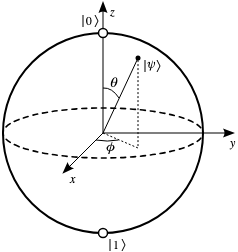

- [Introduction](#introduction)
  - [1.1 Expansion of a Quantum State in a Basis](#11-expansion-of-a-quantum-state-in-a-basis)
  - [1.2 Complex Conjugate](#12-complex-conjugate)
  - [1.3 Bra Vector](#13-bra-vector)
- [2.	Inner Product:](#2inner-product)
  - [Geometric Interpretation of the Inner Product](#geometric-interpretation-of-the-inner-product)
  - [Norm of a Vector:](#norm-of-a-vector)
  - [Orthogonality:](#orthogonality)
  - [Bra Expansion in a Basis](#bra-expansion-in-a-basis)
  - [Inner Product in Terms of Basis Expansion](#inner-product-in-terms-of-basis-expansion)
  - [Inner Product of Basis Vectors](#inner-product-of-basis-vectors)
- [3. Operators in Dirac Notation](#3-operators-in-dirac-notation)
  - [3.1 Properties of Operators](#31-properties-of-operators)
  - [3.2 Matrix Elements](#32-matrix-elements)
  - [3.3 Operator Eigenvalues and Eigenvectors](#33-operator-eigenvalues-and-eigenvectors)
  - [3.4 The Role of Hermitian Operators in Measurement](#34-the-role-of-hermitian-operators-in-measurement)
- [4. Operator Action on Expanded States](#4-operator-action-on-expanded-states)
  - [Key Takeaways](#key-takeaways)
  - [The Hermitian Adjoint and Operator Transformation](#the-hermitian-adjoint-and-operator-transformation)
  - [Example: Schrödinger Equation in Dirac Notation](#example-schrödinger-equation-in-dirac-notation)
-  [Bloch Sphere Representation of a Qubit](#bloch-sphere-representation-of-a-qubit)
-  [Commutativity of Operators with Common Eigenstates](#commutativity-of-operators-with-common-eigenstates)

## Introduction

In quantum mechanics, physical systems are described by state vectors in a complex Hilbert space. Dirac notation is a powerful formalism that provides a concise and abstract representation of these vectors.

From a geometric perspective, a ket $|\psi\rangle$ can be visualized as a vector in an abstract complex vector space. Just like arrows in Euclidean space represent direction and magnitude, quantum state vectors represent the "direction" of the system's state in Hilbert space. The length (or norm) of the ket corresponds to the probability amplitude, and only the relative directions (angles) between state vectors have physical meaning, as global phases do not affect measurable quantities.

A state vector is denoted by a **ket**:

$$
|\psi\rangle
$$

where $|\psi\rangle$ is an element of a Hilbert space $\mathcal{H}$, a complete complex vector space equipped with an inner product. The ket represents the abstract quantum state of a physical system. 

In practice, $|\psi\rangle$ can be represented in different bases (such as position or momentum), and its components depend on the chosen basis. The ket notation encapsulates all measurable information about the quantum system and evolves according to the Schrödinger equation in the time-dependent case.

Kets are most commonly used to represent the quantum states of physical systems, such as the position, momentum, or spin state of a particle. For example, the ket $|x\rangle$ denotes a state of definite position, while $|p\rangle$ denotes a state of definite momentum. In addition to representing physical states, kets can also represent abstract vectors in Hilbert space that are not directly measurable, such as superpositions of basis states or unphysical trial states used in computations.

A ket can also represent a basis state, such as a state of definite position |x\rangle, definite momentum |p\rangle, or a discrete basis state like |i\rangle. These basis states form the building blocks used to expand more general quantum states through linear combinations.

### 1.1 Expansion of a Quantum State in a Basis

Any quantum state $|\psi\rangle$ can be written as a linear combination of basis vectors in a Hilbert space. If $\{|i\rangle\}$ is an orthonormal basis, then:

$$
|\psi\rangle = \sum_i c_i |i\rangle
$$

where each coefficient $c_i$ is a complex number given by the projection of the state onto the basis vector:

$$
c_i = \langle i|\psi\rangle
$$

This decomposition expresses $|\psi\rangle$ as a **superposition** of the basis states. The set $\{|i\rangle\}$ can represent position eigenstates, momentum eigenstates, energy eigenstates, or any other complete orthonormal basis appropriate to the quantum system being studied.

The expansion is central to the mathematical formulation of quantum mechanics because it allows us to work with arbitrary states using known basis functions and simplifies calculations involving operators and measurements.

### 1.2 Complex Conjugate

The complex conjugate of a complex number $z = a + ib$, where $a, b \in \mathbb{R}$ and $i^2 = -1$, is defined as:

$$
z^* = a - ib
$$

In quantum mechanics, complex conjugation is used when constructing inner products and in defining the Hermitian adjoint of operators.

### 1.3 Bra Vector

A **bra** is the Hermitian adjoint (also called the conjugate transpose) of a ket. If $|\psi\rangle$ is a ket vector in a Hilbert space $\mathcal{H}$, then the corresponding bra is denoted as $\langle\psi|$.

In terms of linear algebra, if $|\psi\rangle$ is represented as a column vector:

$$
|\psi\rangle =
\begin{pmatrix}
c_1 \\
c_2 \\
\vdots \\
c_n
\end{pmatrix}
$$

then the bra $\langle\psi|$ is the conjugate transpose (row vector):

$$
\langle\psi| =
\begin{pmatrix}
c_1^* & c_2^* & \cdots & c_n^*
\end{pmatrix}
$$

where $c_i^*$ denotes the complex conjugate of the component $c_i$.

Basic Properties of Vectors in Hilbert Space
	1.	Linearity:

Given two vectors $|\psi\rangle$ and $|\phi\rangle$, and complex numbers $a, b \in \mathbb{C}$:

- **Addition is commutative:**  
$$
|\psi\rangle + |\phi\rangle = |\phi\rangle + |\psi\rangle
$$

$$
a|\psi\rangle + b|\phi\rangle \in \mathcal{H}
$$

## 2.	Inner Product:

The inner product of two vectors is written in Dirac notation as:

$$
\langle\phi|\psi\rangle \in \mathbb{C}
$$

In terms of wavefunctions, this corresponds to the integral:

$$
\langle\phi|\psi\rangle = \int \phi^*(x)\psi(x)\,dx
$$

where $\phi(x)$ and $\psi(x)$ are the wavefunctions corresponding to the vectors $|\phi\rangle$ and $|\psi\rangle$, respectively.

In other words, $\phi(x)$ and $\psi(x)$ are the projections of the state vectors onto the position eigenstates $|x\rangle$. These wavefunctions describe how the quantum state “looks” when expressed as a function of position.

It satisfies the following properties:

- **Conjugate Symmetry:**
  $$
  \langle\psi|\phi\rangle = \langle\phi|\psi\rangle^*
  $$

  This property ensures that the inner product is conjugate symmetric, meaning it behaves well under complex conjugation. In particular, if we compute the inner product of a vector with itself:
  $$
  \langle\psi|\psi\rangle = (\langle\psi|\psi\rangle)^*
  $$
  then the result must be equal to its own complex conjugate, which implies that:
  $$
  \langle\psi|\psi\rangle \in \mathbb{R}
  $$
  Thus, the inner product of a vector with itself always yields a **real** (and non-negative) number.
	•	Linearity in the second argument:
$$
\langle\psi| (a|\phi_1\rangle + b|\phi_2\rangle) = a\langle\psi|\phi_1\rangle + b\langle\psi|\phi_2\rangle
$$

Additional properties:

- **Distributivity over addition:**
  $$
  \langle\psi_1| (|\psi_2\rangle + |\psi_3\rangle) = \langle\psi_1|\psi_2\rangle + \langle\psi_1|\psi_3\rangle
  $$

- **Linearity in the second argument:**
  $$
  (\langle\psi_1| + \langle\psi_2|)|\psi_3\rangle = \langle\psi_1|\psi_3\rangle + \langle\psi_2|\psi_3\rangle
  $$

- **Conjugate symmetry:**
  $$
  \langle\psi_1|\psi_2\rangle = \langle\psi_2|\psi_1\rangle^*
  $$

- **Inner product with itself is real:**
  $$
  \langle\psi|\psi\rangle = \langle\psi|\psi\rangle^* \in \mathbb{R}
  $$

### Geometric Interpretation of the Inner Product

The inner product $\langle\phi|\psi\rangle$ can also be interpreted geometrically as the **projection** of the vector $|\psi\rangle$ onto the direction of the vector $|\phi\rangle$.

In Euclidean space, this corresponds to:

$$
\langle\phi|\psi\rangle = |\phi||\psi| \cos\theta
$$

where $\theta$ is the angle between the vectors.

This interpretation helps visualize the inner product as a measure of **overlap** between two quantum states.

### Norm of a Vector:

The norm is defined as:

$$
| |\psi\rangle | = \sqrt{\langle\psi|\psi\rangle}
$$

A vector is said to be normalized if:

$$
\langle\psi|\psi\rangle = 1
$$

### Orthogonality:

Two vectors $|\psi\rangle$ and $|\phi\rangle$ are orthogonal if:

$$
\langle\phi|\psi\rangle = 0
$$

 1. Combined Properties of Bra and Ket

The **bra-ket** formalism, also called the **inner product notation**, allows us to express important operations in quantum mechanics with clarity and abstraction.

- The expression $\langle\phi|\psi\rangle$ represents the **inner product** between two vectors and yields a complex number.
- The expression $|\psi\rangle \langle\phi|$ is an **outer product**, which yields an operator.
- The **Hermitian adjoint** of a product follows the rule:
  $$
  (AB)^\dagger = B^\dagger A^\dagger
  $$
- The **expectation value** of an operator $\hat{A}$ in the state $|\psi\rangle$ is:
  $$
  \langle\psi|\hat{A}|\psi\rangle
  $$

These combined properties form the foundation for expressing measurements, observables, and quantum dynamics in Hilbert space.

---

1. Expansion in a Basis

Any state vector (ket) $|\psi\rangle$ in a Hilbert space can be expressed as a linear combination of a set of orthonormal basis vectors $\{|i\rangle\}$:

$$
|\psi\rangle = \sum_i c_i |i\rangle
$$

where $c_i$ are complex coefficients given by the inner products:

Each coefficient $c_i$ is the inner product of the basis vector $|i\rangle$ with the state $|\psi\rangle$, i.e., it measures the projection (or overlap) of $|\psi\rangle$ along the direction of $|i\rangle$.

$$
c_i = \langle i|\psi\rangle
$$

This decomposition allows us to interpret $|\psi\rangle$ as a superposition of the basis states. The basis $\{|i\rangle\}$ could represent position states, momentum states, energy eigenstates, or any other orthonormal set appropriate to the physical context.

The coefficients $c_i$ represent the **projection** of the state vector onto the basis elements, and satisfy the normalization condition:

$$
\sum_i |c_i|^2 = 1
$$

if $|\psi\rangle$ is normalized.

### Bra Expansion in a Basis

Just as a ket $|\psi\rangle$ can be expanded in terms of an orthonormal basis $\{|i\rangle\}$, the corresponding bra $\langle\psi|$ can be expanded in terms of the dual basis $\{\langle i|\}$:

$$
\langle\psi| = \sum_i c_i^* \langle i|
$$

where $c_i^* = \langle\psi|i\rangle$ is the complex conjugate of the coefficient associated with the ket expansion.

This expansion expresses the bra as a linear combination of bra basis vectors, which are dual to the ket basis vectors. Together, they facilitate the computation of inner products and operator actions in a chosen basis.

### Inner Product in Terms of Basis Expansion

Using the expansions of the ket and bra in the same orthonormal basis $\{|i\rangle\}$ and $\{\langle i|\}$, the inner product between two vectors $|\phi\rangle$ and $|\psi\rangle$ can be written as:

$$
\langle\phi|\psi\rangle = \sum_i \langle\phi|i\rangle \langle i|\psi\rangle
$$

If we define:
$$
\phi_i = \langle i|\phi\rangle, \quad \psi_i = \langle i|\psi\rangle
$$

then:
$$
\langle\phi|\psi\rangle = \sum_i \phi_i^* \psi_i
$$

This is the discrete analog of the integral form $\langle\phi|\psi\rangle = \int \phi^*(x)\psi(x)\,dx$, and represents the dot product in a complex vector space with an orthonormal basis.

### Inner Product of Basis Vectors

In an orthonormal basis $\{|i\rangle\}$, the inner product between two basis vectors $|i\rangle$ and $|j\rangle$ is defined by the **Kronecker delta**:

$$
\langle i|j\rangle = \delta_{ij} =
\begin{cases}
  1 & \text{if } i = j \\
  0 & \text{if } i \ne j
\end{cases}
$$

This identity captures two key properties:

- **Normalization**: each basis vector has unit norm:
  $$
  \langle i|i\rangle = 1
  $$
  
- **Orthogonality**: distinct basis vectors are orthogonal:
  $$
  \langle i|j\rangle = 0 \quad \text{for } i \ne j
  $$

These properties ensure that the set $\{|i\rangle\}$ forms an **orthonormal basis**, allowing for simple expansion and computation of inner products and matrix elements.

Interpretation:
	•	If $j = i$, then $\langle i|i\rangle = 1$: the vector is normalized, meaning it has unit length.
	•	If $j \ne i$, then $\langle j|i\rangle = 0$: the vectors are orthogonal, meaning they are at 90° to each other in Hilbert space.

Summary:

The condition $\langle j|i\rangle = \delta_{ji}$ implies that the set ${|i\rangle}$ is an orthonormal basis—a set of vectors that are both orthogonal and of unit norm.

This property is essential for:
- Expanding arbitrary quantum states as linear combinations of basis vectors.
- Simplifying computations involving inner products, operators, and matrix representations.

## 3. Operators in Dirac Notation

In quantum mechanics, **operators** are fundamental mathematical objects that act on state vectors (kets) in a Hilbert space to represent physical observables such as position, momentum, energy, and angular momentum.

Given an operator $\hat{A}$ and a state vector $|\psi\rangle$, the action of $\hat{A}$ on $|\psi\rangle$ is written as:

$$
\hat{A}|\psi\rangle
$$

This operation produces a new state vector in the same Hilbert space. Operators obey the rules of linear algebra and can be composed, added, and multiplied. They play a central role in the mathematical formulation of quantum mechanics.

### 3.1 Properties of Operators

Operators in quantum mechanics satisfy several important properties:

- **Linearity**: An operator $\hat{A}$ is linear if it satisfies:

  $$
  \hat{A}(a|\psi\rangle + b|\phi\rangle) = a\hat{A}|\psi\rangle + b\hat{A}|\phi\rangle
  $$

  for all complex numbers $a, b$ and vectors $|\psi\rangle, |\phi\rangle$. All physical operators are assumed to be linear.

- **Commutativity and Non-Commutativity**: In general, operators do not commute. The **commutator** of two operators $\hat{A}$ and $\hat{B}$ is defined as:

  $$
  [\hat{A}, \hat{B}] = \hat{A}\hat{B} - \hat{B}\hat{A}
  $$

  If $[\hat{A}, \hat{B}] = 0$, the operators $\hat{A}$ and $\hat{B}$ are said to **commute**. If the commutator is non-zero, they **do not commute**. Commutators are especially important for physical observables, like position and momentum.

- **Hermitian Operators**: An operator $\hat{A}$ is **Hermitian** (or self-adjoint) if it satisfies:

  $$
  \hat{A} = \hat{A}^\dagger
  $$

  Hermitian operators have several key properties:
  
  - Their **eigenvalues** are always real, ensuring that measurements of physical observables yield real numbers.
  - Their eigenvectors form an **orthonormal basis**, making it possible to expand quantum states in terms of these eigenvectors.

- **Unitary Operators**: An operator $\hat{U}$ is **unitary** if it satisfies:

  $$
  \hat{U}^\dagger \hat{U} = \hat{U} \hat{U}^\dagger = I
  $$

  where $I$ is the identity operator. Unitary operators preserve the norm of vectors and are important in describing time evolution and symmetries in quantum mechanics.

### 3.2 Matrix Elements

The **matrix element** of an operator $\hat{A}$ between two states $|\phi\rangle$ and $|\psi\rangle$ is given by:

$$
\langle\phi|\hat{A}|\psi\rangle
$$

This complex number has important physical interpretations:  
- If $|\phi\rangle = |\psi\rangle$, it gives the **expectation value** of $\hat{A}$:
  
  $$
  \langle\psi|\hat{A}|\psi\rangle
  $$

- If $|\phi\rangle \ne |\psi\rangle$, it can represent the **transition amplitude** between the two states under the action of $\hat{A}$.

### 3.3 Operator Eigenvalues and Eigenvectors

Operators often have **eigenvalues** and **eigenvectors**. An eigenvector $|\psi\rangle$ of an operator $\hat{A}$ satisfies the eigenvalue equation:

$$
\hat{A}|\psi\rangle = \lambda|\psi\rangle
$$

where $\lambda$ is the eigenvalue associated with the eigenvector $|\psi\rangle$. Eigenvalues represent the possible measurement outcomes for an observable, and the corresponding eigenvectors represent the quantum states associated with these outcomes.

### 3.4 The Role of Hermitian Operators in Measurement

In quantum mechanics, observables are represented by Hermitian operators. The expectation value of an observable $\hat{A}$ in a quantum state $|\psi\rangle$ is given by:

$$
\langle\psi|\hat{A}|\psi\rangle
$$

This expectation value corresponds to the average value of the observable in repeated measurements of a system prepared in state $|\psi\rangle$.

The **eigenvalue spectrum** of an operator $\hat{A}$ determines the possible measurement outcomes, and the corresponding **eigenstates** are the quantum states in which those outcomes would be obtained with certainty.

## 4. Operator Action on Expanded States

Suppose an operator $\hat{O}$ acts on a state $|\psi\rangle$, and that $|\psi\rangle$ is expressed in terms of an orthonormal basis $\{|i\rangle\}$ as:

$$
|\psi\rangle = \sum_{i=1}^n c_i |i\rangle
$$

Then the action of the operator $\hat{O}$ on $|\psi\rangle$ yields another state:

$$
\hat{O}|\psi\rangle = |\phi\rangle = \sum_{i=1}^n b_i |i\rangle
$$

where the new coefficients $b_i$ depend linearly on the original coefficients $c_i$ and on the matrix elements of the operator.

Applying the operator explicitly:

$$
\hat{O} \left( \sum_{i=1}^n c_i |i\rangle \right) = \sum_{i=1}^n b_i |i\rangle
$$

Taking the inner product with a bra $\langle j|$:

$$
\langle j| \hat{O} \left( \sum_{i=1}^n c_i |i\rangle \right) = \sum_{i=1}^n b_i \langle j|i\rangle
$$

Since the basis is orthonormal:

$$
\langle j|i\rangle = \delta_{ji}
$$

we obtain:

$$
\sum_{i=1}^n (c_i \langle j|\hat{O}|i\rangle)=b_j
$$

The inner product $\langle j|\hat{O}|i\rangle$ is the matrix element of the operator $\hat{O}$ between the basis states $|i\rangle$ and $|j\rangle$. We denote it as:

$$
 \langle j|\hat{O}|i\rangle = O_{ji}
$$

Now we end up with following expression:

$$
\sum_{i=1}^n (O_{ji}c_i)=b_j
$$

In **vector and matrix form**, this can be compactly written as:

$$
\vec{b} = O \vec{c}
$$

where:

- $\vec{c} = \begin{pmatrix} c_1 \\ c_2 \\ \vdots \\ c_n \end{pmatrix}$ is the vector of coefficients representing the original state $ |\psi\rangle $,
- $\vec{b} = \begin{pmatrix} b_1 \\ b_2 \\ \vdots \\ b_n \end{pmatrix}$ is the resulting vector after applying the operator,
- $O = [O_{ji}]$ is the matrix representation of the operator $\hat{O}$ in the chosen orthonormal basis.

This matrix-vector product provides a compact and powerful way to express how linear operators act on state vectors in quantum mechanics.

### Key Takeaways

- A quantum **state** can be represented as a **column vector** of complex coefficients in a chosen orthonormal basis.
- A **ket** $|\psi\rangle$ corresponds to this column vector representation.
- The **action of a linear operator** $\hat{O}$ on a ket is equivalent to multiplying the corresponding matrix $O$ by the state vector $\vec{c}$:
  
  $$
  \vec{b} = O \vec{c}
  $$
  
  This framework allows quantum states and operator actions to be treated using the familiar tools of linear algebra. 
  I don't need to use complex integrals

### The Hermitian Adjoint and Operator Transformation

The Hermitian adjoint (or dagger) of an operator matrix is defined as the **complex conjugate transpose**:

$$
(O^T)^* \equiv O^\dagger
$$

This is the key ingredient that links the transformation of bra vectors to the conjugate-transpose of the operator. If we apply an operator $\hat{O}$ to a ket $|\psi\rangle$ and obtain a new state $|\phi\rangle$:

$$
\hat{O}|\psi\rangle = |\phi\rangle
$$

then taking the Hermitian adjoint of both sides gives:

$$
\langle\psi|\hat{O}^\dagger = \langle\phi|
$$

### Example: Schrödinger Equation in Dirac Notation

Consider the time-independent Schrödinger equation in position space:

$$
\hat{H} \psi(x) = E \psi(x)
$$

where $\hat{H}$ is the Hamiltonian operator, $E$ is the energy eigenvalue, and $\psi(x)$ is the wavefunction of the system. The Hamiltonian typically includes kinetic and potential energy terms:

$$
\hat{H} = \frac{\hat{p}^2}{2m} + V(x), \quad \text{with } \hat{p} \rightarrow -i\hbar \frac{d}{dx}
$$

Inserting this into the Schrödinger equation gives:

$$
\left[ -\frac{\hbar^2}{2m} \frac{d^2}{dx^2} + V(x) \right] \psi(x) = E \psi(x)
$$

This differential equation can be rewritten using **Dirac notation** as:

$$
\hat{H} |\psi\rangle = E |\psi\rangle
$$

where $|\psi\rangle$ is the ket corresponding to the state with wavefunction $\psi(x)$. This is an **eigenvalue equation** where:

- $\hat{H}$ is the operator,
- $|\psi\rangle$ is the eigenvector (state),
- $E$ is the eigenvalue (measurable energy).

Similarly, for a generic operator $\hat{O}$:

$$
\hat{O}|\psi\rangle = \lambda |\psi\rangle
$$

indicates that $|\psi\rangle$ is an eigenvector of $\hat{O}$ with eigenvalue $\lambda$.

This compact notation helps generalize quantum mechanical problems beyond specific representations like position or momentum.

### Example: Solving the Eigenvalue Problem in a Two-State Basis

Suppose we express a quantum state in a two-dimensional orthonormal basis $\{|1\rangle, |2\rangle\}$, and the Hamiltonian operator $\hat{H}$ has the following matrix elements:

$$
\hat{H} \longrightarrow
\begin{pmatrix}
\langle 1|\hat{H}|1\rangle & \langle 1|\hat{H}|2\rangle \\
\langle 2|\hat{H}|1\rangle & \langle 2|\hat{H}|2\rangle
\end{pmatrix}
=
\begin{pmatrix}
\epsilon_0 & t \\
t & \epsilon_0
\end{pmatrix}
$$

The state $|\psi\rangle$ is written as a linear combination of basis states:

$$
|\psi\rangle = c_1|1\rangle + c_2|2\rangle
$$

Applying the eigenvalue equation:

$$
\hat{H}|\psi\rangle = E|\psi\rangle
$$

leads to the matrix equation:

$$
\begin{pmatrix}
\epsilon_0 & t \\
t & \epsilon_0
\end{pmatrix}
\begin{pmatrix}
c_1 \\
c_2
\end{pmatrix}
=
E
\begin{pmatrix}
c_1 \\
c_2
\end{pmatrix}
$$

This is a standard eigenvalue problem. To find the allowed energy values $E$, we solve the characteristic equation:

$$
\det
\begin{pmatrix}
\epsilon_0 - E & t \\
t & \epsilon_0 - E
\end{pmatrix}
= 0
$$

which simplifies to:

$$
(\epsilon_0 - E)^2 - t^2 = 0 \quad \Rightarrow \quad E = \epsilon_0 \pm t
$$

The corresponding normalized eigenvectors are:

- For $E = \epsilon_0 + t$:  
  $$
  |\psi_+\rangle = \frac{1}{\sqrt{2}} \begin{pmatrix} 1 \\ 1 \end{pmatrix}
  $$
  
- For $E = \epsilon_0 - t$:  
  $$
  |\psi_-\rangle = \frac{1}{\sqrt{2}} \begin{pmatrix} 1 \\ -1 \end{pmatrix}
  $$

This example illustrates how a Dirac notation eigenvalue problem can be reduced to a finite-dimensional matrix diagonalization.

## Bloch Sphere Representation of a Qubit

A qubit — the basic unit of quantum information — can be described as a superposition of two basis states, typically denoted $|0\rangle$ and $|1\rangle$:

$$
|\psi\rangle = \cos\left(\frac{\theta}{2}\right) |0\rangle + e^{i\phi} \sin\left(\frac{\theta}{2}\right) |1\rangle
$$

This form ensures normalization:
$$
|\cos\left(\frac{\theta}{2}\right)|^2 + |\sin\left(\frac{\theta}{2}\right)|^2 = 1
$$

The parameters $\theta$ in $[0, \pi]$ and $\phi$ in $[0, 2\pi]$ define a point on the Bloch sphere, a geometrical representation of the qubit state as a point on the surface of a unit sphere in three-dimensional space.
- $|0\rangle$ corresponds to the north pole: $\theta = 0$
- $|1\rangle$ corresponds to the south pole: $\theta = \pi$
- Superpositions lie on the surface, with $\phi$ giving the azimuthal angle around the z-axis.

This visualization helps interpret pure qubit states geometrically and is widely used in quantum computing.

## Commutativity of Operators with Common Eigenstates

Let $\hat{A}$ and $\hat{B}$ be two linear operators acting on a common eigenbasis |$\lambda$, $q_i\rangle$, where:
- $\hat{A}|\lambda, q_i\rangle = \lambda |\lambda, q_i\rangle$
- $\hat{B}|\lambda, q_i\rangle = q_i |\lambda, q_i\rangle$

Then applying $\hat{A}\hat{B}$ and $\hat{B}\hat{A}$ to the same eigenstate gives:

$$
\hat{A}\hat{B}|\lambda, q_i\rangle = \hat{A}(q_i|\lambda, q_i\rangle) = q_i \lambda |\lambda, q_i\rangle
$$

and similarly:

$$
\hat{B}\hat{A}|\lambda, q_i\rangle = \hat{B}(\lambda|\lambda, q_i\rangle) = \lambda q_i |\lambda, q_i\rangle
$$

Since $q_i\lambda = \lambda q_i$, we have:

$$
[\hat{A}, \hat{B}] |\lambda, q_i\rangle = (\hat{A}\hat{B} - \hat{B}\hat{A})|\lambda, q_i\rangle = 0
$$

Therefore:

If two operators share a complete set of common eigenvectors, they commute on that basis:
$$
[\hat{A}, \hat{B}] = 0
$$

This result is central in quantum mechanics, especially in contexts where simultaneous observables (like energy and angular momentum components) must be measured consistently.

On the contrary, if two operators commute then they have same eigenvectors
