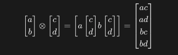

  - [Introduction to Spin-1/2 Systems](#introduction-to-spin-12-systems)
    - [Spin Representation and State Vectors](#spin-representation-and-state-vectors)
    - [Spin Operators and Pauli Matrices](#spin-operators-and-pauli-matrices)
    - [Unitarity of Qubit Rotation Operators](#unitarity-of-qubit-rotation-operators)
    - [Action of the Unitary Operator on Basis States](#action-of-the-unitary-operator-on-basis-states)
  - [Two-Qubit Systems](#two-qubit-systems)
    - [General Expansion of Two-Qubit States in Spin Notation](#general-expansion-of-two-qubit-states-in-spin-notation)
    - [Tensor Product of Two Qubit States (Example)](#tensor-product-of-two-qubit-states-example)
    - [Product of Two Arbitrary One-Qubit States](#product-of-two-arbitrary-one-qubit-states)
  - [Entangled States](#entangled-states)
    - [Demonstration: The Bell State Is Not a Product State](#demonstration-the-bell-state-is-not-a-product-state)
    - [Exercise: Is the Following Two-Qubit State Entangled?](#exercise-is-the-following-two-qubit-state-entangled)
  - [Three-Qubit Systems](#three-qubit-systems)
    - [Example: Tensor Product of Three States](#example-tensor-product-of-three-states)
    - [Partial Measurement of Multi-Qubit States](#partial-measurement-of-multi-qubit-states)
    - [Measurement Outcome Projection and Post-Measurement State](#measurement-outcome-projection-and-post-measurement-state)
    - [Exercise: Partial Measurement on the W State](#exercise-partial-measurement-on-the-w-state)

## Introduction to Spin-1/2 Systems

In quantum mechanics, the spin of a particle is an intrinsic form of angular momentum unrelated to spatial motion. For spin-1/2 particles such as electrons, the spin state is described within a two-dimensional complex Hilbert space. The spin states can be represented using **Dirac notation** and expressed as linear combinations of orthonormal basis states.

These two basis states, denoted $|0\rangle$ and $|1\rangle$ (or equivalently $|\uparrow\rangle$ and $|\downarrow\rangle$), correspond to the eigenstates of the spin operator along the $z$-axis, $\hat{S}_z$.

## Spin Representation and State Vectors

A general state of a spin-1/2 particle can be written as:

$$
|\psi\rangle = a |0\rangle + b |1\rangle
$$

where $|0\rangle = |\uparrow\rangle \equiv \begin{pmatrix} 1 \\ 0 \end{pmatrix}$ and $|1\rangle = |\downarrow\rangle \equiv \begin{pmatrix} 0 \\ 1 \end{pmatrix}$.

The normalization condition is:

$$
|a|^2 + |b|^2 = 1
$$

The column vector representation is:

$$
|\psi\rangle =
\begin{pmatrix}
a \\
b
\end{pmatrix}, \quad
\langle\psi| =
\begin{pmatrix}
a^* & b^*
\end{pmatrix}
$$

and the inner product:

$$
\langle\psi|\psi\rangle = |a|^2 + |b|^2 = 1
$$

## Spin Operators and Pauli Matrices

The spin operators $\hat{S}_x$, $\hat{S}_y$, and $\hat{S}_z$ act on the spin states and are used to model spin measurements along different axes.

In units where $\hbar = 1$, the spin operators are defined via the **Pauli matrices**:

$$
\sigma_x =
\begin{pmatrix}
0 & 1 \\
1 & 0
\end{pmatrix}, \quad
\sigma_y =
\begin{pmatrix}
0 & -i \\
i & 0
\end{pmatrix}, \quad
\sigma_z =
\begin{pmatrix}
1 & 0 \\
0 & -1
\end{pmatrix}
$$

$$
\hat{S}_i = \frac{1}{2} \sigma_i \quad \text{for } i = x, y, z
$$

These matrices satisfy the commutation relations:

$$
[\sigma_i, \sigma_j] = 2i \epsilon_{ijk} \sigma_k
$$

and the anticommutation relations:

$$
\{\sigma_i, \sigma_j\} = 2 \delta_{ij} \mathbb{I}
$$

The operator $\hat{S}_z$ acts on the basis states as:

$$
\hat{S}_z |\uparrow\rangle = +\frac{1}{2} |\uparrow\rangle, \quad
\hat{S}_z |\downarrow\rangle = -\frac{1}{2} |\downarrow\rangle
$$

### Unitarity of Qubit Rotation Operators

In quantum mechanics and quantum computing, unitary operators preserve the norm of quantum states. A matrix $U$ is **unitary** if:

$$
U^\dagger U = \mathbb{I}
$$

where $U^\dagger = (U^T)^*$ is the Hermitian adjoint (the conjugate transpose of $U$), and $\mathbb{I}$ is the identity matrix.

Consider the following matrix, often used to represent qubit rotations on the Bloch sphere:

$$
U =
\begin{pmatrix}
\cos\frac{\theta}{2} & -e^{-i\phi} \sin\frac{\theta}{2} \\
e^{i\phi} \sin\frac{\theta}{2} & \cos\frac{\theta}{2}
\end{pmatrix}
$$

Its Hermitian adjoint is:

$$
U^\dagger =
\begin{pmatrix}
\cos\frac{\theta}{2} & e^{-i\phi} \sin\frac{\theta}{2} \\
-e^{i\phi} \sin\frac{\theta}{2} & \cos\frac{\theta}{2}
\end{pmatrix}
$$

Multiplying these gives:

$$
U^\dagger U = \mathbb{I}
$$

### Action of the Unitary Operator on Basis States

Let us now apply the unitary operator $U$ to the computational basis states $|0\rangle$ and $|1\rangle$.

Recall:

$$
U =
\begin{pmatrix}
\cos\frac{\theta}{2} & -e^{-i\phi} \sin\frac{\theta}{2} \\
e^{i\phi} \sin\frac{\theta}{2} & \cos\frac{\theta}{2}
\end{pmatrix}
$$

Applying $U$ to $|0\rangle = \begin{pmatrix} 1 \\ 0 \end{pmatrix}$:

$$
U|0\rangle =
\begin{pmatrix}
\cos\frac{\theta}{2} \\
e^{i\phi} \sin\frac{\theta}{2}
\end{pmatrix}
$$

Applying $U$ to $|1\rangle = \begin{pmatrix} 0 \\ 1 \end{pmatrix}$:

$$
U|1\rangle =
\begin{pmatrix}
-e^{-i\phi} \sin\frac{\theta}{2} \\
\cos\frac{\theta}{2}
\end{pmatrix}
$$

These results show how the unitary operator rotates the basis states on the Bloch sphere. The transformation depends on the angles $\theta$ and $\phi$, and thus corresponds to a general qubit rotation.
# Two-Qubit Systems

In quantum mechanics, when we consider systems composed of two spin-1/2 particles (such as two qubits), the state space becomes the **tensor product** of two two-dimensional Hilbert spaces. This results in a **four-dimensional Hilbert space** with basis vectors formed by combining the basis states of the individual qubits.

The standard computational basis for two qubits is:

$$
|00\rangle, \quad |01\rangle, \quad |10\rangle, \quad |11\rangle
$$

In quantum computing, the notation $|ab\rangle$ (e.g., $|00\rangle$, $|11\rangle$) is shorthand for the **tensor product** $|a\rangle \otimes |b\rangle$, where $a, b \in \{0, 1\}$. The first qubit is usually considered the **most significant** bit (MSB), and the second is the **least significant** bit (LSB), following the convention of binary encoding. For example:

- $|10\rangle = |1\rangle \otimes |0\rangle$ means the first qubit is in state $|1\rangle$, the second in $|0\rangle$.
- $|11\rangle = |1\rangle \otimes |1\rangle$, both qubits in the excited state.

This compact notation is heavily used in the design and analysis of quantum circuits and algorithms.

where:

- $|00\rangle = |0\rangle \otimes |0\rangle$
- $|01\rangle = |0\rangle \otimes |1\rangle$
- $|10\rangle = |1\rangle \otimes |0\rangle$
- $|11\rangle = |1\rangle \otimes |1\rangle$

A general two-qubit state is a linear combination of these basis vectors:

$$
|\Psi\rangle = c_{00}|00\rangle + c_{01}|01\rangle + c_{10}|10\rangle + c_{11}|11\rangle
$$

where the coefficients $c_{ij}$ are complex numbers satisfying the normalization condition:

$$
|c_{00}|^2 + |c_{01}|^2 + |c_{10}|^2 + |c_{11}|^2 = 1
$$

### General Expansion of Two-Qubit States in Spin Notation

Two-qubit basis states can also be expressed using the spin notation $|\uparrow\rangle$ and $|\downarrow\rangle$ for each qubit. The correspondence is:

$$
|0\rangle \equiv |\uparrow\rangle, \quad |1\rangle \equiv |\downarrow\rangle
$$

Thus, the two-qubit computational basis states translate to:

$$
|00\rangle = |\uparrow\uparrow\rangle, \quad
|01\rangle = |\uparrow\downarrow\rangle, \quad
|10\rangle = |\downarrow\uparrow\rangle, \quad
|11\rangle = |\downarrow\downarrow\rangle
$$

A general two-qubit state in spin notation is:

$$
|\Psi\rangle = c_{\uparrow\uparrow} |\uparrow\uparrow\rangle + c_{\uparrow\downarrow} |\uparrow\downarrow\rangle + c_{\downarrow\uparrow} |\downarrow\uparrow\rangle + c_{\downarrow\downarrow} |\downarrow\downarrow\rangle
$$

where the coefficients $c_{ij}$ correspond to the computational basis coefficients $c_{00}$, $c_{01}$, $c_{10}$, and $c_{11}$ respectively.

### Tensor Product of Two Qubit States (Example)

When forming the tensor product between two qubit states, we apply the Kronecker product between their column vectors.

For example, consider two qubit states:

$$
|0\rangle =
\begin{pmatrix}
1 \\
0
\end{pmatrix}, \quad
\text{and} \quad
\begin{pmatrix}
1 \\
0
\end{pmatrix}
$$

Their tensor product is:

$$
\begin{pmatrix} 1 \\ 0 \end{pmatrix}\otimes \begin{pmatrix} 1 \\ 0 \end{pmatrix}
=
\begin{pmatrix}
1 \cdot 1 \\
1 \cdot 0 \\
0 \cdot 1 \\
0 \cdot 0
\end{pmatrix}
=
\begin{pmatrix}
1 \\
0 \\
0 \\
0
\end{pmatrix}
$$

This construction is fundamental when combining multiple qubits into joint systems or when applying multi-qubit gates. The ordering of tensor products determines the position of nonzero entries and the interpretation of the composite basis states (e.g., $|00\rangle$, $|01\rangle$, etc.).

### Product of Two Arbitrary One-Qubit States

A general two-qubit state can also be constructed as the tensor product of two arbitrary one-qubit states.

Suppose we have two qubits in the following general states:

$$
|\psi_1\rangle = \alpha |\uparrow\rangle_1 + \beta |\downarrow\rangle_1, \quad
|\psi_2\rangle = \gamma |\uparrow\rangle_2 + \delta |\downarrow\rangle_2
$$

Then the combined state is:

$$
|\Psi\rangle = |\psi_1\rangle \otimes |\psi_2\rangle
= (\alpha |\uparrow\rangle_1 + \beta |\downarrow\rangle_1) \otimes (\gamma |\uparrow\rangle_2 + \delta |\downarrow\rangle_2)
$$

Using the distributive property of the tensor product, we expand:

$$
|\Psi\rangle =
\alpha \gamma |\uparrow\uparrow\rangle +
\alpha \delta |\uparrow\downarrow\rangle +
\beta \gamma |\downarrow\uparrow\rangle +
\beta \delta |\downarrow\downarrow\rangle
$$

This gives a fully expanded expression in terms of the basis states for two qubits. If the coefficients factor as shown, the state is **separable**; otherwise, it's **entangled**.

This approach helps visualize the composition of a multi-qubit system from simpler components and is crucial in understanding how separable and entangled states arise in quantum mechanics.

## Entangled states

Two-qubit systems are essential in quantum computing, as they allow for the representation of **entangled states**, which have no classical analogue. One famous example is the Bell state:

$$
|\Phi^+\rangle = \frac{1}{\sqrt{2}}(|00\rangle + |11\rangle)
$$

This state exhibits **quantum entanglement**, meaning the measurement outcome of one qubit instantaneously affects the other, regardless of the distance between them. Operators acting on two-qubit systems include tensor products of single-qubit operators as well as multi-qubit gates such as the CNOT (Controlled-NOT) gate, which is fundamental for quantum logic.

### Demonstration: The Bell State Is Not a Product State

If the Bell state $|\Phi^+\rangle$ were a separable (non-entangled) state, it could be written as the tensor product of two one-qubit states:

$$
|\Phi^+\rangle = |\psi_1\rangle \otimes |\psi_2\rangle
= (\alpha |\uparrow\rangle_1 + \beta |\downarrow\rangle_1) \otimes (\gamma |\uparrow\rangle_2 + \delta |\downarrow\rangle_2)
$$

Expanding the product, we get:

$$
|\Psi\rangle =
\alpha\gamma |\uparrow\uparrow\rangle +
\alpha\delta |\uparrow\downarrow\rangle +
\beta\gamma |\downarrow\uparrow\rangle +
\beta\delta |\downarrow\downarrow\rangle
$$

But the Bell state is:

$$
|\Phi^+\rangle = \frac{1}{\sqrt{2}}(|\uparrow\uparrow\rangle + |\downarrow\downarrow\rangle)
$$

Comparing term by term, we would need:

- $\alpha\gamma = \frac{1}{\sqrt{2}}$
- $\alpha\delta = 0$
- $\beta\gamma = 0$
- $\beta\delta = \frac{1}{\sqrt{2}}$

From $\alpha\delta = 0$ and $\beta\gamma = 0$, either $\alpha = 0$ or $\delta = 0$, and either $\beta = 0$ or $\gamma = 0$.

But if $\alpha = 0$, then $\alpha\gamma = 0$ contradicts $\alpha\gamma = \frac{1}{\sqrt{2}}$.  
Similarly, if $\gamma = 0$, then $\alpha\gamma = 0$ also contradicts $\frac{1}{\sqrt{2}}$.

Therefore, no choice of coefficients satisfies all four conditions simultaneously.

**Conclusion:**  

The Bell state $|\Phi^+\rangle$ cannot be written as a tensor product of two single-qubit states. It is genuinely **entangled**.

### Exercise: Is the Following Two-Qubit State Entangled?

Consider the two-qubit state:

$$
|\Psi\rangle = \frac{1}{2}|00\rangle + \frac{i}{2}|01\rangle - \frac{1}{2}|10\rangle - \frac{i}{2}|11\rangle
$$

We want to determine whether this state is a **product state** (separable) or **entangled**.

Suppose it is a product state. Then it can be written as:

$$
|\Psi\rangle = (\alpha |0\rangle + \beta |1\rangle) \otimes (\gamma |0\rangle + \delta |1\rangle)
$$

Expanding the right-hand side:

$$
|\Psi\rangle = \alpha\gamma |00\rangle + \alpha\delta |01\rangle + \beta\gamma |10\rangle + \beta\delta |11\rangle
$$

Comparing term-by-term with the original state, we obtain the following system:

- $\alpha\gamma = \frac{1}{2}$
- $\alpha\delta = \frac{i}{2}$
- $\beta\gamma = -\frac{1}{2}$
- $\beta\delta = -\frac{i}{2}$
 
**Step 1:** From the first equation, assuming $\gamma \neq 0$, we get:

$$
\alpha = \frac{1}{2\gamma}
$$

**Step 2:** Plug into the second equation:

$$
\frac{1}{2\gamma} \cdot \delta = \frac{i}{2} \Rightarrow \delta = i\gamma
$$

**Step 3:** From the third equation:

$$
\beta = -\frac{1}{2\gamma}
$$

**Step 4:** Verify the fourth equation:

$$
\beta\delta = \left(-\frac{1}{2\gamma}\right)(i\gamma) = -\frac{i\gamma}{2\gamma} = -\frac{i}{2}
$$

which **matches** the target value in the state.

✅ All equations are satisfied.

**Conclusion:**

The state

$$
|\Psi\rangle = \frac{1}{2}|00\rangle + \frac{i}{2}|01\rangle - \frac{1}{2}|10\rangle - \frac{i}{2}|11\rangle
$$

**is a separable product state**, and can be written as:

$$
|\Psi\rangle = (\alpha |0\rangle + \beta |1\rangle) \otimes (\gamma |0\rangle + \delta |1\rangle)
$$

with 

$$
\gamma \in \mathbb{C} \setminus \{0\}, \quad \alpha = \frac{1}{2\gamma}, \quad \beta = -\frac{1}{2\gamma}, \quad \delta = i\gamma
$$

## Three-Qubit Systems

When we consider quantum systems composed of three qubits, the state space becomes the tensor product of three two-dimensional Hilbert spaces:

$$
\mathcal{H}_1 \otimes \mathcal{H}_2 \otimes \mathcal{H}_3
$$

Each individual qubit spans a 2-dimensional space, so the total dimension is:

$$
\dim(\mathcal{H}) = 2^3 = 8
$$

The computational basis for three qubits is:

$$
\{|000\rangle, |001\rangle, |010\rangle, |011\rangle, |100\rangle, |101\rangle, |110\rangle, |111\rangle\}
$$

A general pure state of a three-qubit system is a linear combination of these basis states:

$$
|\Psi\rangle = \sum_{i=0}^{7} c_i |i\rangle
$$

where each $|i\rangle$ corresponds to a binary string of length 3 (e.g., $|i\rangle = |101\rangle$), and the coefficients $c_i \in \mathbb{C}$ satisfy the normalization condition:

$$
\sum_{i=0}^{7} |c_i|^2 = 1
$$

### Example: Tensor Product of Three States

Consider the state:

$$
|\Psi\rangle =
\left(\frac{1}{\sqrt{2}}|0\rangle_1 - \frac{1}{\sqrt{2}}|1\rangle_1\right)
\otimes
\left(\frac{1}{\sqrt{2}}|0\rangle_2 + \frac{i}{\sqrt{2}}|1\rangle_2\right)
\otimes
|0\rangle_3
$$

First, compute the product of the first two qubits:

$$
|\psi_{12}\rangle =
\left(\frac{1}{\sqrt{2}}|0\rangle - \frac{1}{\sqrt{2}}|1\rangle\right)
\otimes
\left(\frac{1}{\sqrt{2}}|0\rangle + \frac{i}{\sqrt{2}}|1\rangle\right)
$$

Expanding this:

$$
|\psi_{12}\rangle = \frac{1}{2}|00\rangle + \frac{i}{2}|01\rangle - \frac{1}{2}|10\rangle - \frac{i}{2}|11\rangle
$$

Now append $|0\rangle_3$:

$$
|\Psi\rangle = |\psi_{12}\rangle \otimes |0\rangle
$$

$$
= \frac{1}{2}|000\rangle + \frac{i}{2}|010\rangle - \frac{1}{2}|100\rangle - \frac{i}{2}|110\rangle
$$

This is a specific three-qubit state expressed as a linear combination of four basis states.

As the number of qubits increases, the size of the Hilbert space grows exponentially. Three-qubit systems are essential for studying concepts such as multi-qubit entanglement, GHZ states, and quantum error correction.

### Partial Measurement of Multi-Qubit States

In multi-qubit systems, it is possible to perform a **partial measurement**, where only a subset of the qubits is measured. The result collapses the overall quantum state in a way that reflects the outcome of the measurement, while the unmeasured qubits remain in a superposition conditioned on the measurement result.

#### Example: Partial Measurement on the First Qubit

Consider the three-qubit state:

$$
|\Psi\rangle =
\frac{1}{2}|000\rangle + \frac{i}{2}|010\rangle - \frac{1}{2}|100\rangle - \frac{i}{2}|110\rangle
$$

Suppose we measure **only the first qubit**. This means we ask: is qubit 1 in state $|0\rangle$ or $|1\rangle$?

The state can be grouped as:

$$
|\Psi\rangle = |0\rangle \otimes \left(\frac{1}{2}|00\rangle + \frac{i}{2}|10\rangle\right)
+ |1\rangle \otimes \left(-\frac{1}{2}|00\rangle - \frac{i}{2}|10\rangle\right)
$$

- If the measurement outcome is $|0\rangle_1$, the state collapses to:

  $$
  |\psi_{\text{post}}\rangle = \frac{1}{\sqrt{1/2}} \left(\frac{1}{2}|00\rangle + \frac{i}{2}|10\rangle\right) = \frac{1}{\sqrt{2}}(|00\rangle + i|10\rangle)
  $$

- If the outcome is $|1\rangle_1$, the state collapses to:

  $$
  |\psi_{\text{post}}\rangle = \frac{1}{\sqrt{1/2}} \left(-\frac{1}{2}|00\rangle - \frac{i}{2}|10\rangle\right) = \frac{-1}{\sqrt{2}}(|00\rangle + i|10\rangle)
  $$

In both cases, the result is a normalized two-qubit state involving the remaining qubits (qubit 2 and 3), and further measurements can be performed on them.

Partial measurement is a key concept in quantum algorithms and error correction, where selective collapse of parts of a system is used to gain information or control entanglement.

### Measurement Outcome Projection and Post-Measurement State

Consider a general two-qubit state:

$$
|\Psi\rangle = \sum_{\alpha,\beta} c_{\alpha\beta} |\alpha\beta\rangle
$$

Suppose we perform a **partial measurement** on the first qubit and obtain the result $|0\rangle$.

The probability of this outcome is given by:

$$
p_0 = \sum_{\beta=0,1} |c_{0\beta}|^2
$$

After the measurement, the post-measurement state collapses to:

$$
|\Psi_{\text{post}}\rangle = |0\rangle \otimes |\phi\rangle
$$

where the second-qubit state is:

$$
|\phi\rangle = \frac{1}{\sqrt{\langle \phi | \phi \rangle}} \sum_{\beta} c_{0\beta} |\beta\rangle
$$

This is the normalized conditional state of the second qubit, obtained by projecting onto $|0\rangle$ on the first qubit and renormalizing.

#### Explanation of the Post-Measurement State Expression

The expression

$$
|\phi\rangle = \frac{1}{\sqrt{\langle \phi | \phi \rangle}} \sum_{\beta} c_{0\beta} |\beta\rangle
$$

arises from performing a **partial measurement** on the first qubit of a two-qubit state. Given a general state:

$$
|\Psi\rangle = \sum_{\alpha,\beta} c_{\alpha\beta} |\alpha\beta\rangle
$$

if we measure the first qubit and obtain the outcome $|0\rangle$, the state collapses onto the subspace corresponding to that outcome:

$$
|\Psi_{\text{post}}\rangle = \frac{1}{\sqrt{p_0}} \left( |0\rangle \otimes \sum_{\beta} c_{0\beta} |\beta\rangle \right)
$$

where the conditional (unnormalized) state of the second qubit is:

$$
\sum_{\beta} c_{0\beta} |\beta\rangle
$$

and the probability of measuring $|0\rangle$ on the first qubit is:

$$
p_0 = \sum_{\beta} |c_{0\beta}|^2 = \langle \phi | \phi \rangle
$$

To ensure that the resulting state is a valid (normalized) quantum state, we divide by the square root of the norm. This results in the normalized state $|\phi\rangle$ as shown above.

This conditional post-measurement state plays a key role in quantum protocols and is a foundational aspect of quantum measurement theory.

#### Example: Measurement Result $|0\rangle$ on the First Qubit

Consider the three-qubit state:

$$
|\Psi\rangle =
\frac{1}{\sqrt{2}}|000\rangle - \frac{1}{\sqrt{6}}|001\rangle + \frac{i}{\sqrt{6}}|010\rangle + \frac{1}{\sqrt{6}}|011\rangle
$$

We want to compute the post-measurement state when the **first qubit is measured and the outcome is $|0\rangle$**.

Step 1: Identify all components where the first qubit is $|0\rangle$:

$$
|\Psi\rangle =
|0\rangle \otimes \left( \frac{1}{\sqrt{2}}|00\rangle - \frac{1}{\sqrt{6}}|01\rangle + \frac{i}{\sqrt{6}}|10\rangle + \frac{1}{\sqrt{6}}|11\rangle \right)
$$

Step 2: Normalize the resulting two-qubit state:

Let:

$$
|\phi\rangle = \frac{1}{\sqrt{N}} \left( \frac{1}{\sqrt{2}}|00\rangle - \frac{1}{\sqrt{6}}|01\rangle + \frac{i}{\sqrt{6}}|10\rangle + \frac{1}{\sqrt{6}}|11\rangle \right)
$$

where the normalization factor is:

$$
N = \left|\frac{1}{\sqrt{2}}\right|^2 + \left|\frac{1}{\sqrt{6}}\right|^2 + \left|\frac{i}{\sqrt{6}}\right|^2 + \left|\frac{1}{\sqrt{6}}\right|^2 = \frac{1}{2} + \frac{1}{6} + \frac{1}{6} + \frac{1}{6} = 1
$$

So, no further normalization is needed.

Final post-measurement state:

$$
|\Psi_{\text{post}}\rangle = |0\rangle \otimes \left( \frac{1}{\sqrt{2}}|00\rangle - \frac{1}{\sqrt{6}}|01\rangle + \frac{i}{\sqrt{6}}|10\rangle + \frac{1}{\sqrt{6}}|11\rangle \right)
$$

This demonstrates the process of extracting the post-measurement state conditioned on measuring a particular outcome in a multi-qubit system.

---

Similarly, we can compute the outcome and resulting state if the measurement gives $|1\rangle$ for the first qubit.

From the original state:

$$
|\Psi\rangle =
\frac{1}{\sqrt{2}}|000\rangle - \frac{1}{\sqrt{6}}|001\rangle + \frac{i}{\sqrt{6}}|010\rangle + \frac{1}{\sqrt{6}}|011\rangle
$$

We isolate the components where the first qubit is $|1\rangle$. These are:

$$
|\Psi\rangle =
|0\rangle \otimes \left( \frac{1}{\sqrt{2}}|00\rangle - \frac{1}{\sqrt{6}}|01\rangle \right)
+ |1\rangle \otimes \left( \frac{i}{\sqrt{6}}|10\rangle + \frac{1}{\sqrt{6}}|11\rangle \right)
$$

Thus, the conditional (unnormalized) state after measuring $|1\rangle$ is:

$$
|\phi_1\rangle = \frac{i}{\sqrt{6}}|10\rangle + \frac{1}{\sqrt{6}}|11\rangle
$$

and the corresponding probability is:

$$
p_1 = \left|\frac{i}{\sqrt{6}}\right|^2 + \left|\frac{1}{\sqrt{6}}\right|^2 = \frac{1}{6} + \frac{1}{6} = \frac{1}{3}
$$

So, the normalized post-measurement state for outcome $|1\rangle$ is:

$$
|\Psi_{\text{post}}\rangle = |1\rangle \otimes \left( \frac{i}{\sqrt{2}}|10\rangle + \frac{1}{\sqrt{2}}|11\rangle \right)
$$

### Measurement Probabilities Summary

- Outcome $|0\rangle$: probability $p_0 = \frac{2}{3}$ (or 66%)
- Outcome $|1\rangle$: probability $p_1 = \frac{1}{3}$ (or 33%)

### Exercise: Partial Measurement on the W State

Consider the three-qubit W state:

$$
|W\rangle = \frac{1}{\sqrt{3}}|001\rangle + \frac{1}{\sqrt{3}}|010\rangle + \frac{1}{\sqrt{3}}|100\rangle
$$

Suppose we perform a partial measurement on the **first qubit** and obtain the outcome $|0\rangle$. What is the resulting (normalized) post-measurement state of the remaining two qubits?

**Solution:**

Step 1: Identify all components of $|W\rangle$ where the first qubit is $|0\rangle$:

$$
|W\rangle = |0\rangle \otimes \left( \frac{1}{\sqrt{3}}|01\rangle + \frac{1}{\sqrt{3}}|10\rangle \right) + |1\rangle \otimes \frac{1}{\sqrt{3}}|00\rangle
$$

To project the state $|W\rangle$ onto the subspace where the first qubit is measured to be $|0\rangle$, we group the terms where the first qubit is $|0\rangle$. In the W state:

$$
|W\rangle = \frac{1}{\sqrt{3}}|001\rangle + \frac{1}{\sqrt{3}}|010\rangle + \frac{1}{\sqrt{3}}|100\rangle
$$

we look at each term:
	•	$|001\rangle$ ⟶ first qubit is $|0\rangle$
	•	$|010\rangle$ ⟶ first qubit is $|0\rangle$
	•	$|100\rangle$ ⟶ first qubit is $|1\rangle$

So we separate as:

$$
|W\rangle = |0\rangle \otimes \left( \frac{1}{\sqrt{3}}|01\rangle + \frac{1}{\sqrt{3}}|10\rangle \right)
	•	|1\rangle \otimes \left( \frac{1}{\sqrt{3}}|00\rangle \right)
$$

This is a partial factorization of the state that helps when computing measurement outcomes. By grouping terms this way:
- You prepare the state for partial measurement (here: on the first qubit)
- And it makes it easier to extract the post-measurement state for either outcome $|0\rangle$ or $|1\rangle$.

Step 2: Normalize the remaining state:

The conditional (unnormalized) state is:

$$
|\phi\rangle = \frac{1}{\sqrt{3}}|01\rangle + \frac{1}{\sqrt{3}}|10\rangle
$$

Norm:

$$
\langle \phi | \phi \rangle = \left|\frac{1}{\sqrt{3}}\right|^2 + \left|\frac{1}{\sqrt{3}}\right|^2 = \frac{1}{3} + \frac{1}{3} = \frac{2}{3}
$$

Step 3: Final normalized post-measurement state:

$$
|\Psi_{\text{post}}\rangle = |0\rangle \otimes \left( \frac{1}{\sqrt{2}}|01\rangle + \frac{1}{\sqrt{2}}|10\rangle \right)
$$

**Probability of obtaining $|0\rangle$ in the first qubit**: $\frac{2}{3}$

**Probability of obtaining $|1\rangle$**: $\frac{1}{3}$, and the resulting post-measurement state would be:

$$
|\Psi_{\text{post}}\rangle = |1\rangle \otimes |00\rangle
$$

