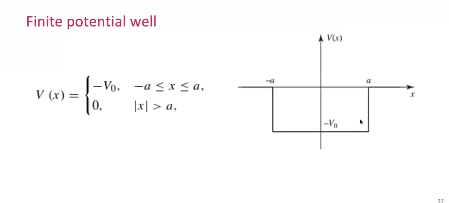
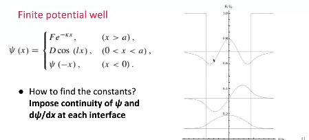
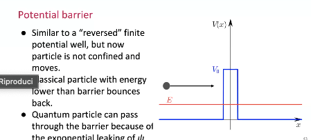
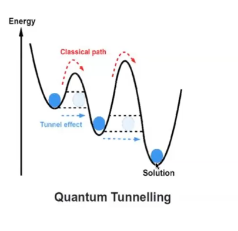
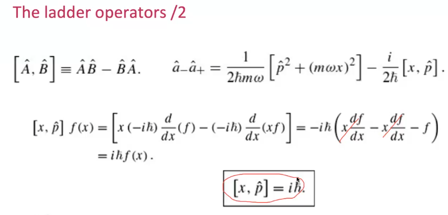

# Table of Contents

- [Table of Contents](#table-of-contents)
- [Introduction to Quantum Mechanics Part 2 – 9/05/2025](#introduction-to-quantum-mechanics-part-2--9052025)
  - [2.1 The Infinite Potential Well (aka "The Particle in a Box")](#21-the-infinite-potential-well-aka-the-particle-in-a-box)
    - [2.1.1 Conclusions](#211-conclusions)
  - [2.3 Finite Potential Well](#23-finite-potential-well)
  - [2.4 Potential Barrier](#24-potential-barrier)
    - [Definition:](#definition)
    - [Schrödinger Equation in Each Region](#schrödinger-equation-in-each-region)
    - [Continuity Conditions](#continuity-conditions)
    - [Physical Insight: Quantum Tunneling](#physical-insight-quantum-tunneling)
    - [Real-World Applications](#real-world-applications)
    - [Quantum Annealing](#quantum-annealing)
  - [2.5 The Quantum Harmonic Oscillator](#25-the-quantum-harmonic-oscillator)
    - [Classical Equation of Motion](#classical-equation-of-motion)
    - [Schrödinger Equation](#schrödinger-equation)
    - [Operator Form and Ladder Operators](#operator-form-and-ladder-operators)
    - [Algebra of Ladder Operators](#algebra-of-ladder-operators)
    - [Commutator Identity](#commutator-identity)
    - [Hamiltonian in terms of Ladder Operators](#hamiltonian-in-terms-of-ladder-operators)
    - [Action of the Ladder Operators](#action-of-the-ladder-operators)
    - [Energy Levels](#energy-levels)

# Introduction to Quantum Mechanics Part 2 – 9/05/2025

## 2.1 The Infinite Potential Well (aka "The Particle in a Box")

We define the potential:

$$
V(x) =
\begin{cases}
0, & 0 \leq x \leq a \\
\infty, & \text{otherwise}
\end{cases}
$$

The time-independent Schrödinger equation becomes:

$$
-\frac{\hbar^2}{2m} \frac{d^2 \psi}{dx^2} = E \psi
\quad \Rightarrow \quad \frac{d^2 \psi}{dx^2} = -k^2 \psi,
\quad \text{with } k = \sqrt{\frac{2mE}{\hbar^2}}
$$

**General solution:**

$$
\psi(x) = A \sin(kx) + B \cos(kx)
$$

Apply boundary conditions:

- $\psi(0) = 0 \Rightarrow B = 0$
- $\psi(a) = 0 \Rightarrow \sin(ka) = 0 \Rightarrow ka = n\pi$

This gives:

$$
k_n = \frac{n\pi}{a}, \quad n = 1, 2, 3, \dots
$$

**Energy levels:**

$$
E_n = \frac{\hbar^2 k_n^2}{2m} = \frac{n^2 \pi^2 \hbar^2}{2 m a^2}
$$

Not all energies are allowed — only discrete values.

**Normalization condition:**

$$
\int_0^a |\psi(x)|^2 dx = 1
\quad \Rightarrow \quad |A|^2 \int_0^a \sin^2\left( \frac{n\pi x}{a} \right) dx = 1
\quad \Rightarrow \quad |A|^2 \cdot \frac{a}{2} = 1
\quad \Rightarrow \quad |A|^2 = \frac{2}{a}
$$

So the normalized wavefunctions are:

$$
\psi_n(x) = \sqrt{\frac{2}{a}} \sin\left( \frac{n\pi x}{a} \right)
$$

**Orthogonality of stationary states:**

For $m \ne n$:

$$
\int_0^a \psi_m(x)^* \psi_n(x) dx =
\frac{2}{a} \int_0^a \sin\left( \frac{m\pi x}{a} \right) \sin\left( \frac{n\pi x}{a} \right) dx = 0
$$

Using trigonometric identities, we have:
$
\int_0^a \sin\left( \frac{m\pi x}{a} \right) \sin\left( \frac{n\pi x}{a} \right) dx =
\frac{1}{2} \int_0^a \left[
\cos\left( \frac{(m - n)\pi x}{a} \right) -
\cos\left( \frac{(m + n)\pi x}{a} \right)
\right] dx
$
over the interval $[0, a]$.

The integral of $\cos\left( \frac{k\pi x}{a} \right)$ over the interval $[0, a]$ is zero for any nonzero integer $k$, so the result is zero for $m \ne n$, confirming orthogonality.

In general:

$$
\int_0^a \psi_m(x)^* \psi_n(x) dx = \delta_{mn}, \quad
\delta_{mn} =
\begin{cases}
1 & m = n \\
0 & m \ne n
\end{cases}
$$

---
### 2.1.1 Conclusions

The “particle in a box” (infinite potential well) is one of the most fundamental models in quantum mechanics. Despite its simplicity, it illustrates several key principles:

1. **Quantization of Energy**  
   The particle cannot have arbitrary energy levels. It can only occupy discrete energy states:
   $$
   E_n = \frac{n^2 \pi^2 \hbar^2}{2ma^2}, \quad n = 1, 2, 3, \dots
   $$
   This is a direct consequence of boundary conditions and wave behavior.

2. **Standing Waves**  
   The wavefunctions are standing sine waves that vanish at the walls of the well:
   $$
   \psi_n(x) = \sqrt{\frac{2}{a}} \sin\left( \frac{n\pi x}{a} \right)
   $$
   These functions represent stationary states of the system.

3. **Zero-Point Energy**  
   The lowest energy is not zero. Even in its ground state ($n = 1$), the particle has energy:
   $$
   E_1 = \frac{\pi^2 \hbar^2}{2ma^2}
   $$
   This reflects the Heisenberg uncertainty principle: the particle cannot be completely at rest.

4. **Orthogonality and Completeness**  
   The eigenfunctions $\psi_n(x)$ form an orthonormal basis for the space of square-integrable functions on $[0, a]$.  
   Any wavefunction can be written as a superposition of these basis states.

5. **No Classical Analog**  
   Unlike classical mechanics, the probability of finding the particle is not uniform.  
   It depends on $|\psi_n(x)|^2$, which varies with position and energy level.

## 2.3 Finite Potential Well

$$
V(x) =
\begin{cases}
0, & -a \leq x \leq a \\
V_0, & \text{otherwise}
\end{cases}
$$

Wavefunction solution:

$$
\psi(x) =
\begin{cases}
B e^{k x}, & x \leq -a \\
C \sin(\ell x) + D \cos(\ell x), & -a \leq x \leq a \\
A e^{-k x}, & x \geq a
\end{cases}
$$

The constants are determined by imposing the continuity of the wavefunction $\psi(x)$ and its first derivative $\frac{d\psi}{dx}$ at each interface ($x = \pm a$):

- Continuity of $\psi(x)$ at $x = -a$ and $x = a$:
  $$
  \psi_{\text{left}}(-a) = \psi_{\text{center}}(-a), \quad \psi_{\text{center}}(a) = \psi_{\text{right}}(a)
  $$

- Continuity of $\frac{d\psi}{dx}$ at $x = -a$ and $x = a$:
  $$
  \left. \frac{d\psi_{\text{left}}}{dx} \right|_{x = -a} = \left. \frac{d\psi_{\text{center}}}{dx} \right|_{x = -a}, \quad
  \left. \frac{d\psi_{\text{center}}}{dx} \right|_{x = a} = \left. \frac{d\psi_{\text{right}}}{dx} \right|_{x = a}
  $$

These boundary conditions lead to a set of equations that determine the allowed energy levels and the coefficients $A$, $B$, $C$, and $D$.

## 2.4 Potential Barrier

The **potential barrier** is another key system in quantum mechanics, useful for understanding tunneling effects.

### Definition:

We consider a potential of the form:

$$
V(x) =
\begin{cases}
0, & x < 0 \\
V_0, & 0 \leq x \leq a \\
0, & x > a
\end{cases}
$$

This models a "barrier" of height $V_0$ and width $a$.

### Schrödinger Equation in Each Region

Let $E$ be the energy of the incoming particle. We solve the time-independent Schrödinger equation in each region.

- **Region I ($x < 0$):** Free particle
  $$
  \psi_I(x) = A e^{ikx} + B e^{-ikx}, \quad k = \frac{\sqrt{2mE}}{\hbar}
  $$

- **Region II ($0 \leq x \leq a$):**
  - If $E > V_0$: oscillatory solution
    $$
    \psi_{II}(x) = C e^{i\kappa x} + D e^{-i\kappa x}, \quad \kappa = \frac{\sqrt{2m(E - V_0)}}{\hbar}
    $$
  - If $E < V_0$: exponential decay
    $$
    \psi_{II}(x) = C e^{\kappa x} + D e^{-\kappa x}, \quad \kappa = \frac{\sqrt{2m(V_0 - E)}}{\hbar}
    $$

- **Region III ($x > a$):**
  $$
  \psi_{III}(x) = F e^{ikx}
  $$

### Continuity Conditions

The wavefunction and its derivative must be continuous at $x = 0$ and $x = a$:

$$
\psi_I(0) = \psi_{II}(0), \quad \psi_{II}(a) = \psi_{III}(a)
$$

$$
\left. \frac{d\psi_I}{dx} \right|_{x=0} = \left. \frac{d\psi_{II}}{dx} \right|_{x=0}, \quad
\left. \frac{d\psi_{II}}{dx} \right|_{x=a} = \left. \frac{d\psi_{III}}{dx} \right|_{x=a}
$$

### Physical Insight: Quantum Tunneling

When $E < V_0$, the solution in Region II becomes evanescent (exponentially decaying), yet the wavefunction is **non-zero** in Region III. This is the essence of **quantum tunneling**: a particle has a nonzero probability to appear on the other side of the barrier, even if classically forbidden.

This effect has profound implications, from alpha decay in nuclear physics to modern electronic devices such as tunnel diodes and quantum tunneling microscopes.

### Real-World Applications

Quantum tunneling is not just a theoretical phenomenon — it has practical uses in modern electronics.

One key application is in the **activation of transistors in circuits**, particularly in devices operating at nanoscale dimensions. When the insulating barrier in a transistor is thin enough, **electrons can tunnel through the barrier**, allowing current to flow even without sufficient classical energy.

This tunneling behavior is fundamental in:

- **Tunnel diodes** – where negative resistance behavior is exploited,
- **Flash memory** – where charge is stored via tunneling through oxide layers,
- **Modern MOSFETs** – where gate leakage due to tunneling is a design constraint at small geometries,
- **Quantum computing** – where quantum tunneling plays a role in qubit manipulation.

These examples show how quantum mechanical effects directly impact electronic design and technology.

### Quantum Annealing

Another powerful application of quantum tunneling is found in **quantum annealers** — specialized quantum computers designed to solve optimization problems.

Quantum annealers, such as those developed by D-Wave Systems, exploit **quantum tunneling** to escape local minima in complex energy landscapes. In classical simulated annealing, a system "jumps" over energy barriers due to thermal fluctuations. In contrast, quantum annealing allows the system to **tunnel through** barriers, potentially reaching the global minimum more efficiently.

This principle is used to solve problems like:

- Optimization of logistics and routing,
- Portfolio optimization in finance,
- Machine learning model training,
- Protein folding and molecular design.

## 2.5 The Quantum Harmonic Oscillator

The harmonic oscillator is one of the most important systems in both classical and quantum physics. It models a particle subject to a restoring force proportional to its displacement:

### Classical Equation of Motion

$$
F = -kx = m \frac{d^2x}{dt^2}
\quad \Rightarrow \quad V(x) = \frac{1}{2} kx^2
$$

The potential energy of the harmonic oscillator is given by:

$$
V(x) = \frac{1}{2} k x^2, \quad \omega \equiv \sqrt{\frac{k}{m}}
$$

Using this, we can rewrite the potential in terms of $\omega$:

$$
V(x) = \frac{1}{2} m \omega^2 x^2
$$

### Schrödinger Equation

We write the time-independent Schrödinger equation:

$$
- \frac{\hbar^2}{2m} \frac{d^2 \psi}{dx^2} + \frac{1}{2} m \omega^2 x^2 \psi = E \psi
$$

Where $\omega = \sqrt{\frac{k}{m}}$.

### Operator Form and Ladder Operators

Define the Hamiltonian operator:

$$
\hat{H} = \frac{1}{2m} \hat{p}^2 + \frac{1}{2} m \omega^2 \hat{x}^2
$$

We introduce the ladder (creation and annihilation) operators:

$$
\hat{a}_\pm \equiv \frac{1}{\sqrt{2 \hbar m \omega}} (\mp i \hat{p} + m \omega \hat{x})
$$

please note that operators doesn't commute

Using these, the Hamiltonian becomes:

$$
\hat{H} = \hbar \omega \left( \hat{a}_+ \hat{a}_- + \frac{1}{2} \right)
$$

### Algebra of Ladder Operators

We can explore further the algebraic structure of the ladder operators using their definitions:

$$
\hat{a}_- \hat{a}_+ = \frac{1}{2\hbar m\omega} (i\hat{p} + m\omega \hat{x})(-i\hat{p} + m\omega \hat{x})
$$

Expanding this product:

$$
\hat{a}_- \hat{a}_+ = \frac{1}{2\hbar m\omega} \left[ \hat{p}^2 + (m\omega \hat{x})^2 - i m\omega (\hat{x} \hat{p} - \hat{p} \hat{x}) \right]
$$

The term $\hat{x} \hat{p} - \hat{p} \hat{x}$ is known as the **commutator**, denoted:

$$
[\hat{x}, \hat{p}] = \hat{x} \hat{p} - \hat{p} \hat{x} = i\hbar
$$

Substituting this back in:

$$
\hat{a}_- \hat{a}_+ = \frac{1}{2\hbar m\omega} \left[ \hat{p}^2 + (m\omega \hat{x})^2 - i m\omega (i\hbar) \right]
= \frac{1}{2\hbar m\omega} \left[ \hat{p}^2 + (m\omega \hat{x})^2 + \hbar m\omega \right]
$$

Hence, the Hamiltonian becomes:

$$
\hat{H} = \hbar \omega \left( \hat{a}_+ \hat{a}_- + \frac{1}{2} \right)
= \frac{1}{2m} \hat{p}^2 + \frac{1}{2} m \omega^2 \hat{x}^2
$$

This confirms the consistency between the algebraic and differential representations of the quantum harmonic oscillator.

The commutator notation in general is defined as:

$$
[\hat{A}, \hat{B}] \equiv \hat{A} \hat{B} - \hat{B} \hat{A}
$$

It encodes fundamental quantum relationships and lies at the heart of quantum algebra.

### Commutator Identity

The fundamental commutator between position and momentum is:

$$
[\hat{x}, \hat{p}] = i \hbar
$$

This implies:

$$
[\hat{a}_-, \hat{a}_+] = 1
$$

### Hamiltonian in terms of Ladder Operators

We have already defined the Hamiltonian using ladder operators as:

$$
\hat{H} = \hbar \omega \left( \hat{a}_+ \hat{a}_- + \frac{1}{2} \right)
$$

Now let's derive expressions for $\hat{a}_- \hat{a}_+$ and $\hat{a}_+ \hat{a}_-$ in terms of the Hamiltonian.

Using the fundamental commutator:

$$
[\hat{a}_-, \hat{a}_+] = 1 \Rightarrow \hat{a}_- \hat{a}_+ = \hat{a}_+ \hat{a}_- + 1
$$

Substitute into the Hamiltonian:

- Starting from:

$$
\hat{H} = \hbar \omega \left( \hat{a}_+ \hat{a}_- + \frac{1}{2} \right)
$$

we rearrange:

$$
\hat{a}_+ \hat{a}_- = \frac{1}{\hbar \omega} \hat{H} - \frac{1}{2}
$$

- Then using the commutator identity:

$$
\hat{a}_- \hat{a}_+ = \hat{a}_+ \hat{a}_- + 1 = \frac{1}{\hbar \omega} \hat{H} - \frac{1}{2} + 1 = \frac{1}{\hbar \omega} \hat{H} + \frac{1}{2}
$$

Thus we obtain the two key identities:

$$
\hat{a}_- \hat{a}_+ = \frac{1}{\hbar \omega} \hat{H} + \frac{1}{2}
$$

$$
\hat{a}_+ \hat{a}_- = \frac{1}{\hbar \omega} \hat{H} - \frac{1}{2}
$$

These relations demonstrate the symmetric structure of the quantum harmonic oscillator and show how energy levels shift under the action of the ladder operators.

### Action of the Ladder Operators

If $\psi$ is an eigenstate of $\hat{H}$ with energy \( E \), then:

We demonstrate the action of the raising operator $\hat{a}_+$ on an eigenstate $\psi$:

$$
\hat{H}(\hat{a}_+ \psi) = \hbar \omega \left( \hat{a}_+ \hat{a}_- + \frac{1}{2} \right)(\hat{a}_+ \psi)
$$

Expand using associativity:

$$
= \hbar \omega \left[ \hat{a}_+ \hat{a}_- \hat{a}_+ + \frac{1}{2} \hat{a}_+ \right] \psi
$$

Use the identity $\hat{a}_- \hat{a}_+ = \hat{a}_+ \hat{a}_- + 1$:

$$
= \hbar \omega \left[ \hat{a}_+ (\hat{a}_- \hat{a}_+ + 1) + \frac{1}{2} \hat{a}_+ \right] \psi
$$

$$
= \hbar \omega \left[ \hat{a}_+ \hat{a}_- \hat{a}_+ + \hat{a}_+ + \frac{1}{2} \hat{a}_+ \right] \psi
$$

Factor out $\hat{a}_+$:

$$
= \hat{a}_+ \left[ \hbar \omega \left( \hat{a}_- \hat{a}_+ + \frac{3}{2} \right) \right] \psi
$$

Since $\hat{H} \psi = E \psi$ and $\hat{a}_- \hat{a}_+ = \frac{1}{\hbar \omega} \hat{H} + \frac{1}{2}$:

$$
\hat{H}(\hat{a}_+ \psi) = \hat{a}_+ (\hat{H} + \hbar \omega) \psi = (E + \hbar \omega)(\hat{a}_+ \psi)
$$

Therefore, $\hat{a}_+ \psi$ is an eigenstate of $\hat{H}$ with energy $E + \hbar \omega$.

So $\hat{a}_+$ raises the energy by $\hbar \omega$, and $\hat{a}_-$ lowers it.

### Energy Levels

The eigenvalues of the harmonic oscillator are:

$$
E_n = \hbar \omega \left( n + \frac{1}{2} \right), \quad n = 0, 1, 2, \dots
$$

This structure reveals equally spaced quantized energy levels — a hallmark of the quantum harmonic oscillator.
This approach avoids solving differential equations and directly constructs the spectrum and eigenstates from operator algebra — a hallmark technique of quantum mechanics.

Instead of solving the differential equation directly, we can take a more elegant algebraic approach using the ladder operators $\hat{a}_\pm$.

We recall that:

$$
\hat{H} = \hbar \omega \left( \hat{a}_+ \hat{a}_- + \frac{1}{2} \right)
$$

Let $\psi_0$ be the **ground state**, i.e., the lowest-energy eigenfunction of $\hat{H}$. Suppose that:

$$
\hat{a}_- \psi_0 = 0
$$

Then:

$$
\hat{H} \psi_0 = \hbar \omega \left( \hat{a}_+ \hat{a}_- + \frac{1}{2} \right) \psi_0 = \frac{1}{2} \hbar \omega \psi_0
$$

So the **ground state energy** is:

$$
E_0 = \frac{1}{2} \hbar \omega
$$

We can now generate excited states by applying the **raising operator** repeatedly:

$$
\psi_n = \frac{1}{\sqrt{n!}} (\hat{a}_+)^n \psi_0
$$

Each application increases the energy by $\hbar \omega$:

$$
\hat{H} \psi_n = \hbar \omega \left(n + \frac{1}{2} \right) \psi_n
$$

Thus, the energy eigenvalues are:

$$
E_n = \hbar \omega \left(n + \frac{1}{2} \right), \quad n = 0, 1, 2, \dots
$$

This approach avoids solving differential equations and directly constructs the spectrum and eigenstates from operator algebra — a hallmark technique of quantum mechanics.

