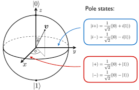
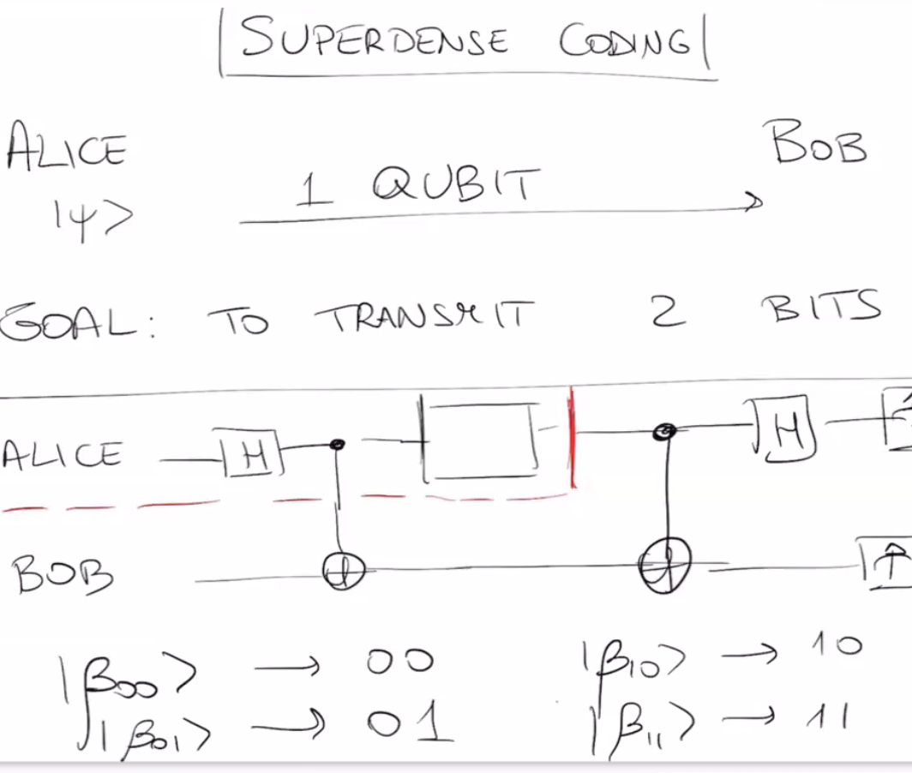
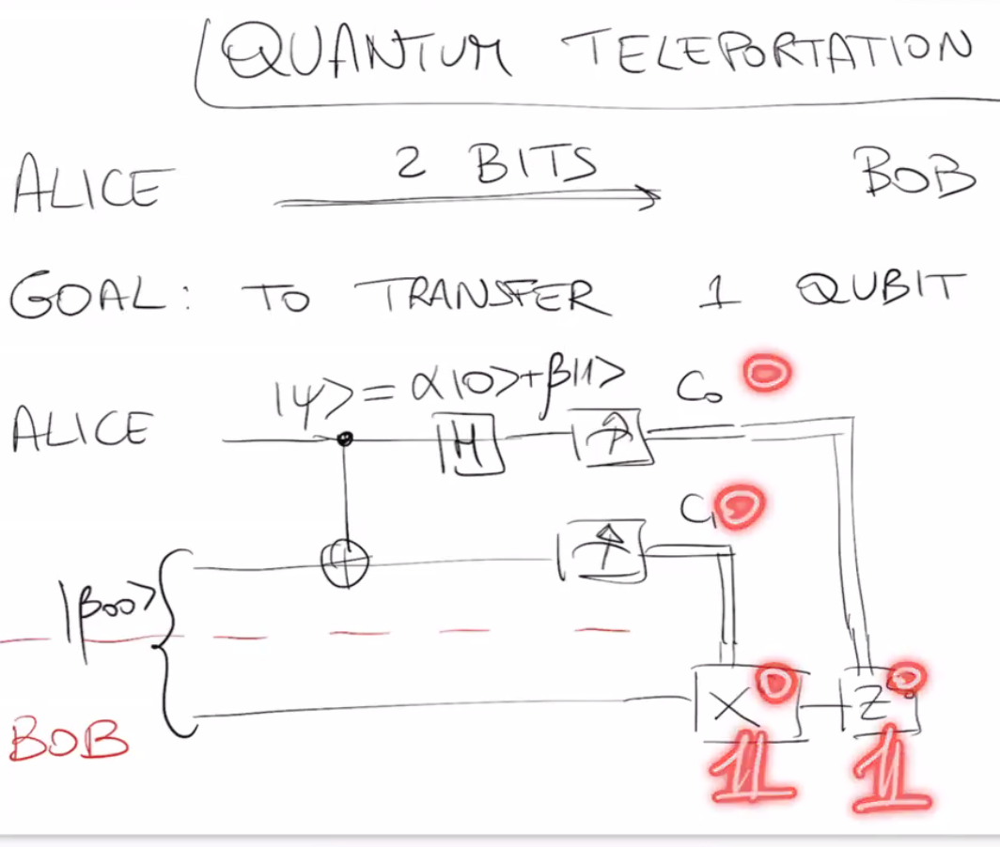

# Quantum Communication Notes

## Table of Contents

0. [Qubit State Representation in Dirac Notation](#qubit-state-representation-in-dirac-notation)
1. [Common Quantum Gates](#common-quantum-gates)
   - [Hadamard Gate](#hadamard-gate-h)
     - [General Expression for Hadamard on $|x\rangle$](#general-expression-for-hadamard-on-xrangle)
     - [Circuit Representation](#circuit-representation)
     - [Generalization to m-Qubit Hadamard Transform](#generalization-to-m-qubit-hadamard-transform)
       - [Bitwise Dot Product Explained](#bitwise-dot-product-explained)
2. [Representing a 2-Qubit State](#representing-a-2-qubit-state)
   - [Composing Quantum Gates for 2-Qubit Systems](#composing-quantum-gates-for-2-qubit-systems)
   - [Product States vs. Generic States](#product-states-vs-generic-states)
   - [Example: Transformation on a 2-Qubit State](#example-transformation-on-a-2-qubit-state)
3. [Creating Entanglement with H + CNOT](#creating-entanglement-with-h--cnot)
4. [Bell States](#bell-states)
5. [Superdense Coding](#superdense-coding)
   - [How the Circuit Works](#how-the-circuit-works)
   - [Matrix Formulation](#matrix-formulation)
6. [Quantum Teleportation](#quantum-teleportation)
   - [How the Protocol Works](#how-the-protocol-works)
7. [No-Cloning Theorem](#no-cloning-theorem)
   - [Statement](#statement)
   - [Consequences](#consequences)

## Qubit State Representation in Dirac Notation

A qubit is a vector in a two-dimensional complex vector space and can be represented in Dirac (bra-ket) notation as a superposition of the basis states $|0\rangle$ and $|1\rangle$:

$$
|\psi\rangle = \alpha|0\rangle + \beta|1\rangle
$$

where $\alpha, \beta \in \mathbb{C}$ and $|\alpha|^2 + |\beta|^2 = 1$ for normalization.

### Examples

- **Basis state |0⟩**:
  $$
  |0\rangle = \begin{bmatrix} 1 \\ 0 \end{bmatrix}
  $$

- **Basis state |1⟩**:
  $$
  |1\rangle = \begin{bmatrix} 0 \\ 1 \end{bmatrix}
  $$

- **Superposition state |+⟩**:
  $$
  |+\rangle = \frac{1}{\sqrt{2}}(|0\rangle + |1\rangle) = \frac{1}{\sqrt{2}} \begin{bmatrix} 1 \\ 1 \end{bmatrix}
  $$

- **Superposition state |−⟩**:
  $$
  |-\rangle = \frac{1}{\sqrt{2}}(|0\rangle - |1\rangle) = \frac{1}{\sqrt{2}} \begin{bmatrix} 1 \\ -1 \end{bmatrix}
  $$

- **State with complex phase**:
  $$
  |\psi\rangle = \frac{1}{\sqrt{2}}(|0\rangle + i|1\rangle) = \frac{1}{\sqrt{2}} \begin{bmatrix} 1 \\ i \end{bmatrix}
  $$

- **General state on Bloch Sphere**:
  $$
  |\psi\rangle = \cos\left(\frac{\theta}{2}\right)|0\rangle + e^{i\phi} \sin\left(\frac{\theta}{2}\right)|1\rangle
  $$

  where $\theta \in [0, \pi]$ and $\phi \in [0, 2\pi]$.

## Common Quantum Gates

In quantum computing, gates are unitary matrices that act on qubit states to perform operations. Among the most fundamental are:

- **Pauli-X Gate (NOT Gate)**:
  - Swaps |0⟩ and |1⟩.
  - Matrix form:
    $$
    X = \begin{bmatrix} 0 & 1 \\ 1 & 0 \end{bmatrix}
    $$

  **Example**: Applying X to $|0⟩$:
  $$
  X|0\rangle = 
  \begin{bmatrix}
  0 & 1 \\
  1 & 0
  \end{bmatrix}
  \begin{bmatrix}
  1 \\
  0
  \end{bmatrix}
  =
  \begin{bmatrix}
  0 \\
  1
  \end{bmatrix}
  = |1\rangle
  $$

---

- **Pauli-Z Gate**:
  - Applies a phase flip to the |1⟩ state.
  - Matrix form:
    $$
    Z = \begin{bmatrix} 1 & 0 \\ 0 & -1 \end{bmatrix}
    $$

  **Example**: Applying Z to $|1⟩$:
  $$
  Z|1\rangle = 
  \begin{bmatrix}
  1 & 0 \\
  0 & -1
  \end{bmatrix}
  \begin{bmatrix}
  0 \\
  1
  \end{bmatrix}
  =
  \begin{bmatrix}
  0 \\
  -1
  \end{bmatrix}
  = -|1\rangle
  $$

  **Example**: Applying Z to $|+\rangle$ and $|-\rangle$:

  Recall:
  $$
  |+\rangle = \frac{1}{\sqrt{2}} \begin{bmatrix} 1 \\ 1 \end{bmatrix}, \quad |-\rangle = \frac{1}{\sqrt{2}} \begin{bmatrix} 1 \\ -1 \end{bmatrix}
  $$

  - Applying $Z$ to $|+\rangle$:
    $$
    Z|+\rangle = \begin{bmatrix} 1 & 0 \\ 0 & -1 \end{bmatrix} \frac{1}{\sqrt{2}} \begin{bmatrix} 1 \\ 1 \end{bmatrix}
    = \frac{1}{\sqrt{2}} \begin{bmatrix} 1 \\ -1 \end{bmatrix}
    = |-\rangle
    $$

  - Applying $Z$ to $|-\rangle$:
    $$
    Z|-\rangle = \begin{bmatrix} 1 & 0 \\ 0 & -1 \end{bmatrix} \frac{1}{\sqrt{2}} \begin{bmatrix} 1 \\ -1 \end{bmatrix}
    = \frac{1}{\sqrt{2}} \begin{bmatrix} 1 \\ 1 \end{bmatrix}
    = |+\rangle
    $$

  **Interpretation:**  
  The Pauli-Z gate flips the sign of the $|1\rangle$ component, which swaps the $|+\rangle$ and $|-\rangle$ states.

---

- **Hadamard Gate (H)**:
  - Creates equal superpositions of |0⟩ and |1⟩, mapping computational basis to superposition basis.
  - Matrix form:
    $$
    H = \frac{1}{\sqrt{2}} \begin{bmatrix} 1 & 1 \\ 1 & -1 \end{bmatrix}
    $$

**Example**: Applying H to $|0\rangle$:
$$
H|0\rangle = \frac{1}{\sqrt{2}} 
\begin{bmatrix} 
1 & 1 \\ 
1 & -1 
\end{bmatrix}
\begin{bmatrix} 
1 \\ 
0 
\end{bmatrix} 
= \frac{1}{\sqrt{2}} 
\begin{bmatrix} 
1 \\ 
1 
\end{bmatrix} 
= \frac{|0\rangle + |1\rangle}{\sqrt{2}}
$$

**Notation:**  
The state $|+\rangle$ is defined as:
$$
|+\rangle = \frac{1}{\sqrt{2}}(|0\rangle + |1\rangle)
$$

**Calculation for $|1\rangle$:**

Applying the Hadamard gate to $|1\rangle$:
$$
H|1\rangle = \frac{1}{\sqrt{2}}
\begin{bmatrix}
1 & 1 \\
1 & -1
\end{bmatrix}
\begin{bmatrix}
0 \\
1
\end{bmatrix}
= \frac{1}{\sqrt{2}}
\begin{bmatrix}
1 \\
-1
\end{bmatrix}
= |-\rangle
$$

**Notation:**  
The state $|-\rangle$ is defined as:
$$
|-\rangle = \frac{1}{\sqrt{2}}(|0\rangle - |1\rangle)
$$

**Probability Calculation**

After applying the Hadamard gate to $|0\rangle$, the resulting state is:
$$
|\psi\rangle = \frac{1}{\sqrt{2}}(|0\rangle + |1\rangle)
$$

The probability of measuring $|0\rangle$ is:
$$
P(0) = |\langle 0 | \psi \rangle|^2 = \left| \frac{1}{\sqrt{2}} \right|^2 = \frac{1}{2}
$$

The probability of measuring $|1\rangle$ is:
$$
P(1) = |\langle 1 | \psi \rangle|^2 = \left| \frac{1}{\sqrt{2}} \right|^2 = \frac{1}{2}
$$

Thus, after applying the Hadamard gate to $|0\rangle$, there is an equal probability (50%) of measuring either $|0\rangle$ or $|1\rangle$.

---

### General Expression for Hadamard on $|x\rangle$

The Hadamard gate acts on a single qubit $|x\rangle$, where $x \in \{0, 1\}$, as follows:

$$
H|x\rangle = \frac{1}{\sqrt{2}} \left( |0\rangle + (-1)^x |1\rangle \right)
$$

This compact expression shows how the Hadamard gate transforms the computational basis states into the superposition basis.

### Circuit Representation

If you have a qubit in state $|x_1\rangle$ or $|x_2\rangle$, the output after applying a Hadamard gate is:

- For $|x_1\rangle$:

$$
|x_1\rangle \xrightarrow{H} \frac{1}{\sqrt{2}} \left( |0\rangle + (-1)^{x_1} |1\rangle \right)
$$

- For $|x_2\rangle$:

$$
|x_2\rangle \xrightarrow{H} \frac{1}{\sqrt{2}} \left( |0\rangle + (-1)^{x_2} |1\rangle \right)
$$

This notation is helpful in expressing quantum algorithms like Deutsch-Jozsa or Bernstein-Vazirani.

---

### Generalization to m-Qubit Hadamard Transform

For a computational basis state of \( m \) qubits, written as:

$$
|X\rangle = |x_1 x_2 \dots x_m\rangle = |x_1\rangle \otimes |x_2\rangle \otimes \dots \otimes |x_m\rangle
$$

applying a Hadamard gate to each qubit results in:

$$
H^{\otimes m} |X\rangle = \frac{1}{\sqrt{2^m}} \sum_{r \in \{0,1\}^m} (-1)^{x \cdot r} |r\rangle
$$

where:
- $x = (x_1, x_2, \dots, x_m)$,
- $r$ is an $m$-bit string,
- $x \cdot r = \sum_{i=1}^{m} x_i r_i \mod 2$ is the bitwise dot product modulo 2.

---

#### Bitwise Dot Product Explained

The expression $x \cdot r$ represents a **bitwise dot product modulo 2** between two $m$-bit binary strings $x$ and $r$. It is computed as follows:

1. Multiply each corresponding pair of bits:
   $$
   (x_1 r_1, x_2 r_2, \dots, x_m r_m)
   $$

2. Sum the results:
   $$
   \sum_{i=1}^{m} x_i r_i
   $$

3. Take the modulo 2 of the sum:
   $$
   x \cdot r = \left( \sum_{i=1}^{m} x_i r_i \right) \mod 2
   $$

The result is either 0 or 1, and is used as the exponent in $(-1)^{x \cdot r}$ to determine the sign of the term $|r\rangle$ in the Hadamard transform expansion.

---

This generalization is fundamental in quantum algorithms like Bernstein-Vazirani and Simon's algorithm.

### Representing a 2-Qubit State

A general 2-qubit state is a quantum state in a 4-dimensional complex Hilbert space. It can be written as a linear combination of the four computational basis states:

$$
|\psi\rangle = a_{00}|00\rangle + a_{01}|01\rangle + a_{10}|10\rangle + a_{11}|11\rangle
$$

where $a_{ij} \in \mathbb{C}$ and the normalization condition holds:

$$
|a_{00}|^2 + |a_{01}|^2 + |a_{10}|^2 + |a_{11}|^2 = 1
$$

This state can also be represented as a column vector:

$$
|\psi\rangle = \begin{bmatrix} a_{00} \\ a_{01} \\ a_{10} \\ a_{11} \end{bmatrix} \in \mathbb{C}^{4 \times 1}
$$

### Composing Quantum Gates for 2-Qubit Systems

To apply quantum gates to multi-qubit systems, we use the **tensor product** (denoted ⊗) to build larger gate matrices from smaller ones. This is how we extend single-qubit gates to multi-qubit systems.

#### Identity on Two Qubits

Applying the identity \( I \) to both qubits:

$$
I \otimes I = 
\begin{bmatrix} 1 & 0 \\ 0 & 1 \end{bmatrix} \otimes
\begin{bmatrix} 1 & 0 \\ 0 & 1 \end{bmatrix}
=
\begin{bmatrix}
1 & 0 & 0 & 0 \\
0 & 1 & 0 & 0 \\
0 & 0 & 1 & 0 \\
0 & 0 & 0 & 1
\end{bmatrix}
$$

#### Applying Pauli-X to the First Qubit

$$
X \otimes I =
\begin{bmatrix} 0 & 1 \\ 1 & 0 \end{bmatrix} \otimes
\begin{bmatrix} 1 & 0 \\ 0 & 1 \end{bmatrix}
=
\begin{bmatrix}
0 & 0 & 1 & 0 \\
0 & 0 & 0 & 1 \\
1 & 0 & 0 & 0 \\
0 & 1 & 0 & 0
\end{bmatrix}
$$

This allows us to apply gates selectively to one qubit within a multi-qubit register.

## Product States vs. Generic States

In quantum mechanics, especially when working with multiple qubits, it is essential to distinguish between **product states** and **generic (entangled or non-product) states**.

### Product States

A product state is a multi-qubit state that can be written as the tensor product of individual qubit states. For two qubits:

$$
|\psi\rangle = |\psi_1\rangle \otimes |\psi_2\rangle
$$

where:
$$
|\psi_1\rangle = \alpha|0\rangle + \beta|1\rangle \\
|\psi_2\rangle = \gamma|0\rangle + \delta|1\rangle
$$

Then:
$$
|\psi\rangle = (\alpha|0\rangle + \beta|1\rangle) \otimes (\gamma|0\rangle + \delta|1\rangle) = \alpha\gamma|00\rangle + \alpha\delta|01\rangle + \beta\gamma|10\rangle + \beta\delta|11\rangle
$$

This form shows that the overall state is fully determined by the states of the individual qubits.

### Generic States

A generic 2-qubit state takes the form:

$$
|\psi\rangle = a_{00}|00\rangle + a_{01}|01\rangle + a_{10}|10\rangle + a_{11}|11\rangle
$$

where the coefficients $a_{ij} \in \mathbb{C}$ are arbitrary (subject to normalization).

If **this state cannot be written as a product** of two single-qubit states, then it is **entangled**.

### Example of Entangled State

The Bell state:

$$
|\Phi^+\rangle = \frac{1}{\sqrt{2}}(|00\rangle + |11\rangle)
$$

is **not** a product state — it is entangled, and the qubits cannot be described independently.

### Summary

- **Product state**: qubits are independent.
- **Generic/entangled state**: qubits are correlated in a quantum way and cannot be separated into individual components.

### Example: Transformation on a 2-Qubit State

Consider the initial 2-qubit state:
$$
|00\rangle = \begin{bmatrix} 1 \\ 0 \\ 0 \\ 0 \end{bmatrix}
$$

Apply the Hadamard gate to the first qubit and Identity to the second:
$$
(H \otimes I)|00\rangle = 
\left( \frac{1}{\sqrt{2}} \begin{bmatrix}
1 & 0 & 1 & 0 \\
0 & 1 & 0 & 1 \\
1 & 0 & -1 & 0 \\
0 & 1 & 0 & -1
\end{bmatrix} \right)
\begin{bmatrix} 1 \\ 0 \\ 0 \\ 0 \end{bmatrix}
=
\frac{1}{\sqrt{2}} \begin{bmatrix} 1 \\ 0 \\ 1 \\ 0 \end{bmatrix}
$$

This corresponds to the superposition state:
$$
\frac{1}{\sqrt{2}} (|00\rangle + |10\rangle)
$$

Now apply a Pauli-Z gate to the second qubit:
$$
(I \otimes Z)\left( \frac{1}{\sqrt{2}} \begin{bmatrix} 1 \\ 0 \\ 1 \\ 0 \end{bmatrix} \right)
=
\frac{1}{\sqrt{2}} \begin{bmatrix} 1 \\ 0 \\ -1 \\ 0 \end{bmatrix}
$$

Which represents:
$$
\frac{1}{\sqrt{2}} (|00\rangle - |10\rangle)
$$

## Controlled Gates and the CNOT

In multi-qubit quantum circuits, a very important class of operations are **controlled gates**. These gates apply a quantum operation (like X, Z, or H) to a **target qubit** only when a **control qubit** is in the state $|1\rangle$

A general controlled gate is denoted as **C-U**, meaning that a unitary operation \( U \) is applied to the target qubit only if the control qubit is in the state $|1\rangle$. The action on a 2-qubit input state $|x\rangle \otimes |y\rangle$ is:

$$
|x\rangle|y\rangle \longrightarrow |x\rangle \, U^x |y\rangle
$$

where $x \in \{0,1\}$. This notation indicates that if the control qubit is $|0\rangle$, nothing happens, and if it's $|1\rangle$, the unitary $U$ is applied to the target.

In multi-qubit quantum circuits, a very important class of operations are **controlled gates**. These gates apply a quantum operation (like X, Z, or H) to a **target qubit** only when a **control qubit** is in the state $|1\rangle$

### CNOT Gate (Controlled-NOT)

The **CNOT gate** flips the state of the target qubit if the control qubit is $|1\rangle$. Its matrix in the computational basis:

$$
\{ |00\rangle, |01\rangle, |10\rangle, |11\rangle \}
$$

is:

$$
\text{CNOT} =
\begin{bmatrix}
1 & 0 & 0 & 0 \\
0 & 1 & 0 & 0 \\
0 & 0 & 0 & 1 \\
0 & 0 & 1 & 0
\end{bmatrix}
$$

### Action

$$
\begin{aligned}
|00\rangle &\rightarrow |00\rangle \\
|01\rangle &\rightarrow |01\rangle \\
|10\rangle &\rightarrow |11\rangle \\
|11\rangle &\rightarrow |10\rangle
\end{aligned}
$$

The CNOT gate is commonly used to create **entanglement** between qubits (e.g., in Bell states), and is a fundamental building block in many quantum algorithms and protocols.

## Creating Entanglement with H + CNOT

## Bell States

The **Bell states** (also known as EPR pairs) are a set of four maximally entangled 2-qubit states that form an orthonormal basis of the 2-qubit Hilbert space. They are:

$$
\begin{aligned}
|\beta_{00}\rangle &= \frac{1}{\sqrt{2}} (|00\rangle + |11\rangle) \\
|\beta_{01}\rangle &= \frac{1}{\sqrt{2}} (|01\rangle + |10\rangle) \\
|\beta_{10}\rangle &= \frac{1}{\sqrt{2}} (|00\rangle - |11\rangle) \\
|\beta_{11}\rangle &= \frac{1}{\sqrt{2}} (|01\rangle - |10\rangle)
\end{aligned}
$$

These states are important because:
- They are **maximally entangled**: measurement of one qubit instantaneously determines the state of the other.
- They form an **orthonormal basis** for the 2-qubit state space.
- They are used in protocols such as **superdense coding**, **quantum teleportation**, and **entanglement swapping**.

A common method to create an entangled state is by applying a **Hadamard gate** followed by a **CNOT gate** on two qubits.

### Step-by-step

Start with the initial state:

$$
|00\rangle = \begin{bmatrix} 1 \\ 0 \\ 0 \\ 0 \end{bmatrix}
$$

1. **Apply Hadamard to the first qubit**:

$$
(H \otimes I)|00\rangle = \frac{1}{\sqrt{2}}(|00\rangle + |10\rangle)
$$

2. **Apply CNOT** (control: qubit 0, target: qubit 1):

$$
\text{CNOT} \left( \frac{1}{\sqrt{2}}(|00\rangle + |10\rangle) \right) = \frac{1}{\sqrt{2}}(|00\rangle + |11\rangle)
$$

This is the **Bell state** $|\Phi^+\rangle$, an entangled state.

$$
|\Phi^+\rangle = \frac{1}{\sqrt{2}}(|00\rangle + |11\rangle)
$$

This combination (H followed by CNOT) is used frequently to generate entanglement in quantum algorithms and communication protocols.

# Superdense Coding

Superdense coding is a quantum communication protocol that allows the transmission of two classical bits using only one qubit, provided that the communicating parties share an entangled pair in advance. This method leverages quantum entanglement and specific unitary operations to encode and decode classical information efficiently.

## How the Circuit Works

1. **Entanglement Setup**: 
   - A pair of qubits is prepared in a maximally entangled Bell state, such as:
     $$
     |\Phi^+\rangle = \frac{1}{\sqrt{2}}(|00\rangle + |11\rangle)
     $$
   - One qubit is given to Alice and the other to Bob.

2. **Encoding by Alice**:
   - Alice wants to send two classical bits (00, 01, 10, or 11).
   - She applies one of the following gates to her qubit depending on the message:
     - 00: Identity (I)
     - 01: Pauli-X (X)
     - 10: Pauli-Z (Z)
     - 11: Pauli-X followed by Pauli-Z (XZ)

3. **Transmission**:
   - Alice sends her modified qubit to Bob.

4. **Decoding by Bob**:
   - Bob now possesses both qubits.
   - He applies a CNOT gate (control: Alice’s qubit, target: his own), then a Hadamard gate to Alice’s qubit. This Hadamard is needed in order to 
   - Finally, he measures both qubits. The result corresponds to the original two-bit message.
   - This combination of gates is used because, together, they transform the Bell basis into the computational basis:
  
  $$
  \text{Bell basis} \xrightarrow{\text{CNOT + H}} \text{Computational basis}
  $$

  ### Matrix Formulation
To understand how superdense coding works mathematically, we start with the entangled Bell state:

$$
|\Phi^+\rangle = \frac{1}{\sqrt{2}} (|00\rangle + |11\rangle) = \frac{1}{\sqrt{2}} \begin{bmatrix} 1 \\ 0 \\ 0 \\ 1 \end{bmatrix}
$$

Alice encodes her 2 classical bits by applying a gate to her qubit (the first qubit):

- 00: Identity  
- 01: $X \otimes I$  
- 10: $Z \otimes I$  
- 11: $XZ \otimes I = iY \otimes I$

Each operation transforms the shared state into one of the 4 Bell states:

$$
\begin{align*}
I \otimes I &: \frac{1}{\sqrt{2}} \begin{bmatrix} 1 \\ 0 \\ 0 \\ 1 \end{bmatrix} = |\Phi^+\rangle \\
X \otimes I &: \frac{1}{\sqrt{2}} \begin{bmatrix} 0 \\ 1 \\ 1 \\ 0 \end{bmatrix} = |\Psi^+\rangle \\
Z \otimes I &: \frac{1}{\sqrt{2}} \begin{bmatrix} 1 \\ 0 \\ 0 \\ -1 \end{bmatrix} = |\Phi^-\rangle \\
XZ \otimes I &: \frac{1}{\sqrt{2}} \begin{bmatrix} 0 \\ 1 \\ -1 \\ 0 \end{bmatrix} = |\Psi^-\rangle
\end{align*}
$$

When Bob receives the modified qubit, he performs:

1. **CNOT** with Alice's qubit as control and his as target.
2. **Hadamard** on Alice's qubit.
The action of the CNOT and Hadamard gates can be represented as matrices acting on the 2-qubit state.

Let the CNOT gate (control qubit: 0, target: 1) be:

$$
\text{CNOT} =
\begin{bmatrix}
1 & 0 & 0 & 0 \\
0 & 1 & 0 & 0 \\
0 & 0 & 0 & 1 \\
0 & 0 & 1 & 0 \\
\end{bmatrix}
$$

And the Hadamard on qubit 0 (tensor product with identity) is:

$$
H \otimes I =
\frac{1}{\sqrt{2}}
\begin{bmatrix}
1 & 0 & 1 & 0 \\
0 & 1 & 0 & 1 \\
1 & 0 & -1 & 0 \\
0 & 1 & 0 & -1 \\
\end{bmatrix}
$$

Applying $H \otimes I$ followed by CNOT to the Bell states maps them to:

$$
\begin{align*}
|\Phi^+\rangle &\rightarrow |00\rangle \\
|\Psi^+\rangle &\rightarrow |01\rangle \\
|\Phi^-\rangle &\rightarrow |10\rangle \\
|\Psi^-\rangle &\rightarrow |11\rangle \\
\end{align*}
$$

This conversion allows Bob to directly measure in the computational basis and retrieve the classical bit pair sent by Alice.

These operations transform the Bell basis into the computational basis:

$$
\text{Bell basis} \xrightarrow{\text{CNOT + H}} \text{Computational basis}
$$

After measurement, Bob obtains $|00\rangle$, $|01\rangle$, $|10\rangle$, or $|11\rangle$, retrieving the 2 classical bits Alice intended to send.

# Quantum Teleportation

Quantum teleportation is a protocol that allows the transfer of a quantum state from one qubit to another distant qubit, without physically sending the qubit itself. It relies on entanglement and classical communication to accomplish this.

## How the Protocol Works

1. **Entangled Pair**:
  - Alice and Bob share an entangled pair of qubits prepared in the Bell state:  
    $$|\Phi^+\rangle = \frac{1}{\sqrt{2}} (|00\rangle + |11\rangle)$$

2. **State Preparation**:
   - Alice has a third qubit in an unknown state $(|\psi\rangle = \alpha|0\rangle + \beta|1\rangle$ that she wants to teleport to Bob.

3. **Bell Measurement**:
   - Alice performs a Bell basis measurement on her two qubits: the one in state $\psi\rangle$ and her half of the entangled pair.

4. **Classical Communication**:
   - Alice sends the result of her measurement (2 classical bits) to Bob.

5. **Recovery**:
   - Based on the received bits, Bob applies a corresponding gate (I, X, Z, or XZ) to his qubit to recover the original state $|\psi\rangle$

This protocol does not violate causality or faster-than-light communication because it requires classical communication, but it demonstrates the power of quantum entanglement and measurement in transferring quantum information.

# No-Cloning Theorem

The no-cloning theorem is a fundamental result in quantum information theory. It states that it is impossible to create an identical copy of an arbitrary unknown quantum state.

## Statement

There is no unitary operation (or more generally, no quantum process) that can take an unknown state $|\psi\rangle$ and a blank state $|0\rangle$ and produce two copies of $|\psi\rangle$:

$$
U(|\psi\rangle \otimes |0\rangle) \neq |\psi\rangle \otimes |\psi\rangle
$$

for all possible $|\psi\rangle$.

## Consequences

- **No perfect copying** of quantum information.
- **Security**: This underpins the security of quantum cryptography protocols (e.g., BB84), because an eavesdropper cannot clone qubits to measure them without disturbing the original state.
- **Quantum error correction** must use entanglement and redundancy in more subtle ways than classical repetition codes.

This theorem highlights a key difference between classical and quantum information and is central to the design of quantum communication systems.