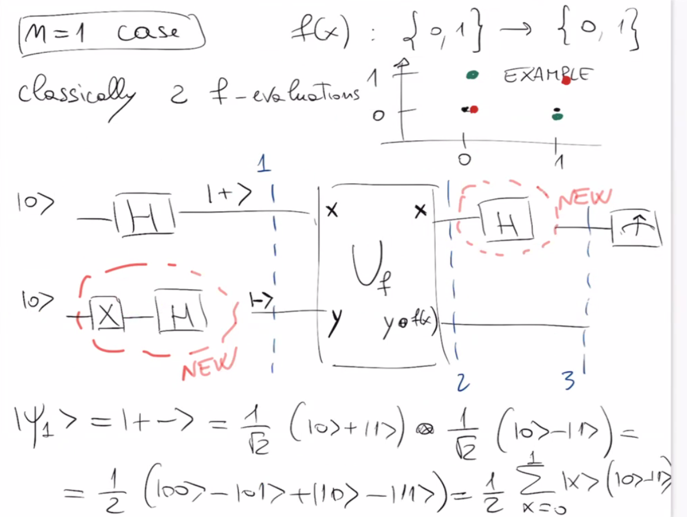
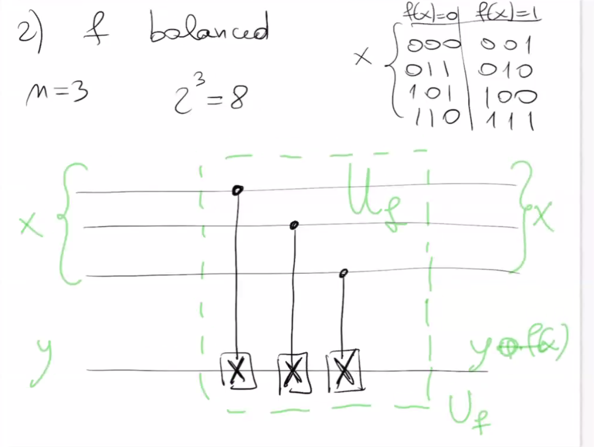
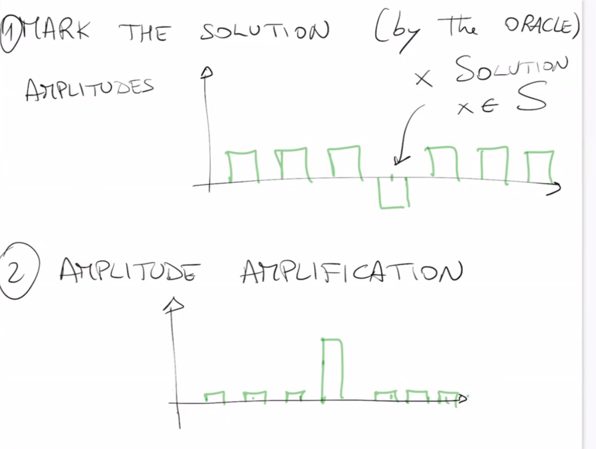
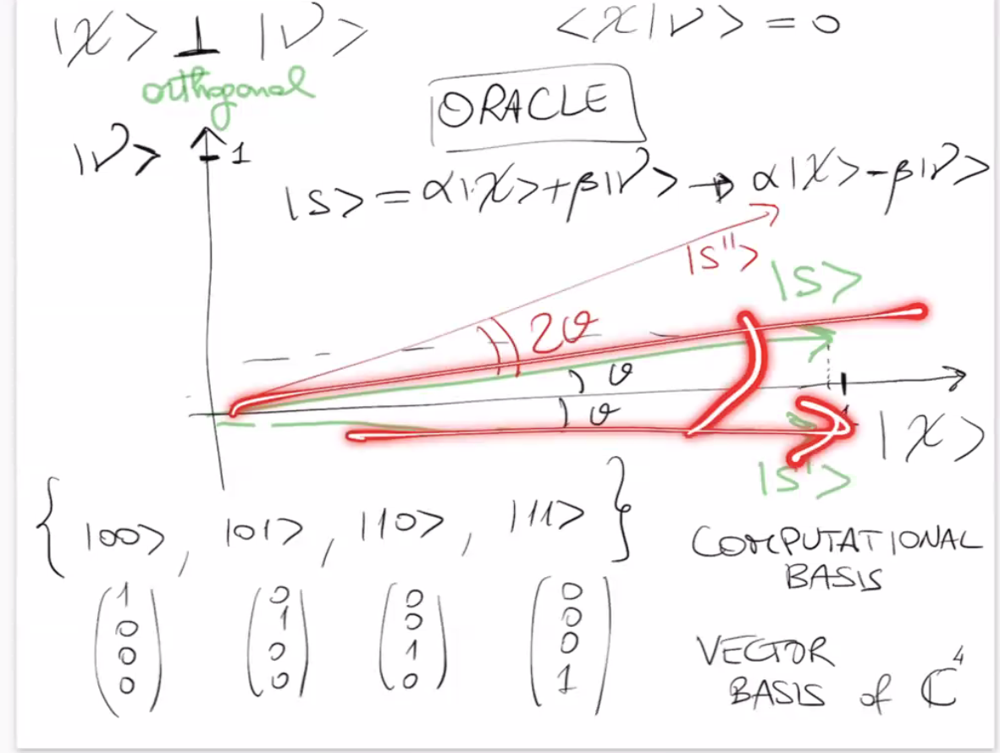
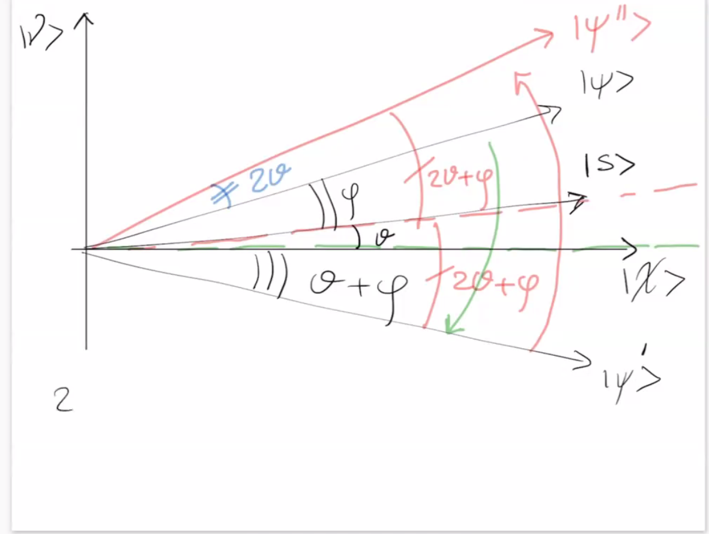
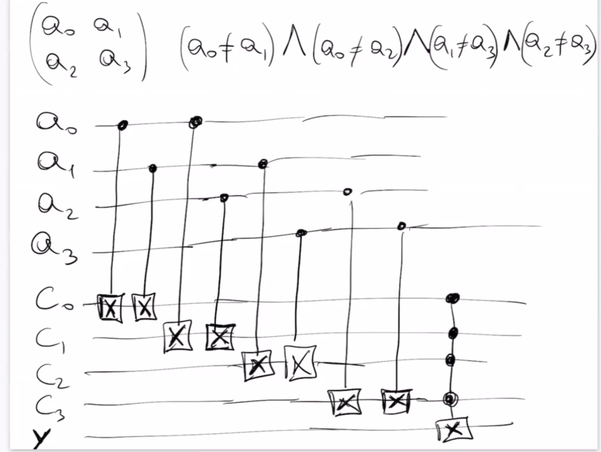
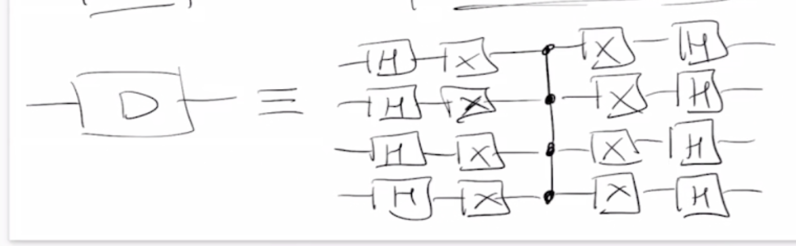
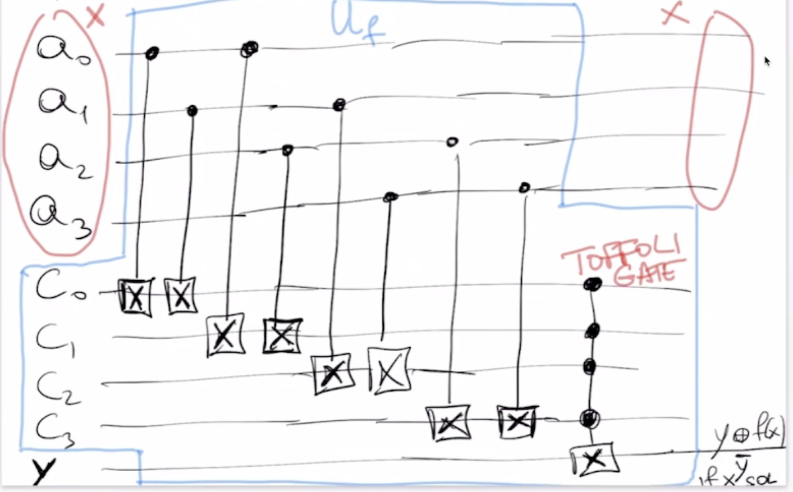

## Table of Contents

1. [Quantum Parallelism](#quantum-parallelism)  
   1.1 [Superposition and Function Evaluation](#superposition-and-function-evaluation)  
   1.2 [Applications](#applications)  
   1.3 [Mathematical Formulation](#mathematical-formulation)  
   1.4 [Definition of $U_f$](#definition-of-u_f)  
   1.5 [Example: Action of $U_f$](#example-action-of-u_f)  
   1.6 [Example: $U_f$ for a Specific 2-bit to 1-bit Function](#example-u_f-for-a-specific-2-bit-to-1-bit-function)  

2. [Quantum Oracle Circuits](#quantum-oracle-circuits)  
   2.1 [Step-by-Step Oracle Preparation](#step-by-step-oracle-preparation)  
   2.2 [Purpose](#purpose)

3. [Deutsch–Jozsa Algorithm](#deutsch–jozsa-algorithm)  
   3.1 [Problem Definition](#problem-definition)  
   3.2 [Why it matters](#why-it-matters)  
   3.3 [Single-Qubit Example](#single-qubit-example)  
   3.4 [Understanding Interference and Why It Works](#understanding-interference-and-why-it-works)  
   3.5 [Oracle Types and Problem Classes](#oracle-types-and-problem-classes)  

4. [Constructing Oracles for Deutsch–Jozsa](#constructing-oracles-for-deutsch–jozsa)  

5. [Search Problems](#search-problems)  

6. [Grover's Algorithm](#grovers-algorithm)  
   6.1 [Problem Setting](#problem-setting)  
   6.2 [Key Steps of Grover’s Algorithm](#key-steps-of-grovers-algorithm)  
   6.3 [Quantum Circuit](#quantum-circuit)  
   6.4 [Amplitude Amplification](#amplitude-amplification)  
   6.5 [Geometrical View of Grover's Algorithm](#geometrical-view-of-grovers-algorithm)

8. [Grover Oracle](#grover-oracle)

9. [Grover Applied to Binary Sudoku](#grover-applied-to-binary-sudoku)


## Quantum Parallelism

Quantum parallelism is a fundamental concept in quantum computing that allows a quantum computer to evaluate a function on many different inputs simultaneously. This is made possible by the superposition principle of quantum mechanics.

### Superposition and Function Evaluation

Suppose we have a quantum register in a superposition of all possible input values:

$$
\frac{1}{\sqrt{N}} \sum_{x=0}^{N-1} |x\rangle
$$

If we apply a quantum operation that computes a function $f(x)$ and stores the result in another register, we get:

$$
\frac{1}{\sqrt{N}} \sum_{x=0}^{N-1} |x\rangle |f(x)\rangle
$$

This state represents the evaluation of $f$ on all inputs $x$ in parallel. However, it is important to note that we cannot directly observe all results at once. Measurement collapses the state to a single outcome. The power of quantum parallelism is harnessed through interference, which is used by quantum algorithms to amplify correct answers and suppress incorrect ones.

### Applications

Quantum parallelism is a core component of algorithms like:

- **Deutsch-Jozsa algorithm**: Determines whether a function is constant or balanced with a single evaluation.
- **Grover's algorithm**: Searches an unsorted database faster than any classical counterpart.
- **Shor's algorithm**: Factors integers efficiently using the Quantum Fourier Transform.


### Mathematical Formulation

Consider a function:

$$
f(x): \{0,1\}^m \rightarrow \{0,1\}
$$

This is an $m$-to-$1$ bit function, where $x$ is an $m$-bit string.

We prepare a quantum state $|x\rangle$ representing the input and aim to compute $f(x)$ into a second qubit:

$$
|x\rangle \rightarrow |f(x)\rangle
$$

This results in an $m$-qubit input and a 1-qubit output.

### Definition of $U_f$

To evaluate $f(x)$ in superposition, we define a unitary operator $U_f$ as follows:

$$
U_f: |x\rangle |y\rangle \rightarrow |x\rangle |y \oplus f(x)\rangle
$$

---

We use the XOR operation (denoted by $\oplus$) to ensure that the transformation defined by $U_f$ is **unitary**, i.e., reversible. In classical computing, evaluating a function like $f(x)$ often involves losing information, because the mapping from input $x$ to output $f(x)$ is not necessarily reversible.

However, quantum operations must preserve information and probability amplitudes. By applying the XOR between the output qubit $|y\rangle$ and the function value $f(x)$, we embed the result of the function **without erasing** the input. This makes the operation invertible:

- If $f(x) = 0$, then $|y\rangle \rightarrow |y \oplus 0\rangle = |y\rangle$
- If $f(x) = 1$, then $|y\rangle \rightarrow |y \oplus 1\rangle$, which flips the qubit

This reversible encoding allows $U_f$ to be applied safely in quantum circuits, preserving coherence and enabling further quantum interference to extract information about $f(x)$ across many superposed inputs.

where $\oplus$ denotes the bitwise XOR operation.

This construction allows quantum circuits to encode $f(x)$ in a reversible (unitary) manner, which is essential for quantum computation.


### Example: Action of $U_f$


### Example: $U_f$ for a Specific 2-bit to 1-bit Function

Let’s consider a concrete example where:

- $m = 2$
- The function $f: \{0,1\}^2 \rightarrow \{0,1\}$ is defined by:

$$
\begin{align*}
f(00) &= 1 \\
f(01) &= 0 \\
f(10) &= 1 \\
f(11) &= 0 \\
\end{align*}
$$

This is a classical function mapping 2-bit inputs to 1-bit outputs. We now examine how this function is embedded in a quantum oracle $U_f$.

We prepare a quantum input state $|x\rangle$ and an auxiliary qubit $|y\rangle$:

$$
|x\rangle |y\rangle \xrightarrow{U_f} |x\rangle |y \oplus f(x)\rangle
$$

#### Input Domain:

All 2-bit strings:
$$
x \in \{00, 01, 10, 11\}
$$

#### Example Execution:

Let’s take $|x\rangle = |10\rangle$ and $|y\rangle = |0\rangle$.

From the definition of $f$:
$$
f(10) = 1
$$

Then:
$$
U_f(|10\rangle |0\rangle) = |10\rangle |0 \oplus 1\rangle = |10\rangle |1\rangle
$$

So the function value is "written" into the target qubit via XOR.

This example illustrates how a classical function can be encoded and evaluated coherently over a quantum superposition using a reversible operation. It also demonstrates how interference patterns in quantum algorithms arise from the structure of $f(x)$.

---

### Interpretation of $U_f$ as a Controlled Operation

The unitary operator $U_f$ can be interpreted as a **controlled-X gate** (CNOT) acting on the second register $|y\rangle$.

However, instead of being controlled by a specific bit of $x$, the control is effectively determined by the value of the function $f(x)$:

> $U_f$ is like a C-X (CNOT) gate on $y$, but with the control on $f(x)$ instead of on $x$ (as in a standard C-X gate).

This means the target qubit is flipped if and only if $f(x) = 1$. This abstraction helps in understanding how $U_f$ can be implemented as a quantum gate and how it generalizes classical logic in quantum circuits.


## Quantum Oracle Circuits

This section explains how to construct a quantum oracle circuit $begin:math:text$ U_f $end:math:text$ and how superposition enables quantum parallelism.

### Step-by-Step Oracle Preparation

1. **Initial State**  
   All input qubits are initialized to $begin:math:text$ |0\\rangle $end:math:text$, while the ancilla qubit (target) is initialized to $begin:math:text$ |1\\rangle $end:math:text$.

2. **Apply Hadamard Gates**  
   A Hadamard gate is applied to each qubit:

   - For the input register with $begin:math:text$ m $end:math:text$ qubits:

     $$
     H^{\otimes m} |0\rangle^{\otimes m} = \frac{1}{\sqrt{2^m}} \sum_{x=0}^{2^m - 1} |x\rangle
     $$

   - For the ancilla qubit:

     $$
     H |1\rangle = \frac{1}{\sqrt{2}} (|0\rangle - |1\rangle)
     $$

3. **Combined State Before Oracle**

   $$
   \left( \frac{1}{\sqrt{2^m}} \sum_x |x\rangle \right) \otimes \frac{1}{\sqrt{2}} (|0\rangle - |1\rangle)
   $$

4. **Apply the Oracle $U_f$**  
   The oracle acts as:

   $$
   |x\rangle |y\rangle \mapsto |x\rangle |y \oplus f(x)\rangle
   $$

   Resulting in:

   $$
   \frac{1}{\sqrt{2^{m+1}}} \sum_x (-1)^{f(x)} |x\rangle (|0\rangle - |1\rangle)
   $$

### Purpose

This construction prepares the system for extracting global information about the function $U_f$ using quantum interference, enabling algorithms like Deutsch-Jozsa and Simon's algorithm to outperform classical counterparts.


---

## Deutsch–Jozsa Algorithm

The Deutsch–Jozsa algorithm is one of the earliest quantum algorithms to show exponential speedup over classical approaches.

### Problem Definition

You are given a function:

$$
f : \{0,1\}^m \rightarrow \{0,1\}
$$

That is, the function takes an input of \( m \) bits and returns a single bit (0 or 1).  
You are promised that $f$ is either:

- **Constant**: returns the same value (0 or 1) for all \( x \), i.e.  
  $$
  f(x) = 0 \quad \forall x \quad \text{or} \quad f(x) = 1 \quad \forall x
  $$

- **Balanced**: returns 0 for exactly half of the inputs and 1 for the other half.

The goal is to determine **with certainty** whether $f(x)$ is constant or balanced — using **only one query** to the quantum oracle $U_f$.

### Why it matters

Classically, in the worst case, you would need to evaluate $f(x)$ on more than half of the $2^m$ possible inputs to be certain whether $f$ is constant or balanced.

This corresponds to evaluating:

$$
\frac{2^m}{2} + 1 = 2^{m-1} + 1
$$

which is in $\mathcal{O}(2^m)$ time complexity.


Quantumly, using superposition and interference, the Deutsch–Jozsa algorithm can solve the problem in one evaluation of the oracle $U_f$.

### Single-Qubit Example



To better understand the Deutsch–Jozsa algorithm, let’s examine the simplest case where $m = 1$.

We consider a function $f : \{0,1\} \rightarrow \{0,1\}$.

Classically, we would need to evaluate $f(0)$ and $f(1)$ — that is, 2 evaluations — to determine whether $f$ is constant or balanced.

Quantumly, we can solve this with a single evaluation by preparing the following circuit:

- Start with two qubits: the input qubit $|0\rangle$ and the ancilla qubit $|1\rangle$.
- Apply a Hadamard gate to both.
- The ancilla becomes $\frac{1}{\sqrt{2}}(|0\rangle - |1\rangle)$.
 - Apply the oracle $U_f$.

  After applying the Hadamard gates, we obtain the state $\Psi_1$:

  $$
  |\Psi_1\rangle = \frac{1}{2} \sum_{x=0}^1 |x\rangle \otimes (|0\rangle - |1\rangle)
  $$

  This is a tensor product of the equal superposition over the input qubit and the state $(|0\rangle - |1\rangle)$ of the ancilla.


  After applying $U_f$, we transform the joint state of the input and ancilla qubits. Let $\Psi_2$ denote the resulting state:

  $$
  |\Psi_2\rangle = \frac{1}{2} \sum_{x=0}^1 |x\rangle \otimes \left( |0\rangle - |1\rangle \right)
  \xrightarrow{U_f}
  \frac{1}{2} \sum_{x=0}^1 |x\rangle \otimes \left( |0 \oplus f(x)\rangle - |1 \oplus f(x)\rangle \right)
  $$

We can simplify the state $\Psi_1$ by factoring out the common ancilla term and encoding the function result into a phase:

$$
|\Psi_2\rangle = \frac{1}{2} \sum_{x=0}^1 |x\rangle \otimes \left( |0 \oplus f(x)\rangle - |1 \oplus f(x)\rangle \right)
= \frac{1}{2} \sum_{x=0}^1 (-1)^{f(x)} |x\rangle \otimes \left( |0\rangle - |1\rangle \right)
$$

Thus, the action of the oracle is to apply a **phase shift** of $(-1)^{f(x)}$ to each basis state $|x\rangle$ in the input register.

This phase encoding is what allows the Hadamard gate applied later to interfere constructively or destructively, revealing whether $f$ is constant or balanced.


We now apply a Hadamard gate to the input qubit to obtain the final state $\Psi_3$:

$$
|\Psi_3\rangle = \frac{1}{2} \sum_{x=0}^{1} (-1)^{f(x)} H|x\rangle \otimes (|0\rangle - |1\rangle)
$$

Recalling the Hadamard transformation on a 1-qubit basis state:

$$
H|x\rangle = \frac{1}{\sqrt{2}} \sum_{y=0}^{1} (-1)^{x \cdot y} |y\rangle,
$$

we substitute:

$$
|\Psi_3\rangle = \frac{1}{2\sqrt{2}} \sum_{x=0}^{1} \sum_{y=0}^{1} (-1)^{f(x)} (-1)^{x \cdot y} |y\rangle \otimes (|0\rangle - |1\rangle)
$$

Grouping the summations:

$$
|\Psi_3\rangle = \frac{1}{\sqrt{8}} \sum_{y=0}^{1} \left( \sum_{x=0}^{1} (-1)^{f(x) + x \cdot y} \right) |y\rangle \otimes (|0\rangle - |1\rangle)
$$

This form allows us to observe constructive or destructive interference depending on whether $f$ is constant or balanced.


Depending on the outcome:
- If $f$ is constant, the measurement yields $|0\rangle$.
- If $f$ is balanced, the measurement yields $|1\rangle$.


We can now compute the probability of measuring the first qubit in the state $|0\rangle$:

$$
\text{prob}(|0\rangle_1) = \left| \frac{1}{2} \sum_{x=0}^1 (-1)^{f(x)} \right|^2
$$

- If $f(x)$ is constant, then $(-1)^{f(0)} = (-1)^{f(1)}$, so the terms add:
  $$
  \text{prob}(|0\rangle_1) = \left| \frac{1}{2} \cdot 2 \cdot (-1)^{f(0)} \right|^2 = 1
  $$

- If $f(x)$ is balanced, then $(-1)^{f(0)} = -(-1)^{f(1)}$, so the sum is zero:
  $$
  \text{prob}(|0\rangle_1) = \left| \frac{1}{2} \cdot 0 \right|^2 = 0
  $$


### Understanding Interference and Why It Works

The key insight behind the Deutsch–Jozsa algorithm is **quantum interference** — the idea that amplitudes can **add constructively or destructively**, affecting the outcome probabilities.

Let’s analyze what happens:

1. **Initial state after Hadamards**:
   $$
   |\Psi_1\rangle = \frac{1}{2} \sum_{x=0}^1 |x\rangle \otimes (|0\rangle - |1\rangle)
   $$

2. **After applying the oracle $U_f$**, the phase $(-1)^{f(x)}$ is introduced:
   $$
   |\Psi_2\rangle = \frac{1}{2} \sum_{x=0}^1 (-1)^{f(x)} |x\rangle \otimes (|0\rangle - |1\rangle)
   $$

3. **Apply Hadamard to the input qubit**, yielding:
   $$
   |\Psi_3\rangle = \sum_y \left( \sum_x (-1)^{f(x)} (-1)^{x \cdot y} \right) |y\rangle
   $$

This is where **interference** occurs:

- If $f(x)$ is **constant**, all $(-1)^{f(x)}$ are the same ⇒ the amplitudes **add up constructively**, especially at $|0\rangle$, giving probability 1.
- If $f(x)$ is **balanced**, half the terms are +1 and half -1 ⇒ **they cancel out**, causing **destructive interference** at $|0\rangle$ and probability 0.

Thus, the final **measurement outcome** reveals the answer:
- $|0\rangle$ → function is constant
- $|1\rangle$ → function is balanced

All of this from a **single oracle evaluation**, thanks to **interference of quantum amplitudes**.


### Oracle Concept

In quantum computing, an **oracle** is a "black box" unitary operation that encodes a function $f(x)$ in such a way that it can be queried quantumly. The oracle doesn't reveal how $f$ is implemented, but allows us to evaluate it coherently on superpositions.

Formally, for a function $f : \{0,1\}^m \rightarrow \{0,1\}$, the oracle is a unitary operator $U_f$ that acts as:

$$
U_f |x\rangle |y\rangle = |x\rangle |y \oplus f(x)\rangle
$$

This operation:
- Preserves reversibility (a must in quantum computing),
- Allows phase kickback when $|y\rangle$ is prepared in a state like $|-\rangle = \frac{1}{\sqrt{2}}(|0\rangle - |1\rangle)$,
- Enables evaluating all $2^m$ inputs simultaneously thanks to superposition.

The Deutsch–Jozsa algorithm relies on this oracle to extract global properties of a function $f(x) : \{0,1\}^m \rightarrow \{0,1\}$, which is promised to be either constant or balanced. By applying the oracle to a superposition of all inputs and exploiting interference, the algorithm can determine the nature of $f(x)$ using only one quantum query—an exponential speedup over the classical case.

### Oracle Types and Problem Classes

Oracles are powerful tools in quantum algorithms, and they can be designed to solve two broad classes of computational problems:

- **Decision problems**: The oracle helps decide a yes/no question about the input. For example, in the Deutsch–Jozsa algorithm, the oracle answers: "Is the function constant or balanced?"

- **Function problems**: The oracle encodes a function, and the goal is to find something about its structure or output. For instance, in Simon’s algorithm, the goal is to find a hidden period of a function.

In both cases, the oracle provides a mechanism to manipulate quantum states in a way that encodes the solution into interference patterns. However, the power of the oracle depends on the overall algorithmic structure and the ability to interpret the result after measurement.

It is important to note that while oracles are theoretical constructs, they abstract away the implementation of $f(x)$ and focus on how quantum mechanics can transform problem-solving via superposition and interference.

## Constructing Oracles for Deutsch–Jozsa

To use the Deutsch–Jozsa algorithm in practice, we must implement a unitary operator $U_f$ for a given function $f(x)$. This is a key challenge: for **each choice of function $f$**, we must define a corresponding circuit that implements $U_f$ such that:

$$
U_f |x\rangle |y\rangle = |x\rangle |y \oplus f(x)\rangle
$$

This means the oracle applies a **bit-flip** on the second qubit if and only if $f(x) = 1$. The implementation of $U_f$ must be **reversible** and **unitary** to preserve quantum coherence.


### Case 1: Constant Function

Consider the case where:

$$
f(x) = 0 \quad \forall x \quad \text{or} \quad f(x) = 1 \quad \forall x
$$

This represents a constant function.

- If

$$
f(x) = 0 \quad \forall x
$$

the oracle does **nothing** to the second qubit:

$$
U_f |x\rangle |y\rangle = |x\rangle |y \oplus 0\rangle = |x\rangle |y\rangle
$$

- If

$$
f(x) = 1 \quad \forall x
$$

the oracle applies an **X gate** to the second qubit, flipping it for all inputs:

$$
U_f |x\rangle |y\rangle = |x\rangle |y \oplus 1\rangle = |x\rangle |\bar{y}\rangle
$$

This is simple to implement, as the transformation is input-independent.

### Case 2: Balanced Function



Now consider the case where \( f(x) \) is **balanced**: it returns 0 for half the inputs and 1 for the other half.

For example, if $m = 1$ , we define:

$$
f(0) = 0, \quad f(1) = 1
$$

Then the oracle \( U_f \) must implement:

$$
U_f |0\rangle |y\rangle = |0\rangle |y \oplus 0\rangle = |0\rangle |y\rangle
$$

$$
U_f |1\rangle |y\rangle = |1\rangle |y \oplus 1\rangle = |1\rangle |\bar{y}\rangle
$$

This corresponds to applying an **X gate** to the second qubit **controlled by the first qubit being in state $|1\rangle$**. In circuit notation, this is a **CNOT gate**, where:

- The control is the input qubit $|x\rangle$
- The target is the ancilla qubit $|y\rangle$

This oracle flips the second qubit only if \( x = 1 \), which encodes the behavior of \( f(x) \) into the system in a reversible way.

Such a gate-based construction is typical for encoding balanced functions, and more complex balanced functions (e.g., for \( m = 2 \)) require larger circuits composed of Toffoli or multiple-controlled gates.

### How to Construct a Quantum Oracle for a Balanced Function

To implement an oracle \( U_f \) for a balanced function \( f(x) \), follow these key steps:

1. **Identify which inputs produce \( f(x) = 1 \)**. These are the cases where the oracle must flip the ancilla qubit.
2. **Use quantum logic gates to conditionally apply an X gate on the ancilla** only when \( x \) matches one of those inputs.
3. **Ensure the circuit is reversible** and composed only of unitary gates.

#### Example: m = 2, Balanced Function

Let:

$$
f(00) = 0,\quad f(01) = 1,\quad f(10) = 1,\quad f(11) = 0
$$

We must design $U_f$ such that:

- If $x = 01$ or $x = 10$, apply an X gate to the ancilla qubit $y$
- Otherwise, do nothing

This requires:
- Two separate controlled operations, each conditioned on one of the values $x = 01$ and $x = 10$

The circuit is constructed as follows:

1. Use X gates on control lines to convert conditions like $x = 01$ or $x = 10$ into AND logic
2. Apply a Toffoli or multi-controlled X gate to the ancilla
3. Uncompute the X gates to restore the original input qubits

To conditionally flip \( y \) when \( x = 01 \):

```
x₀: ──●──────
       │
x₁: ──X──────
       │
y : ──⊕──────
```

And similarly for \( x = 10 \):

```
x₀: ──X──────
       │
x₁: ──●──────
       │
y : ──⊕──────
```

You can stack these logic blocks to form a full oracle for any balanced function.

This approach generalizes to larger \( m \), where you may need Toffoli gates or their decompositions into basic gates. The key is always to encode the positions where \( f(x) = 1 \) as control logic for flipping the ancilla.


## Search Problems

Search problems are a major class of computational tasks where we are given a dataset of size \( N = 2^m \) and we want to identify one or more elements that satisfy a specific condition.

The size of the dataset grows exponentially with the number of input bits \( m \). For example:

$$
N = 2^m \quad \text{elements of some dataset}
$$

### Goal

The goal is to **search for some specific item(s)** within this exponentially large set, ideally using fewer steps than classically possible.

This type of problem appears in many real-world scenarios:

- Searching for a specific entry in an unsorted database
- Satisfying constraints (e.g. SAT problems)
- Finding pre-images in cryptographic functions
- Optimization over large discrete domains

Classically, such search problems require $\mathcal{O}(N)$ steps in the worst case. Quantum algorithms, such as **Grover's algorithm**, offer a quadratic speedup, solving them in $\mathcal{O}(\sqrt{N})$ steps.


## Grover's Algorithm

Grover's algorithm is a quantum algorithm designed to solve **unstructured search problems**. Given a function:

$$
f : \{0,1\}^n \rightarrow \{0,1\}
$$

such that there exists a unique input $x_0$ for which $f(x_0) = 1$, and $f(x) = 0$ for all other inputs, Grover's algorithm finds $x_0$ in $\mathcal{O}(\sqrt{N})$ queries, where $N = 2^n$.


### Problem Setting

We are given black-box access to a function $f(x)$. Our goal is to find the unique value $x_0$ such that:

$$
f(x_0) = 1
$$

This is known as an **oracle problem**, where the function $f$ is implemented as a quantum oracle $U_f$, acting as:

$$
U_f |x\rangle = (-1)^{f(x)} |x\rangle
$$

This version of the oracle applies a **phase flip** to the solution state $|x_0\rangle$, and leaves all others unchanged.

### Key Steps of Grover’s Algorithm

1. **Initialize** the system in a uniform superposition over all $N$ basis states:

$$
|\psi\rangle = \frac{1}{\sqrt{N}} \sum_{x=0}^{N-1} |x\rangle
$$

2. **Grover Iteration**: Repeatedly apply the following two operations:
   - **Oracle Mark the solution**: Applies a phase flip to the target state (the marked solution), effectively multiplying its amplitude by $-1$.
   - **Amplitude Amplification**: Also called the "inversion about the mean," this operation reflects all amplitudes around their average value, increasing the marked state’s amplitude and reducing the others.

   The process works as follows:

   - Let $\alpha$ be the average amplitude across all basis states.
   - For each state $|x\rangle$, compute the new amplitude as: $2\alpha - a_x$
   - This causes the marked state's (negative) amplitude to increase significantly, while the others decrease slightly.

   The effect is visualized in the diagram below:

 

   As iterations continue, the amplitude of the marked state grows while others diminish. After about $\sqrt{N}$ iterations, measuring the quantum state will return the marked solution with high probability.

3. **Repeat** the Grover iteration $\sim \sqrt{N}$ times.

4. **Measure** the system. With high probability, the result will be $x_0$.

### Quantum Circuit

The Grover circuit consists of:

- Hadamard gates to create the initial uniform superposition.
- The oracle $U_f$ to mark the correct state.
- The diffusion operator to amplify its amplitude.

### Applications

Grover’s algorithm can be used to accelerate:

- Database lookups
- Cryptographic attacks (e.g., key search)
- Constraint satisfaction problems (e.g., SAT)
- Combinatorial optimization

### Limitations

- Grover’s algorithm gives only a **quadratic** speedup, unlike exponential ones (e.g., Shor’s algorithm).
- It assumes **a unique solution**, though variants exist for multiple solutions.
- It requires a well-defined oracle $U_f$, which may be hard to construct for arbitrary problems.


## Geometrical View of Grover's Algorithm

To better understand how Grover's algorithm works, it's helpful to adopt a **geometric perspective** of quantum states as vectors in a Hilbert space.

In this view, we consider the full $2^n$-dimensional space spanned by computational basis states like:

$$
\{|000\rangle, |001\rangle, |010\rangle, |011\rangle, \dots, |111\rangle\}
$$

Each of these states can be represented as a standard unit vector with a 1 in a unique position and 0 elsewhere.

### Vector Representation

For example:

- $|100\rangle = \begin{pmatrix}1 \\ 0 \\ 0 \\ 0 \\ \vdots \end{pmatrix}$
- $|011\rangle = \begin{pmatrix}0 \\ 0 \\ 0 \\ 1 \\ \vdots \end{pmatrix}$

### Grover Subspace

Grover's algorithm operates entirely within a **2D subspace** spanned by:

- $|\nu\rangle$: the solution state
- $|\chi\rangle$: the orthogonal component (i.e., the uniform superposition of all non-solutions)

These two vectors are orthogonal:

$$
\langle \chi | \nu \rangle = 0
$$

This forms a plane in which Grover's iterations rotate the current state vector closer and closer to the solution state.

### Geometric Intuition




1. Start with a superposition state $|\psi\rangle$.
2. Apply the oracle → reflection over $|x^\perp\rangle$.
3. Apply the diffusion operator → reflection over $|\psi\rangle$.
4. The composition of two reflections is a rotation: each iteration rotates the state closer to $|x\rangle$.

After roughly $\mathcal{O}(\sqrt{N})$ such rotations, the state aligns closely with $|x\rangle$, and a measurement reveals the solution with high probability.

This situation reflects the typical case in quantum search problems where the number of solutions is much smaller than the total space size, i.e., $\# \text{solutions} \ll N$.

The initial superposition $|s\rangle$ lies somewhere between the solution state $|\nu\rangle$ and the orthogonal complement $|\chi\rangle$ and can be expressed as:

We can decompose the initial state $|s\rangle$ as a linear combination of two orthonormal vectors:
$$
|s\rangle = \alpha |\nu\rangle + \beta |\chi\rangle
$$
where $|\nu\rangle$ is the (unknown) solution state, and $|\chi\rangle$ is a superposition of all non-solution states (orthogonal to $|\nu\rangle$). The coefficients $\alpha = \langle \nu | s \rangle$ and $\beta = \langle \chi | s \rangle$ represent the projections (or overlaps) of $|s\rangle$ onto the solution and non-solution subspaces, respectively.

The angle $\theta$ between the state vector $|s\rangle$ and the non-solution axis $|\chi\rangle$ determines the probability amplitude of the correct answer. At the beginning, $\theta$ is small because $|s\rangle$ is mostly aligned with $|\chi\rangle$, due to the rarity of the solution.

Each Grover iteration consists of two reflections:
1. The **oracle** reflects the state about the hyperplane orthogonal to $|w\rangle$, flipping the sign of the solution component.
2. The **diffusion operator** reflects the state about the initial state $|s\rangle$.


Together, these two reflections rotate the state vector by an angle of $2\theta$ toward $|w\rangle$. After approximately $\frac{\pi}{4} \sqrt{N}$ iterations, the state vector aligns closely with $|w\rangle$. At this point, a measurement will return the correct solution with high probability.

### Visualizing Grover's Rotation and Angle

The geometric interpretation of Grover's algorithm shows how each iteration applies two reflections: one through the solution subspace and one through the mean state $|s\rangle$. These reflections produce a **rotation of angle $2\theta$** in the 2D space spanned by the solution state $|\nu\rangle$ and the orthogonal component $|\chi\rangle$.

The initial state $|s\rangle$ lies at an angle $\theta$ from $|\chi\rangle$, with $\sin\theta = \langle \chi | s \rangle = \sqrt{\frac{k}{N}}$, where $k$ is the number of solutions. After each Grover iteration, the state vector rotates by $2\theta$, increasing the amplitude of the solution state.

This diagram summarizes the progression:



The figure shows:
- $|\chi\rangle$: the axis of non-solutions
- $|w\rangle$: the vertical solution axis
- $|s\rangle$: initial superposition
- $|\psi\rangle$, $|\psi''\rangle$: rotated states
- $\theta$: angle between $|s\rangle$ and $|\chi\rangle$
- $G$: one Grover iteration (rotation by $2\theta$)


### Calculating the Quadratic Speedup via $\theta$

From the geometry of Grover's algorithm, we know that the amplitude of the solution state is:

$$
\langle \chi | s \rangle = \sin \theta = \sqrt{\frac{k}{N}}
$$

where $k$ is the number of solutions in the dataset of size $N$.

For large $N$ and $k \ll N$, the angle becomes small and we can approximate:

$$
\theta \approx \sqrt{\frac{k}{N}}
$$

Since each Grover iteration rotates the state vector by an angle of $2\theta$, the number of iterations required to reach close alignment with the solution state $|w\rangle$ is approximately:

$$
R \approx \frac{\pi}{4\theta} \approx \frac{\pi}{4} \sqrt{\frac{N}{k}}
$$

This shows that Grover's algorithm achieves a **quadratic speedup**, reducing the number of queries from $\mathcal{O}(N)$ in the classical case to $\mathcal{O}(\sqrt{N/k})$ in the quantum case.


## Grover's Algorithm with Multiple Solutions m > 1

When the oracle marks more than one solution—that is, when there are $m > 1$ values of $x$ for which $f(x) = 1$—Grover’s algorithm can still be applied, but the analysis requires slight modifications.

### Adjusted State Decomposition

In the case of multiple solutions, we define:

- $|\nu\rangle$: the normalized superposition of all $m$ solution states.
- $|\chi\rangle$: the normalized superposition of all $N - m$ non-solution states.

The initial state $|s\rangle$ is still the uniform superposition over all $N$ states:

To compute the coefficient $\alpha = \langle \chi | s \rangle$, we use the definition of inner product between superpositions:

$$
|s\rangle = \frac{1}{\sqrt{N}} \sum_x |x\rangle
$$
$$
 \quad |\nu\rangle = \frac{1}{\sqrt{m}} \sum_{x \in \text{solutions}} |x\rangle
$$
$$
\quad |\chi\rangle = \frac{1}{\sqrt{N - m}} \sum_{x \notin \text{solutions}} |x\rangle
$$

Then:

$$
\langle \nu | s \rangle = \left\langle \frac{1}{\sqrt{m}} \sum_{y \in \text{solutions}} \langle y| \,\middle|\, \frac{1}{\sqrt{N}} \sum_x |x\rangle \right\rangle
= \frac{1}{\sqrt{Nm}} \sum_{x} \sum_{y \in \text{solutions}} \langle y | x \rangle
$$

The inner product $\langle y | x \rangle$ is 1 only when $x = y$, so the double sum counts exactly $m$ matches:

$$
\langle \nu | s \rangle = \frac{1}{\sqrt{Nm}} \cdot m = \sqrt{\frac{m}{N}}
$$


### Rotation Angle and Number of Iterations

As in the single-solution case, Grover’s iteration rotates the state vector within the plane spanned by $|w\rangle$ and $|\chi\rangle$ by an angle of $2\theta$ at each step, where:

$$
\sin \theta = \alpha = \sqrt{\frac{m}{N}} \Rightarrow \theta \approx \sqrt{\frac{m}{N}} \text{ for small } \theta
$$

The optimal number of iterations becomes:

$$
R \approx \frac{\pi}{4} \sqrt{\frac{N}{m}}
$$

After $R$ Grover iterations, the state vector aligns closely with $|\nu\rangle$, and measuring yields one of the $m$ solutions with high probability.

### Summary

Grover’s algorithm with multiple solutions maintains a quadratic speedup over classical search. The main differences are:

- The solution subspace has dimension $m$
- The number of iterations must be adapted to $m$
- The final measurement yields one of the $m$ valid solutions

This generalization is crucial for applying Grover’s algorithm to broader search problems where multiple correct results may exist.


## Grover Oracle

In this section, we introduce how to build the Grover oracle $U_f$ used to mark solutions in the search space.

We consider an example with 2 qubits:

- Input space size: $N = 2^2 = 4$
- Inputs: $\{|00\rangle, |01\rangle, |10\rangle, |11\rangle\}$
- Suppose the solution is $|11\rangle$
- Thus $m = 1$ (number of solutions)

We define:

- The uniform superposition state:

$$
|s\rangle = \frac{1}{2} (|00\rangle + |01\rangle + |10\rangle + |11\rangle)
$$

 - The non-solution component:

$$
|\chi\rangle = \frac{1}{\sqrt{3}} (|00\rangle + |01\rangle + |10\rangle)
$$

- The solution state:

$$
|w\rangle = |11\rangle
$$

The Grover oracle $U$ is defined such that:

$$
U |x\rangle =
\begin{cases}
|x\rangle & \text{if } x \notin S \\
-|x\rangle & \text{if } x \in S
\end{cases}
$$

Where $S$ is the solution set.

In this case, only $|11\rangle$ is flipped:

$$
U|00\rangle = |00\rangle, \quad U|01\rangle = |01\rangle, \quad U|10\rangle = |10\rangle, \quad U|11\rangle = -|11\rangle
$$

This phase flip applied by the oracle marks the solution and allows the amplitude amplification to selectively boost its probability.


The number of required iterations is approximately:

$$
\left\lfloor \frac{\pi}{4} \sqrt{N} \right\rfloor = \left\lfloor \frac{\pi}{2} \right\rfloor \approx 1 \text{ or } 2
$$

### Controlled-$f(x)$ Gates in the Oracle

To implement the Grover oracle $U_f$, we must conditionally apply a phase flip to the solution states. This is typically achieved using a **controlled gate** that checks whether $x$ belongs to the solution set $S$.

In practice, this is implemented using a **multi-controlled Z gate**, often referred to as a **$C^n(Z)$** or **controlled-$Z$ gate**, acting only when $x = x_0$ for the marked solution.

This requires a circuit construction that evaluates $f(x)$ in quantum logic and flips the phase of the state when $f(x) = 1$.

If $f(x)$ is efficiently classically computable, one can:
- Build a quantum circuit that outputs $f(x)$ into an ancilla qubit.
- Use that ancilla to control a $Z$ gate.
- Uncompute $f(x)$ to restore the ancilla to its original state (cleaning up entanglement).


---

### Amplitude Amplifier (Diffusion Operator)

The amplitude amplifier (or **diffusion operator**) is the second key component in each Grover iteration, responsible for **reflecting the state about the average amplitude**. It amplifies the amplitude of marked states and suppresses the rest, steering the quantum state toward the solution.

This can be geometrically interpreted as a **reflection with respect to the initial state** $|s\rangle$.

To implement the diffusion operator, we use the following sequence:

1. Apply Hadamard gates $H^{\otimes n}$ to transform $|s\rangle$ into $|0\rangle^{\otimes n}$
2. Apply a multi-controlled-Z gate (or $C^n(Z)$) to flip the sign of $|0\rangle^{\otimes n}$, leaving other basis states unchanged
3. Apply Hadamard gates again to return to the original basis

This sequence results in the following transformation:

$$
D = 2|s\rangle\langle s| - I
$$

### Circuit Description

To reflect about $|s\rangle$, we use the identity:

$$
\text{Reflection w.r.t. } |s\rangle = H^{\otimes n} \cdot (2|0\rangle\langle 0| - I) \cdot H^{\otimes n}
$$

This is implemented as:

1. **Initial state** $|\psi\rangle \rightarrow H^{\otimes n} |\psi\rangle$
2. **Apply $C^n(Z)$**: flips the sign of $|0\rangle$
3. **Apply $H^{\otimes n}$ again**: transforms back to original basis

This implements the diffusion operator and completes the Grover iteration: **oracle + diffuser**.

---

### Example: Full Grover Circuit with Oracle and Diffuser

The diagram illustrates a full implementation of Grover’s algorithm for 2 qubits, searching for the solution \( |11\rangle \).

#### 1. **Initial State Preparation**

Apply Hadamard gates to all qubits to create the uniform superposition:

$$
|s\rangle = H^{\otimes 2} |00\rangle = \frac{1}{2} (|00\rangle + |01\rangle + |10\rangle + |11\rangle)
$$

#### 2. **Grover Iteration $G = D \cdot U_f$**

- **Oracle $U_f$** (green):  
  A controlled-Z gate flips the phase of the solution state $|11\rangle$ by applying a phase shift of -1.

- **Diffuser $D$** (red):  
  Implements reflection about the mean amplitude via:

  $$
  D = H^{\otimes n} \cdot (2|0\rangle\langle 0| - I) \cdot H^{\otimes n}
  $$

  This involves:
  1. Applying Hadamard to all qubits
  2. Applying X gates to invert around \( |0\rangle \)
  3. Applying controlled-Z
  4. Undoing X and Hadamard gates

#### 3. **Measurement**

After 1 or 2 Grover iterations, the probability of measuring the correct state \( |11\rangle \) becomes very high. The final measurement yields the solution with near certainty, as depicted in the histogram.


## Grover Applied to Binary Sudoku

Grover's algorithm can be applied to constraint satisfaction problems like **Sudoku**, where the goal is to find a solution that satisfies all constraints.

### Binary Sudoku 2×2

We consider a simple **binary Sudoku** puzzle defined on a 2×2 grid. Each cell can take a value of either 0 or 1. Let the variables representing the four cells be:

$$
Q_0, Q_1, Q_2, Q_3
$$

which are laid out in the grid as:

$$
\begin{matrix}
Q_0 & Q_1 \\
Q_2 & Q_3 \\
\end{matrix}
$$

#### Constraints

For a valid binary Sudoku configuration:
- Each **row** must contain one 0 and one 1
- Each **column** must contain one 0 and one 1

This creates a total of **4 binary constraints**, which the oracle will evaluate.

#### Oracle Construction

The oracle $U_f$ will evaluate all 4 constraints and return 1 **only if all are satisfied**.

That is:

$$
f(Q_0, Q_1, Q_2, Q_3) =
\begin{cases}
1 & \text{if all constraints are satisfied} \\
0 & \text{otherwise}
\end{cases}
$$


---

### Implementing the Oracle for Binary Sudoku

To implement the oracle $U_f$ for the binary Sudoku, we follow this process:

#### Step 1: Prepare Ancillae

Create 4 ancilla qubits $A_1, A_2, A_3, A_4$ to store the XOR results of the following constraints:

- $A_1 = Q_0 \oplus Q_1$
- $A_2 = Q_2 \oplus Q_3$
- $A_3 = Q_0 \oplus Q_2$
- $A_4 = Q_1 \oplus Q_3$

These ancillae must all be in state $|1\rangle$ for the constraints to be satisfied.

#### Step 2: Compute the XORs

Each XOR is implemented using two CNOT gates:
- For \( A_1 \): `CNOT(Q0, A1); CNOT(Q1, A1)`
- For \( A_2 \): `CNOT(Q2, A2); CNOT(Q3, A2)`
- For \( A_3 \): `CNOT(Q0, A3); CNOT(Q2, A3)`
- For \( A_4 \): `CNOT(Q1, A4); CNOT(Q3, A4)`

#### Step 3: Apply Multi-Controlled CNOT

Use a multi-controlled CNOT Gate (or a controlled phase flip) that is activated when all ancillae are in state $|1\rangle$, flipping the global phase of the state if all constraints are satisfied. This type of multi-controlled operation is often implemented using a **Toffoli gate**, also known as a **CCNOT gate**, when only two control qubits are involved.

if I have the ancilla qbit (y), not it means that all conditions are satisfied




---


---

### The Diffuser (Amplitude Amplification)

Once the oracle marks the correct solutions by flipping their sign, we need to amplify their probability amplitude. This is done via the **diffusion operator**, sometimes referred to as **Grover's diffuser**.

The diffusion operator performs this transformation:



Where $|\psi\rangle$ is the uniform superposition over all basis states. Operationally, this is implemented as:

1. Apply Hadamard gates to all data qubits  
2. Apply $X$ gates to all data qubits  
3. Apply a multi-controlled $Z$ gate (phase flip) targeting the $|0\rangle^{\otimes n}$ state  
4. Apply $X$ gates again to all data qubits  
5. Apply Hadamard gates again

This sequence reflects all state amplitudes about the average, amplifying those marked by the oracle.

The number of times this diffuser is applied depends on the number of valid solutions. For $N = 2^n$ total states and $m$ solutions:

$$
R \approx \frac{\pi}{4} \sqrt{\frac{N}{m}}
$$

iterations are typically required to maximize the measurement probability of a correct solution.

---

### Final Construction of the Oracle for Binary Sudoku

To complete the oracle for this specific Binary Sudoku configuration, we follow these steps:

1. **Create ancilla qubits** $A_1, A_2, A_3, A_4$ to check the XOR constraints:
   - $A_1 = Q_0 \oplus Q_1$
   - $A_2 = Q_2 \oplus Q_3$
   - $A_3 = Q_0 \oplus Q_2$
   - $A_4 = Q_1 \oplus Q_3$

2. **Add a fifth ancilla qubit** $A_5$ initialized in state $\frac{1}{\sqrt{2}}(|0\rangle - |1\rangle)$.

3. **Use Toffoli gates** to check that all constraints are satisfied simultaneously by:
   - Combining $A_1, A_2$ into one Toffoli
   - Combining $A_3, A_4$ into another Toffoli
   - Then combining the outputs of those into a final Toffoli that flips the phase of $A_5$

4. **Uncompute** all ancillae to return them to $|0\rangle$, preserving reversibility.

This completes the construction of the oracle, allowing Grover's algorithm to amplify only the configurations that satisfy all Binary Sudoku constraints.

