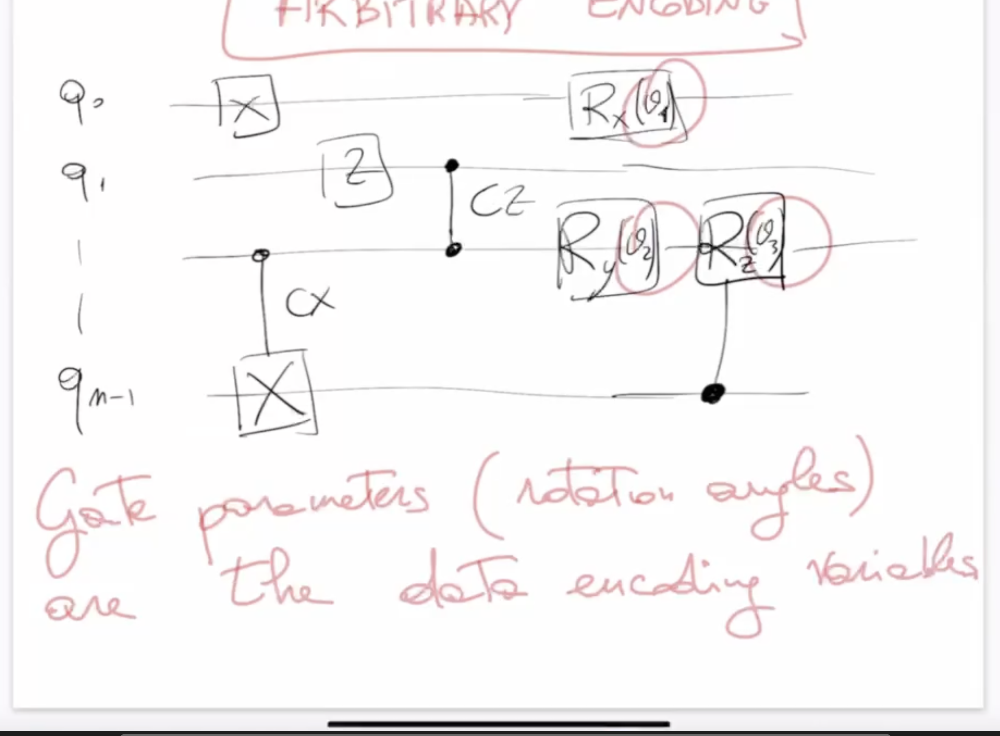

0. [Introduction to Quantum Machine Learning](#introduction-to-quantum-machine-learning)
1. [QML Paradigms: Classical vs Quantum Data and Algorithms](#qml-paradigms-classical-vs-quantum-data-and-algorithms)
2. [Building Blocks of QML](#building-blocks)
3. [Data Encoding (Embedding)](#data-encoding-embedding)
    - [Basis Encoding](#1basis-encoding)
    - [Amplitude Encoding](#2-amplitude-encoding)
    - [Angle Encoding](#3-angle-encoding)
    - [Why do we get cos and sin when applying the rotation, and where does the $R_y$ rotation come from?](#why-do-we-get-cos-and-sin-when-applying-the-rotation-and-where-does-the-r_y-rotation-come-from)
    - [Arbitrary (General) Encoding](#4-arbitrary-general-encoding)
4. [FRQI (Flexible Representation of Quantum Images)](#frqi-flexible-representation-of-quantum-images)
    - [How to Realize FRQI Image Encoding](#how-to-realize-frqi-image-encoding)
5. [NEQR (Novel Enhanced Quantum Representation for Digital Images)](#neqr-novel-enhanced-quantum-representation-for-digital-images)
  - [Implementing NEQR (Normalized Encoding of Quantum Representations)](#implementing-neqr-normalized-encoding-of-quantum-representations)

6. [Quantum Facial Expression Recognition](#quantum-facial-expression-recognition)

7. [Quantum Edge Detection](#quantum-edge-detection)

# Introduction to Quantum Machine Learning

Quantum Machine Learning (QML) is an interdisciplinary field that combines concepts from Machine Learning (ML) and Quantum Computing (QC). The goal is to leverage quantum algorithms and quantum data representations to enhance or accelerate machine learning tasks.

A useful way to categorize approaches in QML is by considering whether the data and the algorithms are classical or quantum:

|                | **Classical Data (C)** | **Quantum Data (Q)** |
|----------------|:---------------------:|:-------------------:|
| **Classical Algorithm (C)** | CC (Standard ML)         | CQ                  |
| **Quantum Algorithm (Q)**   | QC (Quantum-enhanced ML) | QQ (Fully Quantum)  |

- **CC:** Classical algorithms on classical data (traditional machine learning).
- **CQ:** Classical algorithms on quantum data.
- **QC:** Quantum algorithms on classical data (quantum-enhanced machine learning, also called quantum-inspired).
- **QQ:** Quantum algorithms on quantum data (fully quantum machine learning).

QML explores all these combinations, with a particular focus on how quantum resources can provide advantages over classical approaches.

## Building blocks

Data  --> Learning Model --> Optimization (Loss Function)

### Data Encoding (Embedding)

In Quantum Machine Learning, **data encoding** (or embedding) refers to the process of mapping classical information (such as text, images, or sound) into quantum states so it can be processed by a quantum computer.

Classical digital information can be represented as a vector of features. In the quantum setting, this information is encoded into the amplitudes of a quantum state.

For an $m$-qubit system, a general quantum state can be written as:
$$
|\psi\rangle = \sum_{i=0}^{2^m-1} x_i |i\rangle
$$
- $|i\rangle$ represents the computational basis states (bit-strings).
- $x_i$ are the amplitudes, which encode the information.

**Summary:**
- **Bit-string**: The basis state $|i\rangle$ (e.g., $|00\rangle$, $|01\rangle$, etc.).
- **Amplitudes**: The coefficients $x_i$ that encode the classical data into the quantum state.

This process allows classical data (such as text, images, or sound) to be embedded into a quantum system for further quantum processing.

#### 1.Basis Encoding

**Basis encoding** is one of the simplest ways to encode classical data into quantum states.

- A classical bit string (e.g., `101101`) is directly mapped to a quantum computational basis state (e.g., $|101101\rangle$).
- For $m$ classical bits, you need $m$ qubits.

Mathematically, a set of $N$ bit strings can be encoded as:
$$
|\psi\rangle = \frac{1}{\sqrt{N}} \sum_{i=1}^{N} |x^i\rangle
$$
where $N = 2^m$ and $|x^i\rangle$ are the computational basis states.

**Key points:**
- For $m$ bits, one needs $m$ qubits.
- **Advantage:** Simple and direct mapping.
- **Disadvantage:** Requires as many qubits as bits in the data, and it can be challenging to prepare and measure such states for large $m$.

This is the first and most straightforward method for encoding classical data into quantum states.

#### 2. Amplitude Encoding

**Amplitude encoding** is a method where classical data is encoded into the amplitudes of a quantum state.

Given a classical data vector of $N$ values, the data is mapped as:
$$
|\psi\rangle = \sum_{i=1}^{N} x_i |i\rangle
$$
where $|i\rangle$ are the computational basis states and $x_i$ are the (normalized) data values.

- For $m$ qubits, you can represent $2^m$ amplitudes, allowing you to encode an exponentially large amount of data with a linear number of qubits.

**Key points:**
- Very efficient in terms of qubit usage: $m$ qubits $\rightarrow 2^m$ amplitudes.
- **Advantage:** Compact representation of large datasets.
- **Disadvantage:** Preparing arbitrary amplitude-encoded states can be challenging in practice. Also Measurement is complicated (more sensitive of error)

This method is widely used in quantum machine learning for its efficiency in representing high-dimensional data.

#### 3. Angle Encoding

**Angle encoding** (or parametric encoding) is a method where classical data is encoded into the angles of quantum gates, typically using rotation gates.

Given a classical data vector $\mathbf{x} = (x_1, x_2, ..., x_N)$, each feature $x_i$ is encoded as the angle of a rotation applied to a qubit:
$$
|x\rangle = \bigotimes_{i=1}^{N} \left[ \cos(x_i)|0\rangle + \sin(x_i)|1\rangle \right]
$$

This means the quantum state is constructed as:
$$
|x\rangle = 
\begin{pmatrix}
\cos(x_1) \\
\sin(x_1)
\end{pmatrix}
\otimes
\begin{pmatrix}
\cos(x_2) \\
\sin(x_2)
\end{pmatrix}
\otimes \cdots \otimes
\begin{pmatrix}
\cos(x_N) \\
\sin(x_N)
\end{pmatrix}
$$

- Each classical value $x_i$ is mapped to a rotation angle for a single qubit.
- For $N$ features, $N$ qubits are typically used.

**Key points:**
- **Advantage:** Simple to implement on quantum hardware; widely used in variational quantum circuits.
- **Disadvantage:** The number of qubits grows linearly with the number of features.

A common way to implement angle encoding is by using rotation gates, such as the $R_y(\theta)$ gate, where the angle $\theta$ is set according to the data value $x_i$.

For example, applying a rotation to the initial state $|0\rangle$:
$$
U(x_i) |0\rangle = 
\begin{pmatrix}
\cos(x_i) \\
\sin(x_i)
\end{pmatrix}
$$

More generally, a rotation around the $y$-axis is given by:
$$
R_y(\theta) = e^{-i \frac{\theta}{2} \sigma_y} = 
\begin{pmatrix}
\cos \frac{\theta}{2} & -\sin \frac{\theta}{2} \\
\sin \frac{\theta}{2} & \cos \frac{\theta}{2}
\end{pmatrix}
$$
where typically $\theta = 2x_i$ for encoding the data value $x_i$.

This approach allows each classical parameter to be mapped to a quantum rotation, efficiently embedding classical data into quantum circuits.

Angle encoding is commonly used in quantum machine learning models to efficiently map classical data into quantum circuits using parameterized gates.

#### Why do we get cos and sin when applying the rotation, and where does the $R_y$ rotation come from?

When we apply a quantum rotation such as $R_y(\theta)$ to a qubit state, we are rotating the state vector on the Bloch sphere around the $y$-axis. The $R_y(\theta)$ gate is defined as:
$$
R_y(\theta) = e^{-i \frac{\theta}{2} \sigma_y} = 
\begin{pmatrix}
\cos \frac{\theta}{2} & -\sin \frac{\theta}{2} \\
\sin \frac{\theta}{2} & \cos \frac{\theta}{2}
\end{pmatrix}
$$
where $\sigma_y$ is the Pauli-Y matrix.

If we apply $R_y(\theta)$ to the basis state $|0\rangle = \begin{pmatrix} 1 \\ 0 \end{pmatrix}$, we get:
$$
R_y(\theta)|0\rangle = 
\begin{pmatrix}
\cos \frac{\theta}{2} \\
\sin \frac{\theta}{2}
\end{pmatrix}
$$

If we set $\theta = 2x_i$, then:
$$
R_y(2x_i)|0\rangle = 
\begin{pmatrix}
\cos x_i \\
\sin x_i
\end{pmatrix}
$$

This shows that by rotating the qubit by an angle $2x_i$ around the $y$-axis, we obtain a quantum state whose amplitudes are $\cos(x_i)$ and $\sin(x_i)$. This is why, in angle encoding, classical data $x_i$ is mapped directly to rotation angles, and the resulting quantum state has components $\cos(x_i)$ and $\sin(x_i)$.

**Summary:**
- The $R_y$ rotation comes from the physics of qubits and their representation on the Bloch sphere.
- Applying $R_y(2x_i)$ to $|0\rangle$ produces a state with amplitudes $\cos(x_i)$ and $\sin(x_i)$, encoding the classical value $x_i$ into the quantum state.

#### 4. Arbitrary (General) Encoding

**Arbitrary encoding** refers to the most flexible approach for embedding classical data into quantum circuits. In this method, the parameters of quantum gates—such as rotation angles for $R_x$, $R_y$, $R_z$ gates—are set according to the values of the classical data.

- Each data feature can control the angle of a rotation gate on a specific qubit.
- More complex circuits can use combinations of single-qubit rotations and multi-qubit gates (like CNOT, CZ) to entangle qubits and encode correlations between features.

For example, in the circuit above:
- The classical data is mapped to the angles $\theta_1, $\theta_2$, $\theta_3$, $\ldots$ of the rotation gates ($R_x$, $R_y$, $R_z$).
- The transformations $R_x$ and $R_y$ are **rotation operators** that act on a single qubit, rotating its state around the $x$ and $y$ axes of the Bloch sphere.

- **Rotation around the $x$ axis ($R_x$):**
  $$
  R_x(\theta) = \exp\left(-i \frac{\theta}{2} X\right) =
  \begin{pmatrix}
    \cos\frac{\theta}{2} & -i\sin\frac{\theta}{2} \\
    -i\sin\frac{\theta}{2} & \cos\frac{\theta}{2}
  \end{pmatrix}
  $$

- **Rotation around the $y$ axis ($R_y$):**
  $$
  R_y(\theta) = \exp\left(-i \frac{\theta}{2} Y\right) =
  \begin{pmatrix}
    \cos\frac{\theta}{2} & -\sin\frac{\theta}{2} \\
    \sin\frac{\theta}{2} & \cos\frac{\theta}{2}
  \end{pmatrix}
  $$

These transformations allow you to encode classical data into the rotation parameters $\theta$ applied to the qubits.
- Entangling gates (like CX, CZ) can be used to introduce dependencies between qubits, allowing for more expressive encodings.

**Key points:**
- **Flexibility:** Any quantum gate parameter (rotation angle, phase, etc.) can be used as a data encoding variable.
- **Expressiveness:** By combining different gates and entanglement, arbitrary encoding can represent complex data structures and correlations.
- **Usage:** This approach is common in variational quantum circuits and quantum neural networks, where the circuit structure and parameters are tailored to the learning task.

In summary, arbitrary encoding allows you to design custom quantum circuits where the gate parameters are directly determined by the classical data you want to encode.

### FRQI (Flexible Representation of Quantum Images)

The Flexible Representation of Quantum Images (FRQI) is a method for encoding classical images into quantum states. In FRQI, both the pixel position and the color (or grayscale) information are encoded using quantum resources:

$$
|I(\theta)\rangle = \frac{1}{\sqrt{2^n}} \sum_{i=0}^{2^n-1} \left( \cos \theta_i |0\rangle + \sin \theta_i |1\rangle \right) \otimes |i\rangle
$$

- **Pixel position** is encoded in the computational basis state $|i\rangle$ (basis encoding).
- **Color information** (e.g., grayscale value) is encoded in the angle $\theta_i$ using angle encoding, where each pixel's color determines the rotation angle.

This approach allows quantum computers to represent and process images efficiently, leveraging both basis and angle encoding within a single quantum state.

#### Example: FRQI for a 2x2 Image

Let's see how the FRQI encoding works for a simple $2 \times 2$ image. Suppose the image has four pixels with grayscale values $\theta_0, \theta_1, \theta_2, \theta_3$.

The quantum state is:
$$
|I\rangle = \frac{1}{2} \Big[
    (\cos\theta_0|0\rangle + \sin\theta_0|1\rangle) \otimes |00\rangle +
    (\cos\theta_1|0\rangle + \sin\theta_1|1\rangle) \otimes |01\rangle + \\
    (\cos\theta_2|0\rangle + \sin\theta_2|1\rangle) \otimes |10\rangle +
    (\cos\theta_3|0\rangle + \sin\theta_3|1\rangle) \otimes |11\rangle
\Big]
$$

- Each basis state $|00\rangle, |01\rangle, |10\rangle, |11\rangle$ encodes the pixel position.
- The corresponding angle $\theta_i$ encodes the grayscale (or color) value for each pixel.

#### How to Realize FRQI Image Encoding

To encode an image using the FRQI method, you need to represent both the pixel positions and the color (intensity) information in a quantum state.

- For an image with $2^n \times 2^n$ pixels:
  - You need $2n$ qubits to encode the pixel positions (basis encoding).
  - You need 1 additional qubit to encode the color intensity (angle encoding).

**Total qubits required:** $2n + 1$

**Step-by-step procedure:**

1. **Initialize the qubits:**
   - Start with all qubits in the $|0\rangle$ state.

2. **Apply Hadamard gates to the $2n$ position qubits:**

   - This creates a uniform superposition over all possible pixel positions:
     $$
     H^{\otimes 2n} |0\rangle^{\otimes 2n} = \frac{1}{\sqrt{2^{2n}}} \sum_{i=0}^{2^{2n}-1} |i\rangle
     $$

         > **Note:** The state  
    > $$
    > |0\rangle \otimes \frac{1}{2} (|00\rangle + |01\rangle + |10\rangle + |11\rangle)
    > $$
    > is the output obtained by applying Hadamard gates to the two position qubits. This operation creates a linear combination (superposition) of all four possible pixel positions.

     the image is now black

3. Now, to encode the color information for each pixel, you apply a controlled rotation $R_y(2\theta_i)$ to the color qubit, conditioned on the pixel position $|i\rangle$.

For example, for pixel position $|i\rangle$, you apply:
$$
R_y(2\theta_i) = 
\begin{pmatrix}
\cos \theta_i & -\sin \theta_i \\
\sin \theta_i & \cos \theta_i
\end{pmatrix}
$$

This rotation changes the color 

To encode the value $\theta_0$ for the pixel at position $|00\rangle$, you need to activate the control only when both position qubits are in the state $|1\rangle$. 

This is achieved by applying $X$ gates to flip the qubits from $|0\rangle$ to $|1\rangle$ (so that the control is "on" when both are $|1\rangle$), and then using a multi-controlled $R_y(2\theta_0)$ gate on the color qubit. 

After the first controlled rotation (box), the state is:
$$
\frac{1}{2} \left[ (\cos(\theta_0)|0\rangle + \sin(\theta_0)|1\rangle) \otimes |00\rangle + |01\rangle + |10\rangle + |11\rangle \right]
$$

This means only the color qubit associated with the pixel at position $|00\rangle$ has been rotated according to $\theta_0$, while the other positions remain unchanged.

Now, to encode the next pixel value (for example, $\theta_1$ at position $|01\rangle$), you repeat a similar procedure:

- Apply $X$ gates as needed to activate the control only when the position qubits are in the $|01\rangle$ state.
- Apply a multi-controlled $R_y(2\theta_1)$ gate to the color qubit.

After this second controlled rotation, the state becomes:
$$
\frac{1}{2} \left[
(\cos(\theta_0)|0\rangle + \sin(\theta_0)|1\rangle) \otimes |00\rangle +
(\cos(\theta_1)|0\rangle + \sin(\theta_1)|1\rangle) \otimes |01\rangle +
|10\rangle + |11\rangle
\right]
$$

and finally

This process is repeated for all pixel positions, so that each pixel's color information is encoded in the corresponding basis state by the appropriate controlled rotation.

At the end, after applying all the controlled rotations, the final state will be:
$$
|I\rangle = \frac{1}{2} \Big[
    (\cos\theta_0|0\rangle + \sin\theta_0|1\rangle) \otimes |00\rangle +
    (\cos\theta_1|0\rangle + \sin\theta_1|1\rangle) \otimes |01\rangle + \\
    (\cos\theta_2|0\rangle + \sin\theta_2|1\rangle) \otimes |10\rangle +
    (\cos\theta_3|0\rangle + \sin\theta_3|1\rangle) \otimes |11\rangle
\Big]
$$

This is the FRQI-encoded quantum state, where each pixel position is associated with its corresponding color (or grayscale) value.

### Measurement

Once the FRQI state has been prepared, you can perform a measurement to extract information about the image. 

- Measuring the **position qubits** gives you the pixel position (e.g., $|00\rangle$, $|01\rangle$, etc.).
  -   
    **Note:** For each pixel position (e.g., $|00\rangle$), you may find multiple quantum states (like $|000\rangle$ and $|100\rangle$) corresponding to the same pixel position. The amplitudes for these states are different: one is associated with $\cos\theta_i$ and the other with $\sin\theta_i$ 
  - **N.B.** The color information can be read in the $y$ axis of the amplitude histogram: the probability of measuring the color qubit in $|0\rangle$ or $|1\rangle$ for each pixel position reflects the encoded grayscale (or color) value.

This allows you to reconstruct the image by sampling the quantum state and analyzing the measurement statistics.

### NEQR (Novel Enhanced Quantum Representation for Digital Images)

**NEQR** is an alternative to FRQI in which pixel color values are encoded directly using **basis encoding**, instead of angle encoding.

In NEQR:
- Each pixel's **position** is encoded in the computational basis states (basis encoding).
- Each pixel's **color value** (e.g., grayscale value) is represented using an L-bit binary string encoded into qubits via basis encoding.

The quantum state is:

$$
|I\rangle = \frac{1}{\sqrt{2^{2n}}} \sum_{i=0}^{2^{2n}-1} |x_i\rangle_{\text{color}} \otimes |i\rangle_{\text{position}}
$$

- $|i\rangle$ encodes the pixel position.
- $|x_i\rangle$ is the L-bit binary representation of the pixel color value.

**Example: 8-bit Grayscale Image**

- Grayscale values range from 0 (black) to 255 (white).
- Example encoding:

| Grayscale Value | Binary Encoding | Description   |
|-----------------|-----------------|---------------|
| 0               | 00000000        | Black         |
| 100             | 01100100        | Dark shade    |
| 200             | 11001000        | Light shade   |
| 255             | 11111111        | White         |

**Example State Structure**

$$
|I\rangle = \frac{1}{\sqrt{2}} \left( |00\rangle \otimes |10000000\rangle + |11\rangle \otimes |11001000\rangle + \dots \right)
$$

- $|00\rangle, |11\rangle$ → pixel position.
- $|10000000\rangle, |11001000\rangle$ → pixel color in basis encoding.

---

## Implementing NEQR (Normalized Encoding of Quantum Representations)

The **Normalized Encoding of Quantum Representations (NEQR)** is a method for encoding classical data, such as images, into quantum states. This encoding allows quantum algorithms to process classical data efficiently, leveraging the principles of quantum superposition and entanglement.

### Quantum Circuit for NEQR

The image illustrates the quantum circuit for NEQR encoding. The circuit uses Hadamard gates ($H$) to create a superposition state, representing pixel positions in an image. The encoded quantum state is given by:
$$
\frac{1}{2} \left( |00\rangle + |01\rangle + |10\rangle + |11\rangle \right)
$$
Where:
- Each basis state (e.g., $|00\rangle$, $|01\rangle$, etc.) corresponds to a pixel position in the image.
- The amplitude of each basis state can be adjusted to encode pixel intensity values.

### Steps to Implement NEQR

1. **Initialize Qubits**:
  - Allocate qubits to represent pixel positions and intensities.
   - For an $n \times n$ image, use $\log_2(n)$ qubits for pixel positions and additional qubits for intensity values.

2. **Apply Hadamard Gates**:
  - Use Hadamard gates ($H$) to create a superposition of all possible pixel positions. This ensures that all positions are represented simultaneously in the quantum state.

3. **Encode Pixel Intensities**:
  - For an $L$-bit grayscale image, allocate $L$ qubits to represent the intensity (e.g., 8 qubits for 8-bit grayscale).
  - For each pixel position, use multi-controlled $X$ (NOT) gates to set the color qubits according to the binary representation of the pixel's intensity value.
  - This ensures that, for every basis state representing a pixel position, the associated color qubits encode the correct grayscale value in binary.

4. **Measurement**:
  - Measure the quantum state to retrieve both pixel positions and intensity values. Each measurement yields a bitstring where:
    - The first $\log_2(n)$ bits represent the pixel position.
    - The following $L$ bits represent the pixel intensity (e.g., 8 bits for 8-bit grayscale).
  - By repeatedly measuring the quantum state, you can reconstruct the classical image by collecting the frequency of each observed bitstring.

  

  > **Note:** In the measurement histogram, all bars have the same height because the NEQR encoding creates a uniform superposition over all pixel positions. The histogram's x-axis encodes both the pixel position (first bits) and the color value (last bits), while the y-axis shows the probability (which is uniform if all pixels are equally likely).

### Example Circuit

For a $2 \times 2$ image:
- Use 2 qubits for pixel positions ($|00\rangle$, $|01\rangle$, $|10\rangle$, $|11\rangle$).
- Apply Hadamard gates to both qubits:
$$
H \otimes H \cdot |00\rangle = \frac{1}{2} \left( |00\rangle + |01\rangle + |10\rangle + |11\rangle \right)
$$

then we apply the coding for color corresponding to each pixel position

### Advantages of NEQR

- **Efficient Encoding**: NEQR allows classical data to be encoded into quantum states with minimal resources.
- **Parallel Processing**: Quantum algorithms can process all pixel positions simultaneously due to superposition.
- **Scalability**: NEQR can be extended to larger images by increasing the number of qubits.

### Challenges

- **Hardware Limitations**: Implementing NEQR requires quantum hardware capable of handling a large number of qubits.
- **Noise Sensitivity**: Quantum states are sensitive to noise, which can affect the accuracy of the encoding.

NEQR is a foundational technique for quantum image processing, enabling quantum algorithms to work with classical

## Quantum Facial Expression Recognition

Facial expression recognition is a critical task in computer vision, and quantum computing offers unique advantages for processing and classifying facial features. This chapter explores how quantum algorithms can be applied to facial expression recognition using quantum states and graph-based representations.

### Process Overview

1. **Image Preprocessing**:
   - The facial image is preprocessed to extract key features, such as landmarks.
   - Typically, 68 facial landmarks are identified, representing critical points on the face (e.g., eyes, nose, mouth).

2. **Feature Extraction**:
   - The landmarks are used to construct a graph representation of the face.
   - Each node in the graph corresponds to a facial landmark, and edges represent relationships between landmarks (e.g., distances or connections).

3. **Classification**:
   - Quantum states are used to encode the graph structure.
   - The classification task involves distinguishing between different facial expressions (e.g., happy vs. sad) based on the quantum representation.

### Graph Representation

The facial landmarks are encoded as a graph $G$, where:
- $g(i, j) = 1$ if $(i, j)$ is a link (i.e., there is a connection between landmarks $i$ and $j$).
- $g(i, j) = 0$ otherwise.

The graph can be represented as a quantum state:
$$
|G\rangle = \sum_{i, j} g(i, j) |i\rangle |j\rangle
$$
Where:
- $|i\rangle$ and $|j\rangle$ represent the quantum states corresponding to the nodes (landmarks).

### Quantum Classification

The quantum state $|G\rangle$ is used to classify facial expressions:
- For a "happy" expression, the quantum state might have specific amplitude distributions.
- For a "sad" expression, the amplitude distributions differ.

The classification is performed by computing the inner product (overlap) between the quantum state $|G\rangle$ representing the input facial graph and reference quantum states $|G_{\text{sad}}\rangle$ or $|G_{\text{happy}}\rangle$ corresponding to known "sad" or "happy" expressions. The squared magnitude of these inner products indicates how closely the input matches each reference:

$$
\langle G_{\text{sad}} | G \rangle^2 \quad \text{vs.} \quad \langle G_{\text{happy}} | G \rangle^2
$$

The input is classified as the expression with the highest overlap.

### Advantages of Quantum Facial Expression Recognition

- **Efficient Feature Encoding**: Quantum states can encode complex graph structures efficiently.
- **Parallel Processing**: Quantum algorithms can process multiple features simultaneously due to superposition.
- **Scalability**: Quantum methods can handle large datasets and complex relationships between features.

### Challenges

- **Noise Sensitivity**: Quantum states are sensitive to noise, which can affect classification accuracy.
- **Hardware Limitations**: Current quantum hardware may struggle with large-scale graph encoding.

## Swap Test for Face Comparison

The **Swap Test** is a quantum algorithm for measuring the similarity (overlap) between two quantum states. In facial expression recognition, it compares quantum-encoded faces (e.g., $|\phi\rangle$ and $|\psi\rangle$) to quantify how alike they are.

### Circuit Description

The Swap Test circuit consists of:
1. **Ancilla Qubit**:
   - An additional qubit initialized in the state $|0\rangle$.
   - This qubit is used to control the swap operation between the two input states.

2. **Input States**:
   - Two quantum states $|\phi\rangle$ and $|\psi\rangle$ representing the faces to be compared.
   - These states encode features extracted from facial landmarks.

3. **Hadamard Gates**:
   - A Hadamard gate ($H$) is applied to the ancilla qubit at the beginning and end of the circuit to create and measure superposition.

4. **Controlled-SWAP Gate**:
   - The ancilla qubit controls the swap operation between $|\phi\rangle$ and $|\psi\rangle$.
   - If the ancilla qubit is in state $|1\rangle$, the two states are swapped.

5. **Measurement**:
   - The ancilla qubit is measured at the end of the circuit to determine the similarity between $|\phi\rangle$ and $|\psi\rangle$.

### Quantum State Evolution

1. **Initial State**:
   - The system starts in the state:
     $$
     |0\rangle \otimes |\phi\rangle \otimes |\psi\rangle
     $$

2. **After First Hadamard Gate**:
   - The ancilla qubit is placed in superposition:
     $$
     \frac{1}{\sqrt{2}} \left( |0\rangle + |1\rangle \right) \otimes |\phi\rangle \otimes |\psi\rangle
     $$

3. **Controlled-SWAP Operation**:
   - If the ancilla qubit is $|1\rangle$, the states $|\phi\rangle$ and $|\psi\rangle$ are swapped.

4. **Final Hadamard Gate**:
   - The ancilla qubit is transformed back to the computational basis.

5. **Measurement**:
   - The probability of measuring $|0\rangle$ on the ancilla qubit is:
     $$
     P(|0\rangle) = \frac{1}{2} \left( 1 + |\langle \phi | \psi \rangle|^2 \right)
     $$
   - The overlap $|\langle \phi | \psi \rangle|^2$ quantifies the similarity between the two states.

### Interpretation of Results

- **$|\langle \phi | \psi \rangle|^2 = 1$**:
  - The two states are identical (perfect match).
- **$|\langle \phi | \psi \rangle|^2 = 0$**:
  - The two states are orthogonal (no similarity).

### Application to Face Comparison

1. **Quantum Encoding**:
   - Faces are encoded as quantum states based on features extracted from facial landmarks.

2. **Similarity Measurement**:
   - The Swap Test is used to compare the quantum states of two faces.
   - The result indicates whether the faces represent the same expression or different expressions.

### Advantages of the Swap Test

- **Efficient Similarity Measurement**:
  - The Swap Test directly computes the overlap between two quantum states without requiring full state tomography.
- **Scalability**:
  - It can be applied to high-dimensional quantum states, making it suitable for complex facial features.

### Challenges

- **Transpilation overhead**:
  - Transpiling circuits with multi-controlled gates generates many basic gates, leading to deeper, more error-prone circuits on current quantum hardware.

## Quantum Edge Detection
Quantum edge detection leverages quantum parallelism to efficiently identify image boundaries. By encoding images into quantum states using probability-based methods, quantum algorithms can process all pixels simultaneously, offering significant speedups over classical approaches. This section introduces the principles and advantages of quantum edge detection using quantum probability-based image encoding.

### Classical vs Quantum Edge Detection

For an image with $2^m \times 2^m$ pixels:
- **Classical Complexity**:
  - Classical edge detection algorithms typically require $O(2^{2m})$ operations, as they process each pixel individually.
- **Quantum Complexity**:
  - Quantum edge detection can achieve $O(1)$ complexity by encoding the entire image into a quantum state and processing it in parallel.

### Quantum Probability-Based Image Encoding (QPIE)

The image is encoded into a quantum state using probabilities derived from pixel intensities. The encoding process ensures that the quantum state represents the image efficiently.

#### Encoding Formula

Each pixel intensity $I_{x,y}$ is normalized to compute the probability amplitude $C_i$:
$$
C_i = \frac{I_{x,y}}{\sqrt{\sum_{x,y} I_{x,y}^2}}
$$
Where:
- $I_{x,y}$ is the intensity of the pixel at position $(x, y)$.
- $\sum_{x,y} I_{x,y}^2$ ensures normalization, making $C_i \in [0, 1]$.

#### Quantum State Representation

The image is encoded as a quantum state:
$$
|I\rangle = \sum_{x,y} c_{x,y} |x\rangle |y\rangle
$$
Where:
- $|x\rangle |y\rangle$ represents the position of the pixel.
- $c_{x,y}$ represents the normalized intensity of the pixel.

### Quantum Hadamard Edge Detection (QHED)

The **Quantum Hadamard Edge Detection (QHED)** algorithm leverages quantum principles, such as superposition and parallelism, to efficiently detect edges in images.

### Key Components of QHED

1. **Hadamard Gates**:
   - The Hadamard gate ($H$) creates a superposition of states, enabling parallel processing of pixel information.
   - For a qubit in state $|0\rangle$, applying $H$ results in:
     $$
     H|0\rangle = |+\rangle = \frac{1}{\sqrt{2}} (|0\rangle + |1\rangle)
     $$
   - For a qubit in state $|1\rangle$, applying $H$ results in:
     $$
     H|1\rangle = |-\rangle = \frac{1}{\sqrt{2}} (|0\rangle - |1\rangle)
     $$

2. **Binary Representation**:
   - Each pixel is represented as a binary string of $2^m$ bits, where $m$ is the number of qubits used to encode the image.
   - For example, a pixel intensity $I_{x,y}$ is encoded as:
     $$
     |b_{2^m-1} b_{2^m-2} \dots b_1\rangle
     $$
   - The **Least Significant Bit (LSB)** plays a critical role in detecting intensity differences.

3. **Edge Detection Formula**:
   

$$
\Delta C = |C_{b_{2^m-1} \dots b_0} - C_{b_{2^m-1} \dots b_1 1}|
$$
Where:
- $C_{b_{2^m-1} \dots b_0}$ represents the normalized intensity of the current pixel.
- $C_{b_{2^m-1} \dots b_1 1}$ represents the normalized intensity of the adjacent pixel.

#### Thresholding

To classify a pixel as part of an edge:
- If $\Delta C > \Delta C_{\text{th}}$, the pixel is classified as an **edge**.
- Otherwise, the pixel is classified as **no edge**.

Here:
- $\Delta C_{\text{th}}$ is the threshold value, which can be adjusted based on the desired sensitivity of edge detection.

#### Quantum Representation of Thresholding

The thresholding operation can be implemented using quantum gates:
- The Hadamard gate ($H$) is applied to create superposition states for comparing pixel intensities.
- The comparison is performed in parallel across all pixels using quantum operations.

#### Final Quantum State

The quantum state after thresholding represents the edges in the image:
$$
\frac{1}{2^{m-1}} \otimes H = \frac{1}{\sqrt{2}}
$$
This state encodes the positions of edge pixels, which can be measured to retrieve the edge map.

### Matrix Representation in Quantum Edge Detection

The image illustrates how matrix operations are used in quantum edge detection to compute intensity differences and identify edges. This step involves transforming the quantum state into a column vector and applying specific matrix operations to extract edge information.

#### Quantum State Transformation

The quantum state encoding pixel intensities is represented as a $2^m$-dimensional column vector:
$$
\begin{bmatrix}
C_0 \\
C_1 \\
C_2 \\
\vdots \\
C_{2^m-1}
\end{bmatrix}
$$

#### Hadamard Matrix Transformation

To compute intensity differences, a Hadamard matrix is applied to the column vector. The Hadamard matrix is defined as:
$$
H = \frac{1}{\sqrt{2}}
\begin{bmatrix}
1 & 1 \\
1 & -1
\end{bmatrix}
$$

For a larger system, the Hadamard matrix is extended to $2^m \times 2^m$ dimensions, with Hadamard transformations along its diagonal. For example, a $4 \times 4$ Hadamard matrix looks like:
$$
H_4 = \frac{1}{\sqrt{2}}
\begin{bmatrix}
1 & 1 & 0 & 0 \\
1 & -1 & 0 & 0 \\
0 & 0 & 1 & 1 \\
0 & 0 & 1 & -1
\end{bmatrix}
$$

#### Application of Hadamard Matrix

The Hadamard matrix is applied to the quantum state vector to compute sums and differences of adjacent pixel intensities:
$$
H \cdot
\begin{bmatrix}
C_0 \\
C_1 \\
C_2 \\
C_3
\end{bmatrix}
=
\frac{1}{\sqrt{2}}
\begin{bmatrix}
C_0 + C_1 \\
C_0 - C_1 \\
C_2 + C_3 \\
C_2 - C_3
\end{bmatrix}
$$

#### Resulting Vector

The resulting vector contains the sums and differences of adjacent pixel intensities (only even indices), which are essential for edge detection. 
$$
\begin{bmatrix}
C_0 + C_1 \\
C_0 - C_1 \\
C_2 + C_3 \\
C_2 - C_3
\end{bmatrix}
$$

The quantum state encoding pixel intensities is represented as a $2^m$-dimensional column vector:
$$
\begin{bmatrix}
C_0 \\
C_1 \\
C_2 \\
\vdots \\
C_{2^m-1}
\end{bmatrix}
$$

For odd indices, a permutation operation is applied t

$$
\begin{bmatrix}
C_1 \\
C_2 \\
C_3 \\
\vdots \\
C_{2^m-1} \\
C_0 \\
\end{bmatrix}
$$

in this case the resulting vector includes odd indices

$$
\begin{bmatrix}
C_1 + C_2 \\
C_1 - C_2 \\
C_3 + C_4 \\
C_3 - C_4
\end{bmatrix}
$$

