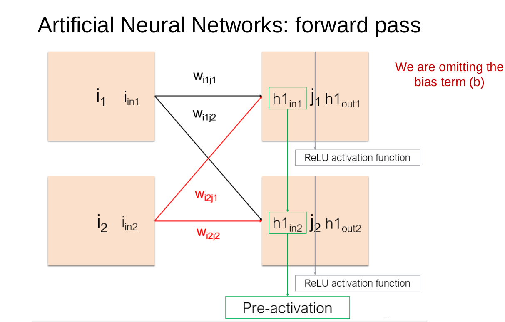

# Deep Learning: training an artificial neural network <!-- omit in toc -->
## Table of Contents <!-- omit in toc -->
- [Modeling problems](#modeling-problems)
- [Artificial Neural Network](#artificial-neural-network)
  - [Forward pass](#forward-pass)
  - [Training](#training)
  - [Backpropagation](#backpropagation)
    - [One-neuron neural network](#one-neuron-neural-network)
    - [Two-layer neural network](#two-layer-neural-network)
- [Training](#training-1)

## Modeling problems

Machine Learning (ML) can help us when we have complex problems, but we can “easily” tell what variables are involved in it. In traditional Machine Learning, models require __pre-computed features__ that are manually designed based on domain knowledge. This feature engineering requires human expertise to identify the most relevant attributes for a given task.  
We can use ML on problems in which we have some knowledge, we know indvance the features we need.

__Deep Learning (DL)__ eliminates the need for manual feature extraction by learning hierarchical representations directly from raw data. Using artificial neural networks, DL can automatically detect patterns at multiple levels of abstraction.  
In DL we don't need to know the features in advance anymore. DL models are able to learn the features from the data. 

## Artificial Neural Network
A neuron receives $n$ inputs $(x_1, x_2, \ldots, x_n)$, multiplies each $x_i$ by a __weight__ $w_i$, sums them all and adds a __bias__, to obtain the output $\hat{y}$
$$
\hat{y} = \sum_{i=1}^n w_i x_i + b_i = \vec{w} \cdot \vec{x} + \vec{b} \ .
$$

**Weights** and **bias** are the **parameters** of the neural network.

In this way our neural network is able to reproduce only _linea models_. In order to model more complex models, we need to introduce non-linearity in our neural network. This is done by introducing an [activation function](./activation_functions.md), $g(\cdot)$. After doing that, the output $\hat{y}$ will be given by
$$
\hat{y} = g ( \vec{w} \cdot \vec{x} + \vec{b} ) \ .
$$
Using a non-linear activation function allows to:
- Model complex problems
- Limit the possible outputs

The above pictures represents a __layer__ of a neural network, having only one neuron.

This is what a simple neural network looks like:
- an input layer
- a few hidden layers
- an output layer

The above picture is an example of a **fully-connected** neural network, because every neuron of one layer is connected to all neurons of the next layer.

Each neuron in layer $i$ sums and activate the outputs from all the neurons in layer $i-1$. Each layer has its own parameters and activation functions. The activation function is usually the same for all the neurons in the same layer, but neurons belonging to the same layer can have different parameters (weights and bias).

The number of neurons in the output layer depends on the task:
* in __regression__, we want to predict one number and we need one neuron
* in __classification__, we want to label the input as one of the possible $N$ classes and we need $N$ neurons

The optimal number of neurons in the hidden layers (as well as the number of hidden layers) cannot be assessed in advance. The more the neurons and the layers, the more abstract information we can extract from the input data.  
Each layer extracts information from the input and transmits it to the next one for further data processing. This process is called **FORWARD PASS**. In the Forward Pass stage the input is propagated through the hidden layers towards the output layer where the prediction of the model is calculated. 

### Forward pass

Let us consider the following neural network 

and focus on layers I and J

First we compute the _pre-activation_ (or hypothesis) (we are omitting the bias)
$$
\begin{align*}
\begin{pmatrix} h1_{in1} & h2_{in2} \end{pmatrix} & = \begin{pmatrix} i_{in1} & i_{in2} \end{pmatrix} 
\begin{pmatrix} 
  w_{i_i j_1} & w_{i_1 j_2} \\
  w_{i_2 j_1} & w_{i_2 j_2}
\end{pmatrix} \\
& = \begin{pmatrix} i_{in1} w_{i_i j_1} + i_{in2} w_{i_2 j_1} & i_{in1} w_{i_1 j_2} + i_{in2} w_{i_2 j_2} \end{pmatrix} \ .
\end{align*}$$

Then, we apply the ReLU activation function to the pre-activation vector to get the output vector
$$
  \begin{pmatrix} h1_{out1} & h2_{out2} \end{pmatrix} = \text{ReLU} \begin{pmatrix} h1_{in1} & h2_{in2} \end{pmatrix}
$$

This steps are repeated for all layers until the output one where we get the prediction $\hat{y}$ as outcome.

### Training
How do we know the parameters (weights and bias) to use in the forward pass? We don't need to know them in advance. We **train** the model to let the neural network learn them.

The training is supervised by the **groud-truth value**, $y$. The output $\hat{y}$ is compared to $y$ and an error is computed. The error quantifies the distance between the prediction $\hat{y}$ and the ground-truth $y$, i.e. $error = | y - \hat{y} |$.

The goal of the training is to minimize the error between $y$ and $\hat{y}$. To do so we have to find the parameter configuration (optimal values of $w$ and $b$) that explains the problem in the best possible way, in such a way that the prediction $\hat{y}$ is as close as possible to the ground-truth $y$. **Error minimization** is an optimization problem !!!. 

How to optimize the parameters? Use **gradient descent**.  
Gradient descent is the most-used optimization technique to minimize the error. It means that, for each step, I compute the error and change the parameters in order to minimize it according to its dependence on each parameter. Indeed, the error function depends on $w$ and $b$ through $\hat{y}$, i.e. $error = f(w,b)$ and is called **cost function**.  
Given the training set $\{ x^{(i)}, y^{(i)} \}_{i=1}^n$, the least square cost function for the $i$-th example is given by
$$
  J^{(i)}(w,b) = \frac{1}{2} (\hat{y}^{(i)} - y^{(i)})^2 \ .
$$
The mean-squared cost function for the dataset is defined as
$$
 J(w,b) = \frac{1}{n} \sum_{i=1}^n J^{(i)}(w,b) \ .
$$

_Note_:
* the mathematical requirements for a cost function are the diffentiability and convexity.
* multiply the cost function by a scalar does not change the local minima or global minima of the cost function.

The gradient of the cost function identifies the direction to move in order to update parameters. The training involves the use of a hyperparameter called **learning rate**. The learnig rate tells me how much I have to move towards the direction identified by the gradient. The choice of the value of this parameters affects the velocity at which the neural network learns. 

At each step of the gradient descent algorithm the parameters get updated according to
$$
\begin{align*}
  w^{t+1} & = w^t - \alpha \nabla_w J(w,b) \\
  b^{t+1} & = b^t - \alpha \nabla_b J(w,b) \ ,
\end{align*}
$$
where the superscript $t$ indicates that the algorithm is at the $t$-th iteration, and $\alpha$ is the learning rate.

The choice of value of the learning rate must be such that the cost function reaches its minimum in a not too long time.
* if the learning rate is too large I could miss the minimum.
* if the learning reate is too small I will reach them minimum, but the optimization process would take too long
  
The best way to solve this problem is to choose an initial value and modify it during the learning, by reducing the learning rate as we move closer and closer to minimum so that we do not miss the minimum.

### Backpropagation
The training of a neural network involves two steps:
* the **FORWARD PASS**, in which we compute the prediction $\hat{y}$ and the error (cost function),
* the **BACKPROPAGATION**, in which the error computed before gets back-propagated in order to update the paramenters of the neural network.

The backpropagation involves the computation of the gradient of the cost function by using the chain rule 

#### One-neuron neural network
Consider a neural network with one neuron. We compute the cost function via the following sequential steps:
* $z = \vec{w} \cdot \vec{x} + b$
* $\hat{y} = g(z) = ReLU(z)$
* $J = \frac{1}{2}(y - \hat{y})^2$

By the chane rule we have that
$$
  \frac{\partial J}{\partial w_i} = \frac{\partial J}{\partial \hat{y}} \frac{\partial \hat{y}}{\partial w_i} \ .
$$
Since $\hat{y}$ depends on $z$, $\hat{y} = g(z)$, we have 
$$
  \frac{\partial \hat{y}}{\partial w_i} = \frac{\partial \hat{y}}{\partial z} \frac{\partial z}{\partial w_i} \ .
$$
Combining the two equations above we have
$$
\begin{align*}
  \frac{\partial J}{\partial w_i} & = \frac{\partial J}{\partial \hat{y}} \frac{\partial \hat{y}}{\partial z} \frac{\partial z}{\partial w_i} \\
  & = (\hat{y} - y) g \prime (z) x_i \ .
\end{align*}
$$
Similarly, the gradient with respect to $b$ is
$$
\begin{align*}
  \frac{\partial J}{\partial b} & = \frac{\partial J}{\partial \hat{y}} \frac{\partial \hat{y}}{\partial z} \frac{\partial z}{\partial b} \\
  & = (\hat{y} - y) g \prime (z) \ .
\end{align*}
$$

In a vectorized form one can write
$$
\begin{align*}
  \nabla_w J(w,b) & = (\hat{y} - y) g \prime (z) \vec{x} \\
  \nabla_b J(w,b) & = (\hat{y} - y) g \prime (z) \ .
\end{align*}
$$

#### Two-layer neural network

TO DO

## Training
How is a neural network trained practically?

In order to train a neural network we need is a dataset, i.e., a set of $(x, y)$ samples where $x$ is the **input** and $y$ is the **output** (target). The dataset is divided in three sub-sets: a **training set**, a **validation set**, and a **test set**.

* The **training set** is used to optimize the parameters (weights and bias) of a network.
* The **validation set** is used to fine-tune the hyperparameters.
* The  **test set** is used to test the performance on data that the neural network hasn't never seen. 

The neural network needs to perform well both on the training set and on the two test sets (validation and test)!  
If this doesn't happen, we may run into the problem of **overfitting**.

In the above picture, the loss function on the training set has a very nice trend: the network is iteratively optimized on the training samples, its error on these samples decreases. However, the loss function on the validation test does not seem as good.

The model is overfitting!! To avoid this, we should minimize the distance between training and validation performance!

In order to minimize the distance between training and validation performance we choose the parameters of the **best epoch**.

In general, two things are never to be expected:
1. No error or 100% accuracy
2. Better results in validation
