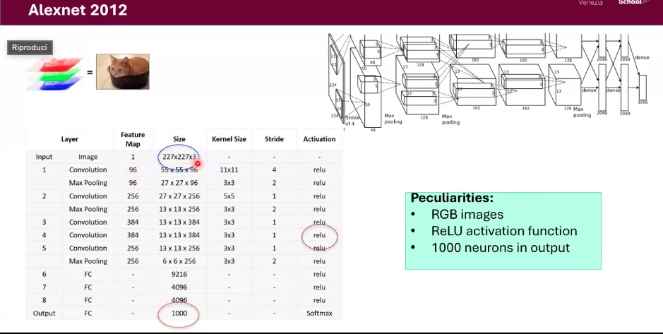

# Classical Machine Learning: Advanced Topics <!-- omit in toc -->
## Table of Contents <!-- omit in toc -->
- [Convolutions from scratch](#convolutions-from-scratch)
  - [Edge detection](#edge-detection)
  - [📸 What does `f(x, y)` represent in image processing?](#-what-does-fx-y-represent-in-image-processing)
  - [Convolutions: basic concepts](#convolutions-basic-concepts)
    - [kernels](#kernels)
  - [Understanding convolutions applied to images](#understanding-convolutions-applied-to-images)
    - [Zero padding](#zero-padding)
    - [Convolutions in volumes](#convolutions-in-volumes)
    - [Multiple filters](#multiple-filters)
    - [Parameters of the convolution](#parameters-of-the-convolution)
  - [Types of convolutions](#types-of-convolutions)
    - [Dilated/atrous convolutions](#dilatedatrous-convolutions)
    - [Spatial separable convolutions](#spatial-separable-convolutions)
    - [Depth-wise separable convolutions](#depth-wise-separable-convolutions)
- [Convolutional Neural Netrwork for image classification](#convolutional-neural-netrwork-for-image-classification)
  - [Image classification](#image-classification)
    - [CNN vs. Fully connected NN](#cnn-vs-fully-connected-nn)
  - [Other layers in CNNs: Pooling](#other-layers-in-cnns-pooling)
  - [Architectures](#architectures)
  - [🧠 LeNet Architecture](#-lenet-architecture)
    - [Key characteristics:](#key-characteristics)
    - [Layer-wise structure:](#layer-wise-structure)
    - [Why is LeNet important?](#why-is-lenet-important)
  - [🧠 Alexnet Architecture](#-alexnet-architecture)
    - [Key characteristics:](#key-characteristics-1)
    - [Layer-wise structure:](#layer-wise-structure-1)
    - [Why is AlexNet important?](#why-is-alexnet-important)
- [Transfer learning/ fine tuning](#transfer-learning-fine-tuning)
- [Evaluation metrics for classification task](#evaluation-metrics-for-classification-task)
- [Training a Convolutional Neural Network](#training-a-convolutional-neural-network)
  - [Data preparation](#data-preparation)
    - [Data normalization](#data-normalization)
    - [Data augmentation](#data-augmentation)
  - [Optimizer, batch size, number of epochs](#optimizer-batch-size-number-of-epochs)
    - [The concept of tensor](#the-concept-of-tensor)
  - [Stochastic Gradient Descent (SGD)](#stochastic-gradient-descent-sgd)
    - [From samples to batches](#from-samples-to-batches)
    - [Other optimizers](#other-optimizers)
  - [Loss function](#loss-function)
    - [Cross entropy loss](#cross-entropy-loss)
      - [Binary classification](#binary-classification)
      - [Multi-class classification](#multi-class-classification)
  - [Learning curves](#learning-curves)
    - [Overfitting](#overfitting)
  - [Other evaluation metrics](#other-evaluation-metrics)

# Convolutions from scratch
## Edge detection
Edge detection is an old-but-gold problem in computer vision that involves detecting edges in an image to determine object boundaries and thus separate the object of interest.

An __edge__ is a point of _rapid change in the intensity_ of the image function. 
The gradient points in the direction of most rapid increase in the intensity of the
## 📸 What does `f(x, y)` represent in image processing?

In the context of **image processing**, the function `f(x, y)` represents:

✅ The **intensity (brightness) value** of the image at pixel location `(x, y)`

- For a **grayscale image**, `f(x, y) ∈ [0, 255]`, where `0 = black` and `255 = white`
- For a **color image**, you'd typically have three functions:  
  `f_R(x, y)`, `f_G(x, y)`, `f_B(x, y)` — one for each RGB channel (Red, Green, Blue)

image function
* the gradient of an image : $\nabla f = (\frac{\partial f}{\partial x}, \frac{\partial f}{\partial y})$

## Convolutions: basic concepts
Convolutions are one of the fundamental elements of computer vision and image processing.
An image can be seen as a matrix and multiply by a __filter__, that is another matrix.  
A convolution (of images) is simply an elementary multiplication of two matrices followed by a sum.
1. take two matrices having the same dimensions
2. multiply them element by element
3. add up the elements

An image is just a multidimensional matrix. Our image has a _width_ (number of columns) and a
_height_ (number of rows), just like a matrix.
But images, can also have a _depth_ (=number of channels in the image). For a standard RGB
image, we have a depth of 3 channels (red, green, blue).   

### kernels
Filters are represented by __kernels__. The kernel can be seen as a small matrix that is used for blurring, sharpening, edge detection, and other image processing functions. 
It is common to define kernels by hand to achieve various image processing functions (mean smoothing, Gaussian smoothing, median smoothing, etc.), edge detection (Laplacian, Sobel, Scharr, Prewitt, etc.): all these operations are hand-defined forms of kernels
designed specifically to perform a particular function.

Is there a way to automatically learn these types of filters? This is what CNN does.
CNN (Convolutional Neural Network) allows to automatically learn the optimal filter for the task we are performing. Filters are different from layer to layer of the Neural Network.

Most of the kernels are $N \times N$ square matrices. Usualy $N$ is odd (e.g. $3 \times 3$) to ensure that there is always a valid integer coordinate in the center of the image. Usually kernels are $3 \times 3$ or $5 \times 5$ square matrices.

## Understanding convolutions applied to images
In image processing, a convolution requires three components:
- an input image
- a kernel matrix to apply to the input image
- an output image to store the result of the convolution between the input image and the kernel
  
To apply a convolution:
- select a coordinate $(x,y)$ from the original image
- place the center of the kernel at this coordinate
- take the elementary multiplication of the input image region and the kernel, then sum the values of these multiplication operations into a single value. The sum is called the __kernel output__
- store the output at the same location $(x,y)$ as the output image (or __feature map__)
  
 

$$
\begin{align*}
& 45 \cdot 0 + 12 \cdot (-1) + 5 \cdot 0 + 22 \cdot (-1) + 10 \cdot 5 + 35 \cdot (-1) + 88 \cdot 0 + 26 \cdot (-1) + 51 \cdot 0 = -45 \\
& 12 \cdot 0 + 5 \cdot (-1) + 17 \cdot 0 + 10 \cdot (-1) + 35 \cdot (5) + 6 \cdot (-1) + 26 \cdot 0 + 51 \cdot (-1) + 19 \cdot 0 = 103 \\
& \ldots \\
& \ldots
\end{align*}
$$

The process of "sliding" a convolutional kernel over an image and storing the output decreases the spatial dimensions of the output image (or feature map). This is a side effect of convolutions. Sometimes this effect is desirable and sometimes not, it depends on the application.  
However, in most cases, we want the output image to be the same size as the input image. To ensure this, we apply **padding**.  

The fact that the output image is a little smaller than the input one does not seem to be a big problem, especially if most of the important features are located in the central area of the input. In this case we don't lose too much data.  
On the contrary, reducing the size turns out to be a problem if there is significant info at the edges of the image.

What happens when the input goes through a neural network with many more filters applied as you go deeper toward the
output layers?  
Going through the layers we lose valuable data by completely throwing away the information around the edges of the input and the resulting output will be almons insignificant because how small it is.

What can we do? We can apply a techinique called **Zero padding**

### Zero padding
Zero padding is one of the most used techiques in convolutional neural networks. It is a technique that allows us to preserve the original size of the input.  
It is an operation that is specified for each convolutional layer. For each convolutional layer, just as we define the number of filters and their size, we can also specify whether or not to use padding.  
Zero padding consists in adding a border of pixels all with value zero around the edges of the input images.

 

### Convolutions in volumes
An RGB image is represented as a $6 \times 6 \times 3$ volume, where the $3$ correspond to the $3$ color channels (RGB).

To detect edges or other features in this image, one could convolve the $6 \times 6 \times 3$ volume with a 3-D filter. Then, the filter itself will have 3 levels corresponding to the red, green and blue
channels. So, the filter also has a height, a width and a number of channels.  
The number of channels in the image must match the number of channels in the filter.

### Multiple filters
In convolutional neural networks, convolutional layers are not only applied to input data, such as pixel values, but can also be applied to the output of other layers.  
The sequence of convolutional layers allows a _hierarchical breakdown of the input_.

Filters operating directly on the raw pixel values will learn to extract low-level features from the starting image, such as lines.  
Filters operating on the output of the first convolutional layers can extract features that are combinations of lower level
features, such as features that comprise multiple lines to express shapes.  
This process continues until very deep layers extract faces, animals, houses and so on.

**The abstraction of characteristics to ever higher orders increases with network depth.**

### Parameters of the convolution
* __Kernel size__: defines the convolution field of view (a common choice for 2D is $3$, that is $3\times3$ pixels).
* __Padding__: defines how the edge of a sample is handled. A convolution with padding will keep the spatial dimensions of the output equal to those of the input, while convolutions without padding will crop some of the edges if the kernel is larger than $1$.
* __Stride__: defines the size of the kernel step when passing through the image. Default setting is usually 1. A stride of 2 downsamples an image.

## Types of convolutions
### Dilated/atrous convolutions
The atrous convolutions introduce another parameter called _the rate of expansion_. This parameter defines the distance between values of a kernel. A $3 \times 3$ kernel with $2$ expansion rate will have the same field of view as a $5 \times 5$ kernel, while using only $9$ parameters.

### Spatial separable convolutions
A separable spatial convolution simply splits one kernel into two smaller kernels. The most common case is to split
a 3x3 kernel into a 3x1 and 1x3 kernel. Instead of doing a convolution with 9 multiplications, let’s do two convolutions with 3 multiplications each (6 in total) to get the same effect. With fewer multiplications, the computational complexity decreases
(the network has fewer parameters to learn).

### Depth-wise separable convolutions
Similarly to spatially separable convolution, a deep separable convolution divides a kernel into two separate kernels that perform two convolutions:
1. **the depthwise convolution**: used to filter input channels. Each input channel (depth) is convolved with its own filter.
2. **the point convolution**: used to combine channels and create new fatures. A $1 \times 1$ convolution is used to mix the outputs of the depthwise convolution.

# Convolutional Neural Netrwork for image classification

Deep neural networks are normally organized in alternate repetitions of linear and non-linear operators. The reason for having multiple layers of this type is to build a hierarchical representation of the data.

We need a hierarchical representation because the world we live in is a compositional one (The local pixels assemble to form simple patterns like oriented edges. These borders are in turn combined to form patterns that are even more abstract. We can continue to build above these hierarchical representations until we arrive at the objects that we observe in the real world.).

## Image classification
Image classification is the task of assigning to an input image a label belongingto a pre-set set of categories.

The image is a matrix of pixels (in case of a black and white image there is only one channel and the image is a 2D matrix) on which convolution kernel slides and extracts peculiar characteristics and saves them in a __feature map__ (output matrix).

### CNN vs. Fully connected NN
In a __Fully connected NN__, given a small size image ($3 \times 3$), from the input layer, where the ($3 \times 3$) matrix becomes a vector of $9$ elements, to the first hidden layer we have an "explosion" of weights.

In a __CNN__, the pixels of the feature map with the same color (blue, yellow, green- image at right) are from the _same kernel_ and therefore _share the same weights_. Therefore, CNN reduces the number of weights compared to FCN.

Both types of networks learn by updating the weights which, in the case of fully connected networks, are the values of the connections whereas, in the case of convolutional neural networks, they are the values of the kernels
and connections (there may be, especially in classification networks, fully connected layers).

In both types of networks, the neuron receives an input which is a
combination of weighted inputs. This combination of weighted inputs
represents the overall level of neuron excitation and is given as input to an
activation function which produces some limited output.

## Other layers in CNNs: Pooling
Pooling is a downsampling operation that reduces the spatial dimensions (width & height) of the feature maps while keeping the important information.  
Pooling provides a form of translational invariance: small shifts in the input can lead to the same output.  
__Pooling reduces the number of parameters__. To do so, additional pooling layers are usually placed after a convolutional layers.

It applies statistics over neighboring features to reduce the size of the feature maps:
  * Separate the image into non-overlapping subimages
  * Select the maximum / average / ... in each subimage
  

* This is very useful when trying to answer ‘what’ questions (Is there a cat in this image?)
* This is less useful when trying to answer ‘where’ questions (Is this pixel just in or just outside a retinal vessel?)

As we can see in the above image, pooling decreases the number of trainable parameters and reduces the computational effort.

## Architectures

## 🧠 LeNet Architecture

LeNet is one of the **earliest convolutional neural network architectures**, developed by **Yann LeCun** in the late 1980s and popularized in the 1990s for digit recognition (like handwritten digits in the MNIST dataset).

### Key characteristics:
- **Input**: 32×32 grayscale image
- **Convolutional layers**: Extract features (edges, patterns)
- **Pooling layers**: Reduce spatial size (subsampling)
- **Fully connected layers**: Perform classification
- **Output**: 10 classes (digits 0–9)

###  Layer-wise structure:
1. **C1**: Convolution (6 filters of size 5×5)
2. **S2**: Subsampling (average pooling)
3. **C3**: Convolution (16 filters)
4. **S4**: Subsampling
5. **C5**: Convolution → Flattened to a vector
6. **F6**: Fully connected layer
7. **Output**: Fully connected softmax layer

---

### Why is LeNet important?
- It's the **foundation of modern CNNs**
- Introduced key ideas like **local receptive fields**, **weight sharing**, and **subsampling**
- Efficient and works well on simple image recognition tasks

## 🧠 Alexnet Architecture

AlexNet is a deep convolutional neural network architecture that won the ImageNet Large Scale Visual Recognition Challenge (ILSVRC) in 2012. It was a breakthrough in deep learning for computer vision, significantly outperforming traditional methods.

### Key characteristics:
- **Input**: 224×224×3 RGB image
- **5 convolutional layers**, some followed by max-pooling layers
- **ReLU activation functions** (instead of tanh or sigmoid)
- **Dropout** used in fully connected layers to reduce overfitting
- **Local response normalization** (LRN) to aid generalization
- **3 fully connected layers** at the end
- **Output**: 1000-class softmax for classification

### Layer-wise structure:
1. **Conv1**: 96 filters of size 11×11, stride 4 → Max Pooling
2. **Conv2**: 256 filters of size 5×5 → Max Pooling
3. **Conv3**: 384 filters of size 3×3
4. **Conv4**: 384 filters of size 3×3
5. **Conv5**: 256 filters of size 3×3 → Max Pooling
6. **FC6**: Fully connected layer with 4096 units
7. **FC7**: Fully connected layer with 4096 units
8. **FC8**: Fully connected layer with 1000 units (softmax output)

---

### Why is AlexNet important?
- Marked the **first large-scale success of deep CNNs**
- Introduced **ReLU activations**, which improved training speed
- Popularized the use of **GPUs for deep learning**
- Inspired modern architectures like VGG, ResNet, etc.

# Transfer learning/ fine tuning
It consists in taking the characteristics learned on a problem and exploiting them on a new similar problem.  
Transfer learning is usually used for tasks where the dataset has too little data to train a complete model from scratch.

**How to implement transfer learning?**

All levels (convolutional and fully connected) of a previously trained model are considered as trainable. These levels are frozen so that the information contained in them is not destroyed during future training cycles.  
New trainable layers are added on top of the frozen layers.  
Pass the new data set into the "new" network and record the output of one (or more) levels from the base model. This operation is called __feature extraction__. 
This result is used as input data for a new "smaller" model to be trained. The training of this model is called __fine-tuning__.

To summarize:
* **Transfer learning** is about “transferring” the representation learnt during the training of a CNN to another problem. For example, one can use pretrained CNN features to initialize the weights of a new CNN, developed for a different task.
* **Fine tuning** is about making fine adjustments to further improve performance. For example, during transfer learning, you
can unfreeze some of (or all) the pre-trained CNN layers and let it adapt more to the task at hand.

**How many layers of the original model do I freeze?**

It depends on the task!!!!

If the images of my dataset are very "similar" to the images used to train the initial CNN (Imagenet), I can try to freeze all the layers except the last and add new trainable layers. Then I train a mini-network composed by the last convolutional layer + the new layers I have added.

If the images of my dataset are not "similar" to the images used to train the initial CNN, I could think of not freezing any layer
and initializing the weights with the pre-training weights on Imagenet.

# Evaluation metrics for classification task

 

* Precision and Recall need to be defined for each class.
* Accuracy $= \frac{TP + TN}{TP + FP + TN + FN}$ .

 

False Positive Rate: $FPR = \frac{FP}{FP + TN}$ .

# Training a Convolutional Neural Network
* Split and preprocess your data
* Choose your network architecture
* Initialize the weights
* Find a learning rate and regularization strength
* Minimize the loss and monitor progress
* Fiddle with knobs
  
## Data preparation
How to split dataset in traninig, validation and testing set?

If the dataset size is large I can split my dataset as: $70\%$ training set, $20\%$ validation set, $10\%$ testing set.
This is often done unless the dataset size is small, i.e. I have a few data. In this case I can use the __k-fold cross validation__ approach 

### Data normalization
Before starting the training, it can be useful to prepocess data by __normalizing__ them in order to have mean $0$ and variance $1$. We do this by subtracting the mean and $\mu$ and dividing by the standard deviation $\sigma$
$$
\begin{align*}
\text{mean:} \quad \mu & = \frac{1}{n} \sum_{i=1}^m x^{(i)} \\
\text{variance:} \quad \sigma^2 & = \frac{1}{n} \sum_{i=1}^m (x^{(i)} - \mu)^2 \\
\text{rescaling:} \quad x^{(i)} & \to \frac{x^{(i)} - \mu}{\sigma}
\end{align*}
$$

This ensures that different attributes are all treated on the same “scale” and make them more comparable.  
Moreover, normalization helps algorithms like __gradient descent__ to converge faster, i.e. the __loss function__ needs less steps to reach the global minimum.

### Data augmentation
Data augmentation is the process of artificially increasing the size of the training set by creating different versions of existing data.

Normally the augmented data is "driven" by the original data with some minor modifications. In case of image magnification, geometric and color space transformations (flipping, resizing, cropping, brightness, contrast) are performed to increase the size and diversity of the training set.

**One of the major limitations of data augmentation is that some bias of the original set still persists in the augmented dataset**.

## Optimizer, batch size, number of epochs
### The concept of tensor
Input data of convolutional neural networks are tensors.
* rank-$0$ tensor -> scalar
* rank-$1$ tensor -> vector
* rank-$2$ tensor -> matrix
* ...
  
Images are typically coded as rank-$3$ tensors: [height, width, depth of colour].  
A __batch__ of images is a rank-$4$ tensor.  
The batch of videos are rank-$5$ tensors.

## Stochastic Gradient Descent (SGD)
SDG is an algorithm used to train a network. The algorithm's task is to find the **optimal weights combination** that minimizes the loss or error function.

__Optimization__ is a type of research process.

In __gradient descent__, the word __gradient__ refers to the calculation of an error gradient or slope of the error and __descent__ refers to the movement along that slope towards a minimum level of error.

The algorithm is iterative. Each step involves using the model with the current set of internal parameters to make predictions on some samples in the training set, compare the predictions with the expected actual results, calculate the error and use the error to update the internal parameters of the model (**back propagation**).

### From samples to batches
A **sample** (or instance, or observation, or input vector) is an individual data to which, in the case of supervised learning, a label is attached. This is used to compare the predictions and calculate an error. A training dataset consists of many samples.

The __batch size__ is a **hyperparameter** that defines the number of samples to be analyzed before updating the internal parameters (weights) of the model. After processing the batch, the predictions are compared with actual labels and an error is calculated. From this error, the update algorithm is used to improve the model.

A training dataset can be split into one or more batches.  
* When all the training samples are used to create a batch, the learning algorithm is called **batch gradient descent**. All training data are used in a single iteration of the algorithm. So, first all the training data are passed through
the network and we calculate the loss gradient for each sample. Then we take the average of the gradients and
update the parameters using the calculated average.

  

* When the batch has the sample size, the learning algorithm is called **stochastic gradient descent**. A single sample is used to calculate the gradient and update the weights.
  
  

* When the batch size is _greater than a sample_ and _less than the size of the training data set_, the learning algorithm is called __mini-batch gradient descent__. We use a sample group called mini-batch in a single iteration of the
training algorithm. The latter is the most common implementation used in deep learning. The most common batch sizes are 32, 64 and 128 samples.  
If the data set does not divide evenly by batch size, the final batch will have fewer samples than the others.

  

A __training epoch__ means that the learning algorithm has made a pass through the training data set.

Suppose you have a data set with $n=2000$ samples and want to train a deep learning model using gradient descent for $10$ epochs and mini-batches of size $b=4$:
* In __batch gradient descent__, we will update the network parameters (using all data) $10$ times, which corresponds to $1$ time for each epoch.
* In __stochastic gradient descent__, we will update the network parameters (using a sample each time) $2000 \cdot 10=20000$ times, which corresponds to $2000$ times for each epoch.
* In __mini-batch gradient descent__, we will update the network parameters (using $b=4$ samples each time) $2000/4 \cdot 10=5000$ times. Specifically: $2000/4=500$ times for each epoch.

The step size in the learning is determined by the __learning rate__.

### Other optimizers
TO DO

## Loss function
* For continuous output (regression tasks): __Mean Squred Error (MSE)__
  $$
  \begin{equation*}
    MSE = \frac{1}{n} \sum_{i=1}^n (t_i - p_i)^2 \ ,
  \end{equation*}
  $$
  where $t_i$ is the _target_ and $p_i$ is the _prediction_.
* For _categorical_ output (classification tasks):
  *  __Accuracy__: used only for evalution
  *  __Cross entropy__: used during training
      $$
      \begin{equation*}
        L_{CE} = - \sum_{i=1}^n t_i \log p_i \ ,
      \end{equation*}
      $$
      where $t_i$ is the _target_ and $p_i$ is the _prediction_.

### Cross entropy loss
Cross entropy loss, or log loss, measures the performance of a classification model whose output is a probability value between $0$ and $1$.  
(The entropy of a random variable $X$ is the level of uncertainty inherent in the possible outcome of the variable.)    
The lower it is, the better. During learning, the model aims to achieve the lowest possible loss.  
Cross-entropy loss increases as the predicted probability diverges from the actual label.  

#### Binary classification
For a binary classification task, $n=2$, the cross entropy loss function takes the form
$$
\begin{equation*}
  L_{CE} = - \sum_{i=1}^2 t_i \log p_i = - t_1 \log p_1 - (1-t_1) \log (1-p_i) = \left\{ \begin{aligned} 
  & - \log (1-p_i) \ \text{if the target is} \ 0 \\
  & - \log p_1 \ \text{if the target is} \ 1
\end{aligned} \right.
\end{equation*} \ .
$$

#### Multi-class classification
In a multi-class classification task, the __prediction__ $p_i$ is a probability vector: it represents the predicted probabilities of all classes with sum equal to $1$.  
In a neural network, this prediction is usually made with the last layer activated by a __softmax__  activation function
$$
\begin{equation*}
  softmax = \frac{e^{z_i}}{ \sum_{j=1}^k e^{z_j}} \ .
\end{equation*}
$$
The softmax returns in output the probability of an image to belong to each class.

The __target__ represents the probability for all classes, it is a **one-hot encoded vector**, it has $1$ in a single position (corresponding to the actual class) and $0$ in all others.

In a multi-class classification task one starts by calculating the loss for each class separately and then add it up. The loss for the class $X$ is
$$
\begin{equation*}
  loss\_class\_X= - p(X) \log (q(X)) \ ,
\end{equation*}
$$
where $p(X)$ is the probability of class $X$ in target, and $q(X)$ is the probability of class $X$ in predection. If $p(X) = 0$ i.e. the probability in the target is $0$, then $loss\_class\_X=0$. 
The cross entropy will be given by
$$
\begin{equation*}
  cross\_entropy= \sum_X loss\_class\_X \ .
\end{equation*}
$$

_Note_: if the target is a one-hot encoded vector (i.e.,it has $1$ in a single position (corresponding to the actual class) and $0$ in all others), then we can actually forget the targets and predictions for all other classes and only calculate the loss for the hot class. In this case we have
$$
\begin{equation*}
  loss\_class\_X= - 1 \cdot \log (q(X))  \to \text{categorical cross entropy} \ .
\end{equation*}
$$

_Note_: cross-entropy loss also works for distributions that are not one-hot vectors.

In multi-label classification the target can represents multiple classes (or even zero) at the same time. The problem can be considered as a __multiple binary classification__ one. In this case, we calculate the binary cross entropy for each class separately and then add it up to get the complete loss
$$
\begin{equation*}
total\_loss = binary\_cross\_entropy\_class\_A + binary\_cross\_entropy\_class\_B + binary\_cross\_entropy\_class\_C + \ldots
\end{equation*} \ , 
$$ 
where $\ binary\_cross\_entropy\_class\_X = - p(X) \log ((X)) - (1 - p(X)) \log (1 - q(X))$ .

## Learning curves

### Overfitting
**Overfitting** can be due to having too little data or/and too many parameters. To avoid overfitting:
* monitor performance on training set and validation set
* stop at the point where validation loss is minimal
* the network has not started overfitting on the training data and will likely generalize to test data

Other solutions:
* increase amount of data (e.g __data augmentation__)
* reduce the number of parameters (e.g. __pooling__)
* use __regularization__ techniques .

## Other evaluation metrics

The __F1 score__ (aka the __F measure__) is a popular metric for evaluating the performance of a classification model. F1 score is useful because takes into account both __precision__ and __recall__.
$$
\begin{align*}
precision & = \frac{TP}{TP + FP} \ \to \ \text{of all the positive predictions I’ve made, how many are really positive} \\
recall & = \frac{TP}{TP + FN} \ \to \ \text{of all the existing positive examples, how many I've correctly predicted ( as positive)} \\
F1 \ score & = 2 \frac{precision \cdot recall}{precision + recall} = \frac{TP}{TP + \frac{1}{2}(FP + FN)} \ .
\end{align*}
$$

In the case of multi-class classification, for the calculation of the F1 score, averaging methods are used and instead of having multiple F1 scores per class, it is better to have a single number that describes the overall performance.  
Average methods take into account the number of occurrencies of each class in the test set. This number in calle the __support__. This is useful in the case of unbalanced data set, where the accuracy would be ineffective in assessing the performance of the model.

* **Macro average F1 score**

  It is the ordinary mean between single class F1 score.
    $$
    \begin{equation*}
      Macro \ average \ F1-score = \frac{\sum_{X=1}^N F1-score\_class\_X}{N} \ ,
    \end{equation*}
    $$
    where $N$ is the number of classes.

* **Weighted average F1 score**
  The weighted-average F1 score takes into account the support (number ofoccurrences in the test set) of each class. The "weight" refers to the proportion of the support of each class in relation to the sum of all the support values, $w_{class\_X} = \frac{\text{support of class X}}{\text{total number of supports}}$ .
  $$
  \begin{equation*}
    Weighted \ average \ F1-score = \sum_{X=1}^N F1-score\_class\_X \cdot w_{class\_X} \ .
  \end{equation*}
  $$

* **Micro average F1 score**
  The micro-average F1 score calculates an overall mean F1 score by counting the sums of true positives (TP), false negatives (FN) and false positives (FP)
  $$
  \begin{equation*}
    Micro \ average \ F1-score =  \frac{TP}{TP + \frac{1}{2}(FP + FN)} \ .
  \end{equation*}
  $$
  The micro-average F1 score calculates the percentage of correctly ranked observations on all observations.

  In general, Micro-F1 = Accuracy = Micro-Precision = Micro-Recall. That's why the micro-average is not reported in the classificaiton report, because it is equal to the accuracy, which is instead reported in the classification report.