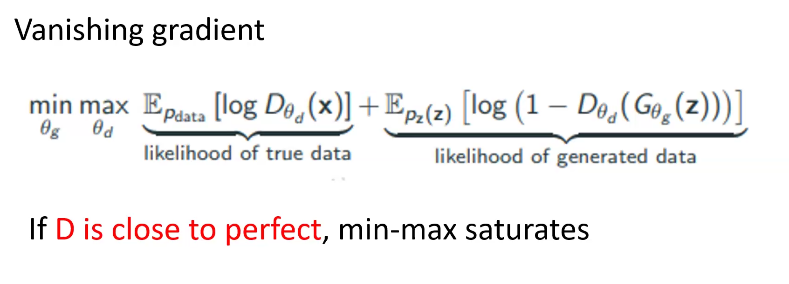

# Deep Generative Models <!-- omit in toc -->
## Table of Contents <!-- omit in toc -->
- [Introduction and context](#introduction-and-context)
  - [What and why?](#what-and-why)
  - [Discriminative and Generative](#discriminative-and-generative)
- [Preliminary concepts](#preliminary-concepts)
  - [Deep Neural Networks](#deep-neural-networks)
  - [Cost function and optimization](#cost-function-and-optimization)
  - [PDF and joint probability](#pdf-and-joint-probability)
  - [MLE and MAP](#mle-and-map)
    - [MLE](#mle)
    - [MAP](#map)
    - [Pros and Cons](#pros-and-cons)
  - [Discriminative vs Generative](#discriminative-vs-generative)
- [Variational AutoEncoders (VAEs)](#variational-autoencoders-vaes)
  - [AutoEncoder](#autoencoder)
  - [Variational AutoEncoder](#variational-autoencoder)
  - [KL Divergence](#kl-divergence)
  - [Training](#training)
  - [Probabilistic interpretation of VAE](#probabilistic-interpretation-of-vae)
  - [ELBO](#elbo)
  - [Other families of variational bounds](#other-families-of-variational-bounds)
  - [Summary](#summary)
- [Generative Adversarial Networks (GANs)](#generative-adversarial-networks-gans)
  - [Training](#training-1)
    - [Historical issues](#historical-issues)
    - [Vanishing gradient](#vanishing-gradient)
    - [Non-convergence](#non-convergence)
    - [Mode-collapse](#mode-collapse)
      - [Mathematical details of Wasserstein distance](#mathematical-details-of-wasserstein-distance)
- [Diffusion Models (DFs)](#diffusion-models-dfs)
    - [OFF TOPIC: What is a Markov Process?](#off-topic-what-is-a-markov-process)
  - [Forward + Reverse](#forward--reverse)
  - [Training](#training-2)
- [Applications](#applications)

# Introduction and context
Objectives:
  - Understand structures of Deep Generative Models (DGM)
  - Use them
  - Knowledge of pipelines of model training
  - Fine-tuning issues and how-to

## What and why?

Deep Generative models are a subfield of AI, used to generate data (e.g image, text, video, what else??)

DGM can be differentiated from computer vision where from a description you can infer an observation and viceversa.

But we need data-drives methods!!!  
The first appearence was concerning **Statistical Generative Models**, non **Deep**.

Think about a simple probability distribution function (pdf), is the pdf modeling a generative model? Can I generate some data knowing the distribution? **YES**, even though it is one-dimensional with no training. The reason is that we can sample a probability $p(x)$ given an input $x$.

## Discriminative and Generative
**Goal**: take as input training samples from some distribution and learn a model that represents that distribution.

# Preliminary concepts
## Deep Neural Networks

One hidden layer $h(x)$ for compression and embedding.

## Cost function and optimization

In the unsupervides pre-training, when a hidden layer is trained, the parameters of the other layers are frozen and are not updated.  
All them get updated in the supervised fine-tuning.

## PDF and joint probability
A PDF (Probability Density Function) is the simplest theoretical generative model one can define. Let $f(x)$ and $F(x)$ be the PDF and the Cumulative Density Function (CDF), respectively, they are related as
$$
\begin{align*}
    f(x) & = \frac{d F(x)}{dx} \\
    F(x) & = P(a \leq x \leq b) = \int_a^b f(x) dx \ .
\end{align*}
$$

* PDF:
  - function of a single variable
  - used to compute $P(X \in [a,b])$
* Joint PDF
  - function of two or more variables
  - used to compute $P(X_1 \in [a_1,b_1] \text{ and } X_2 \in [a_2,b_2])$

$$
    P(X_1 \in [a_1,b_1], \ldots, X_k \in [a_k,b_k]) = \int_{a_1}^{b_1} \ldots \int_{a_k}^{b_k} f_X(x_1, \ldots, x_k) dx_k \ldots dx_1 \ .
$$

## MLE and MAP
_Maximum Likelihood Estimation (MLE)_ and _Maximum a Posteriori Estimation (MAP)_.

In general our objective is to estimate the parameters. There are two methods to do so: MLE and MAP.  
The PDF is our model, how do we estimate its parameters? If the pdf is gaussian we would use the mean and standard deviation.

**MLE** and **MAP** allow to estimate the parameters $\theta$ of a stastistical model based on the observed data $X$. But the difference is that the MLE tries to maximize the conditional probability of $X$ given $\theta$, $p(X|\theta)$.

$p(X|\theta)$ = how likely it is to observe this data if the parameters are $\theta$

### MLE 
MLE tries to find $\theta$ that maximize the likelihood $p(X|\theta)$, i.e., $\hat{\theta}_{MLE} = \text{arg} \max_\theta p(X|\theta)$.

Are we making any hypothesis on the prior distribution on $\theta$? **NO**, the probability $p(\theta)$ is not present in the formula.

How do we find $\theta$ that maximize the likelihood $p(X|\theta)$?

### MAP
MAP tries to find the parameter $\theta$ that maximizes the posterior probability.
From a bayesian perspective, it includes a _priori_ probability $P(\theta)$ that reflects our belief about the parameter values. This improves the optimization process.
> In altre parole, il **prior** è una distribuzione di probabilità che esprime ciò che crediamo sul parametro $\theta$ *prima* di osservare i dati. Può rappresentare conoscenze precedenti, intuizioni, o semplicemente preferenze su certi valori dei parametri.

$$
    P(\theta | X) = \frac{P(X | \theta) P(\theta)}{P(X)} \qquad \propto P(X | \theta) P(\theta)
$$
In this way, the MLE optimization gets modified in the MAP optimization as below

What happens if $\log P(\theta)$ is constant?  
This means that the prior $P(\theta)$ does not favor any particular value of $\theta$: it is a flat uniform distribution.

$\log P(\theta)$ plays the role of a regularization term and can help in reducing overfitting. However, if it is constant we are not regularizing anything and, since the parameters start from a random initialization, the average behavior of many parameters might seem to “cancel out” or stabilize, due to the law of large numbers.

If $\log P(\theta)$ is constant, then MAP reduces to MLE because the constant doesn't affect the location of the maximum.

### Pros and Cons
* MLE:
  - simpler to implement
  - more prone to overfitting if there is limited data and no regularization/prior is used
* MAP:
  - can help reduce overfitting by imposing a prior -> often acts like a regularization term
  - useful when we have domain knowledge or want to encode certain parameter restrictions
  
## Discriminative vs Generative
Difference: when we want to calculate the conditional probability of the output given the input, in supervised (**discriminative**) models we only focus on the prior probability of the output, in **generative** models we focus on the prior probability on the input and the conditional probabiliy on the data.

To calculate the conditional probability $P(Y|X)$, first estimate the __prior__ probability $P(Y)$ and the __likelihood probability__ $P(X|Y)$ from the data provided. Our aim in generative model is to obtain the _posterior_
$$
    posterior = \frac{prior \times likelihood}{evidence} \Rightarrow P(Y|X) = \frac{P(Y) P(X|Y)}{P(X)} \ .
$$

To make things clearer, let's define the variables:

- $( X)$: the **input data**, e.g., an image, an email, or a feature vector describing a sample.
- $( Y)$: the **output label**, e.g., "cat", "not spam", "class A".

Discriminative models directly model $P(Y \mid X)$, i.e., the probability of a label given the input data.  
Generative models, instead, model the **joint probability** $P(X, Y) = P(Y) \cdot P(X \mid Y)$, and then derive $P(Y \mid X)$ via Bayes' theorem:

$$
P(Y \mid X) = \frac{P(X \mid Y) \cdot P(Y)}{P(X)}
$$

This means that generative models also capture how the data \( X \) is distributed within each class \( Y \), which allows them to generate new samples or understand the data distribution better.

# Variational AutoEncoders (VAEs)
## AutoEncoder
An autoencoder is a feed-forward neural net whose job is to take an input $x$ and predict $x$.
To make this task non-trivial, we need to add a _bottleneck layer_ whose dimension is much smaller than the input.

The **encoder** compresses the input data into a lower-dimensional representation, known as the **latent space**. This compressed representation (or **code vector**) is then passed to the **decoder**, which reconstructs the original input as closely as possible.

But why do this? The idea is to capture the most important features of the input in a simplified form. If the neural network can reconstruct the input accurately from this lower-dimensional code, it means that the code captures the essence of the data, what’s truly important, while discarding less relevant details.
This process is similar in spirit to PCA (Principal Component Analysis), but unlike PCA, neural networks can capture complex, nonlinear patterns. By analyzing the latent space, we can gain insight into the key factors that define the data, as learned by the network.

**Simplest**:
- 1 hidden layer
- linear activations
- simple squared error loss $\mathcal{L}(x, \tilde{x}) = || x - \tilde{x} ||^2$

This network computes $\tilde{x} = UVx$, which is a linear function. If $K \geq D$, we can choose $U$ and $V$ such that $UV = \mathbb{I}$. This isn't very interesting.

A linear autoencoder with squared error loss is equal to PCA!!!!

Then, why to autoencode?
* dimensionality reduction
* denoising
* representation learning

**Pros**:
- Simple and fast to implement.
- Effective at compressing high-dimensional data into lower-dimensional representations.
- Can learn useful features for downstream tasks like classification or clustering.
- Useful for denoising and dimensionality reduction, even with limited data.

**Limitations**:
- The latent space is **not regularized**, which means there is no guarantee that similar inputs will have similar encodings.
- There is **no probabilistic interpretation**, so we cannot sample meaningfully from the latent space.
- The latent space (K units) is often **discontinuous and unstructured**: it’s just a collection of vectors without smooth transitions or organization.
- Cannot generate new data in a principled way (unlike VAEs or GANs).

## Variational AutoEncoder
**Main limitation**: autoencoders and deep autoencoders (more hidden layers) do not define a distribution, they do not generate anything, they reproduce!  
If the latent space is not continuous, the **reconstruction loss** is high, and we can sample correctly only in correspondence of training data.

Can we make the latent space continuous? From which we can sample? This is the motivation behind Variational AutoEncoders.

For Variational AutoEncoders, as in AutoEncoders:
* input $x$, hidden layer output $z$, reconstruction $\tilde{x}$
* encoder is a neural network with parameters (weights and biases) $\theta$
* input: $28 \times 28$ pixel photo $\to 784$-dimensional representation
* hidden layer $len(z)$ is much smaller than $784$
* decoder is a neural network with parameters (weights and biases) $\phi$

But in addition:
* the encoder is characterised by a **probability density function** $q_\theta(z|x)$  generally a Gaussian
* efficient compression with this distribution
* from this distribution, we can sample noisy values of $z$
* the decoder is characterised by a pdf $p_\phi(x|z)$ from which we try to reconstruct $\tilde{x}$

Information from the original $784$-dimensional vector cannot be perfectly transmitted, because the decoder only has access to less information in the form of a less-than-$784$-dimensional vector $z$.  
How much information is lost?

## KL Divergence
The Kullback-Leibler (KL) divergence quantifies how much information is lost.

Let $\log p_\phi(x|z)$ be the **reconstruction** log-likelihood, that tells me how effectively we have learned to reconstruct an input image $x$, given its latent representation $z$.  
The **loss function** is a negative log-likelihood with a regularization term (for each $i$-th sample)
$$
l_i (\theta, \phi) = - \mathbb{E}_{z \sim q_\theta(z|x_i)}[\log p_\phi(x_i|z)] + \mathbb{KL}(q_\theta(z|x_i) || p(z)) \ .
$$
The total loss is the sum of losses from $i$ to $N$.

* The first term is the **reconstruction loss** $: \mathbb{E}_{z \sim q_\theta(z|x_i)}[\log p_\phi(x_i|z)]$ is the expectation taken w.r.t. the encoder's distribution, $q_\theta(z|x_i)$, over the representations, $p_\phi(x_i|z)$. It tells how much the decoder is capable to decode the encoder but from the encoder's point of view. We use the $\log$ because it stabilizes numerical values, simplifies optimization, and has strong informational meaning.
* The second term is the **Kullback-Leibner Divergence**: summarize the difference (divergence) between the probability function of the encoder $q_\theta(z|x_i)$ and that of the decoder $p(z)$. So, it quantifies how much information is lost when using $q$ to represent $p$.

In the Variational Autoencoder, the latent variables $z$ are supposed to come from a _prior_ distribution, which is specified to be a normal distribution with zero mean and unit variance, i.e. $p(z) = \mathcal{N}(0,1)$. 
The encoder learns a distribution $q(z∣x_i)$ for each input, and we want this distribution to be close to the prior. This is enforced by a KL divergence term in the loss.
If the encoder tries to produce latent codes that deviate too much from this standard normal shape, the model is penalized (it will receive a penalty in the loss). This regularization helps keep the latent space well-behaved and consistent, making it easier to interpolate between data points or sample new, realistic data.

## Training
To train the VAE use stochastic gradient descent with step size $\rho$
$$
\begin{align*}
    \text{encoder: } & \ \theta \to \theta - \rho \frac{\delta l}{\delta \theta} \\
    \text{decoder: } & \ \phi \to \phi - \rho \frac{\delta l}{\delta \phi}
\end{align*}
$$

## Probabilistic interpretation of VAE
A Variational Autoencoder (VAE) defines a probabilistic model over observed data $\mathbf{x}$ and latent variables $\mathbf{z}$. The joint distribution can be factorized as:
$$
p(\mathbf{x}, \mathbf{z}) = p(\mathbf{x} \mid \mathbf{z}) \, p(\mathbf{z})
$$
where:
  - $\mathbf{x}$: observed variable (e.g., input data)
  - $\mathbf{z}$: latent variable (hidden representation)

* Generative process: for each datopoint $i$:
  - draw $z_i \sim p(z) \to$ drawn from a prior
  - draw $x_i \sim p(x|z) \to$ drawn from a probability (Bernoulli distributed for black/white images)

* Inference (testing after training) -> Goal: infer good values of $z$ given $x$, or to calculate $p(z|x)$.  
    How can we find good values of $z$? Use the Bayes' Theorem
    $$
        p(z|x) = \frac{p(x|z) p(z)}{p(x)}
    $$

We already know $p(x|z)$ and $p(z)$ (we sample from the network), but what about $p(x)$? $p(x)$ _is the prior probability of the data_. How to compute it?  

The value of $p(x)$ indicates how well the generative model can explain or generate the observed data $x$. However, computing $p(x)$ directly is often intractable due to the complexity of the integral. To address this difficulty, an approximate distribution $q(z \mid x)$ is introduced, and a quantity called the Evidence Lower Bound (ELBO) is maximized, which provides a lower bound to $\log p(x)$.

We could marginalize the latent variables: $p(x) = \int p(x|z)p(z) dz$. However, this integral takes time to be evaluated since one needs to evaulate it over all configurations of $z$ (i.e., evaluate this integral for all $z$ that have been generated in the encoder).

We know that $q_\lambda(z|x)$ (from the encoder) has a parameter $\lambda$ which indexes the **family distribution**. If $q$ were gaussian it would be the mean and variance of each data point, $\lambda_i = (\mu_{x_i}, \sigma_{x_i})$. Then the vector $\lambda = (\lambda_1, \lambda_2, \ldots, \lambda_N)$ replaces the parameters vector $\theta = (\theta_1, \theta_2, \ldots, \theta_N)$ and each parameter $\theta_i$ gets substituted by a mean and standard deviation. So, each parameter is a gaussian distribution that allows us to cover better the latent space.

From now on we call $q$ **Variational Posterior**.

How can we know how well our variational posterior $q_\lambda(z|x)$ approximates the true $p(z|x)$? Again, use the KL Divergence
$$
   \mathbb{KL}(q_\lambda(z|x) || p(z|x)) = \mathbb{E}_q[\log q_\lambda(z|x)] - \mathbb{E}_q[\log p(x,z)] + \log p(x) \ ,
$$
This formula measures how different the approximate distribution $q_\lambda(z \mid x)$ is from the true posterior $p(z \mid x)$. In other words, it quantifies how much information is lost when using a simpler distribution to approximate the true one,
which quantifies the amount of information that is lost in the data compression. But how do we again compute $p(x)$?  
Define the **ELBO** (Evidence Lower Bound)
$$
    ELBO(\lambda) = \mathbb{E}_q[\log p(x,z)] - \mathbb{E}_q[\log q_\lambda(z|x)] \ ,
$$ 
and isolating
$$
    \log p(x) = ELBO(\lambda) + \mathbb{KL}(q_\lambda(z|x) || p(z|x)) \ ,
$$
from the Jensen's inequality one can state that $\mathbb{KL} \geq 0$ (because I cannot gain information compressing data). So, given that $\mathbb{KL} \geq 0$ and $\log p(x) \geq 0$, instead of minimizing $\mathbb{KL}$ we can maximize $ELBO$. In this way we avoid the computation of the prior probability of the data, $\log p(x)$.

## ELBO
$$
    ELBO_i(\lambda) = \mathbb{E}_{q_\lambda(z|x_i)}[\log p(x_i,z)] - \mathbb{KL}(q_\lambda(z|x_i) || p(z)] \ ,
$$ 
the first term is the **reconstruction loss** and the second term is the **compression loss**.

Let's remember now NN. The final step is:
1. Parametrize the approximate posterior $q_\theta(z|x, \lambda)$ with an _inference network_ (__encoder__)
2. Parametrize the likelihood $p(x|z)$ with a _generative network_ (__decoder__) that takes latent variables $z$ and outputs parameters to the data distribution $p_\phi(x|z)$
3. $ELBO_i(\theta, \phi)= - l_i(\theta, \phi)$
4. The inference and generative networks have model parameters $(\theta, \phi)$ while $\lambda$ represent variational parameters

## Other families of variational bounds
The combination of reconstruction loss and compression loss can be modified to speed-up the training, to favor the generation and/or discrimination and so on, depending on the specific task.
Other possible formulations that can be used are the following ones

## Summary
1. **Model parameters** (often denoted $\theta, \phi$):
    * $\theta$ typically refers to the __generative model__ parameters, e.g. the decoder network $p_\theta(x|z)$.
    * $\phi$ typically refers to the __inference (recognition) network__ parameters, e.g. the encoder network $q_\phi(z|x)$.
    * These parameters are __global__ to the entire dataset. You train one set of $\theta, \phi$ that applies to every datapoint.
2. **Variational parameters** (often denoted $\lambda$):
    * In classical variational inference, for each datapoint $x^{(i)}$, you might introduce a local variational distribution $q_{\lambda^{(i)}}(z)$ with its own parameters $\lambda^{(i)}$.
    * These __local__ parameters $\lambda^{(i)}$ describe the approximate posterior distribution for a specific datapoint $x^{(i)}$.
    * In a generic variational inference setting (e.g., for Bayesian model), you'd explicitly optimize these local $\lambda^{(i)}$ alongside any global parameters.
    * In practice, VAEs don't store a separate set of parameters $\lambda^{(i)}$ for each datapoint. Instead, they use a __neural network__ (the encoder) parametrized by $\phi$ which __outputs__ the mean $\mu_\phi(x)$ and variance $\sigma_\phi(x)$ (or whichever parameter one needs) for the approximate posterior $q(z|x)$.
    * Formally, each datapoint $x^{(i)}$ has its own latent distribution parameters (i.e. local $\lambda^{(i)}$) computed by the encoder, but we do not treat them as free variables we store and optimize individually. We instead learn the $\phi$ that maps ${x^{(i)}}$ to ${\lambda^{(i)}}$.
  
In other words:
1. $\theta, \phi \to$ global neural network weights for the decoder/encoder. These are explicitly optimized during training and shared across all data.
2. $\lambda \to$ local variational parameters per datapoint. In a standard VAE, they are produced on the fly by plugging $x$ into the encoder network $q_\phi(z|x)$. We do not keep a separate $\lambda$ variable to optimize for each datapoint; the encoder network $\phi$ handles that _functionally_.

Hence, the pratical difference is:
* __Model parameters__ $\theta, \phi$ are a fixed set of weights for the entire model (shared across the entire dataset).
* __Variational parameters__ $\lambda$ (in a strict variational-inference sense) are the parameters of the approximate posterior distribution for each individual datapoint. In a VAE, these local parameters are never individually stored or optimized; rather, they are generated by the encoder (whose weights $\phi$ are optimized globally).

That is why we often talk about **global** and **local** parameters in a variational framework. In typical VAE implementations, we only see the global $\theta, \phi$ in code, but conceptually each datapoint has its own **local** latent distribution characterized by the mean $\mu_\phi(x)$ and variance $\sigma_\phi(x)$, which can be seen as its local $\lambda$.

In the formula $\tilde{x} = UVx$, $U$ and $V$ do not contain parameters in the sense of a neural network which has an activation function, but they are neurons that are characterized by a probability density function, each of them having its own mean and standard deviation. Then each global $\theta$ parameter has its own local $\lambda$ which, in a gaussian sense, is represented by the mean and standard deviation.

# Generative Adversarial Networks (GANs)
Two NN: __generator__ + __discriminator__
1. **Generator** takes random noise as input and tries to produce real data. We optimize a model which takes in input some random noise, into the generator, and tries to generate fake images.
2. **Discriminator** tries to distinguish fake from real data. It is trained out of real and fake images and tries to discriminate which are real and which are fake.

Generator and discriminator are, in some sense, "enemies", unlike the encoder and decoder in a VAE where if I improve the encoder, that is, I encode better the data with less information loss, then the decoder will work better. Here, if the generator is amazing at producing images is a problem for the discriminator because it will not be able to distinguish real from fake images.

This is called _Adversarial Game_: one tries to fool the other!!

Two steps are involved:
1. generate a batch of samples (Generator)
2. update the weights based on correct/wrong (Discriminator)

Some definitions:
* let $z$ and $p(z)$ be a simple base distribution and its probability
* the generator $G(z)$ is a deep neural network
* $\mathcal{D}$ is the manifold of generated examples
* the discriminator $D(x)$ is also a deep neural network

But, how do we optimize the parameters? This is given by the formula:

We are trying to do a simultaneous min max optimization, that is minimize w.r.t. $\theta_g$ and maximize w.r.t. $\theta_d$.
The first term, the **likelihood of true data**, is the probability the discriminator actually disciminates.
The second term is the **likelihood of generated data**; when this term is zero there is no loss meaning that the generated data are exactly what the discriminator is expecting.

This optimization is a problem: it is a __saddle-point optimization__.

This is the reason why the training of GANs is very complex, much more complex than the VAEs.

## Training
Example of a trainig loop

* $\alpha_d \to$ learning rate of the discriminator
* $\alpha_g \to$ learning rate (not exactly) of the generator

In the training loop the generator is updated after the discriminator. 
If the generator improves before the discriminator and starts associating specific noise patterns with specific fake images, the discriminator will only learn to recognize those specific patterns and not generalize well to new ones.

### Historical issues
* **Vanishing gradient**: the discriminator becomes "too good" and the generator gradient vanishes.
* **Non-convergence**: the generator and discriminator oscillate without reaching an equilibrium.
* **Mode collapse**: the generator distribution collapses to a small set of examples.
* **Mode dropping**: the generator distribution doesn't fully cover the data distribution.

### Vanishing gradient
It happens when the discriminator is amazing. 
The generator updates its parameters using gradients from the discriminator, but:
* If the discriminator becomes __too good too quickly__, it can easily distinguish fake data from real data.
* As a result, the discriminator’s output for fake data becomes close to $0$, and the gradient it provides to the generator becomes very small (i.e., __vanishes__).
* This means $G$ can't learn, because it’s not receiving meaningful updates.
* When $D(G(z)) \approx 0$, the derivative of $\log(1 - D(G(z)))$ becomes near to zero --> __vanishing gradient__.

The fact that the discriminator is amazing is not useful because our goal is not to discriminate something but to have a generative model. In this case the parameters $\theta_d$ and $\theta_g$ get not updated because the gradient is vanishing.

How to fix this?  
* possibilities for non-saturating objectives: if the discriminator is not perfect, we can define some objective function that converges to some non-constant number that depends only on the generator. We add something like $\mathbb{E}[\log G]$ to the $\min \max$ formula, but this would imply that to reduce this term to zero the generator will generates only one image and quickly this possibility becomes useless. This could lead to __mode-collapse__.
* use __non-saturating loss__ for $G$: minimize $\log D(G(z))$ instead of $\log(1 - D(G(z)))$.
* restrict capabilities of $\mathcal{D}$ (structurally!!) (limit the number of neurons, use not complex cnn, ...)
* balance learning $D_{\theta_d}$ and $G_{\theta_g}$

The last two solutions are more advisable than the first one.

### Non-convergence
$D_{\theta_d}$ and $G_{\theta_g}$ are often non-convex, so the saddle point is complex to find. Training updates undo each other.

The left picture shows convergence under Adam optimization. We see that in order to converge to the minimum we have to move in only one direction. The right picture shows convergence under saddle-point optimization, in order to converge to the saddle point we have to move in two directions.

### Mode-collapse
It happens when the generator focuses on producing a limited set of data patterns that deceive the discriminator. This could happen as a consequence of using non-saturating objective functions to solve the vanishing gradient problem.

The model becomes fixated on a few dominant modes in the training data and fails to capture the full diversity of the data distribution.

We see that GAN gets fixated on generating only $1$ and $9$.

The solution is provided by WGAN (Wasserstein GANs) in which the __Wasserstein distance__ is used instead of the cross-entropy. The Wasserstein-1 distance (or Earth-Mover's distance) is continuous and differentiable _almost everywhere_ with respect to the generator's parameters. This means that when I take the derivative of the loss function during the training, the fact that it is continuous and differentiable implies that there are no discontinuities. This imply that even when generated data has little overlap with the real distribution, the W-distance provides non-zero gradient. This prevents the gradient from vanishing and, as a consequence, prevents the mode-collapse.

#### Mathematical details of Wasserstein distance
TO DO

# Diffusion Models (DFs)
Based on the __diffusion__ process -> two steps: __forward__ + __backward__.

All the generative models we have seen (VAE, GAN, DF) have the concept of mutual challenge between generation and discrimination.

While in GAN we were providing random noise to a generator to generate an image and train the parameters to associate noise to image, and the discriminator had the job of taking an image and say whether it is fake or not.
Here, in DF, we gradually add small amounts of (gaussian) noise to the initial image, $x_0$, and the backward process consists in just removing noise from the noisy image.

While in VAE and GAN we can define layers, the initial image is processed by layer1, layer1-output is processed by layer2, and so on. The final output depends on the matrix multiplications taking place at each later. The number of matrix multiplications is equal to the number of layers. This could be pretty challenging. In the case of DF we proceed as in a Markov Chain ($t+1$ depends only on $t$).

### OFF TOPIC: What is a Markov Process?

## Forward + Reverse
How do we do forward?

We have to define a __forward process__ $q$ which depends on time $t$ and time $t-1$ and is normally distributed
$$
q(x_t | x_{t-1}) = \mathcal{N}(x_t; \sqrt{1-\beta_t}x_{t-1}, \beta_t I) \ ,
$$
where $\beta\in [0,1]$ is a parameter called __noise schedule__, which quantifies how much noise is injected in the normal distribution at each step.

So, if $\mathcal{N}$ is a normal distribution, our goal is to predict __mean__ and __variance__ to _predict the reverse process_ (invert the forward) and __generate data__.

Then, we define the __reverse process__ $p$ as
$$
p(x_{t-1} | x_t) = \mathcal{N}(x_{t-1}; \mu_\theta(x_t,t), \Sigma_\theta(x_t,t)) \ .
$$

We need to learn this distribution, but how? We can learn the distribution in two ways:
- __old attempts__: with math (Denoising Probabilistic Models)
- __new attempts__: with Unets (Denoising Diffusion Probabilistic Models)

The first ones do not work bad, but they produce only images that are very similar to the training set data. So, it is not so useful, even though it works.

DF models are the first models that improve something in prompting.

## Training
To train one has to minimize the Variational Lower Bound (as VAE)
$$
\mathbb{E}[- \log p_\theta(x_0)] \leq \mathbb{E}_q \Big[- \log \frac{p_\theta(x_{0:T})}{q(x_{1:T}|x_0)} \Big] \ .
$$

Same formula as VAE, we just add a $T$ because this process has to be done pairing each time-step between process $p$ and process $q$ and iterating for all time-steps. In practice there are hundreds or thousands of time-steps, depending on the task. So, this optimization will take a lot of time.

The difference between VAEs and DFs is that in DFs the __variational parameter__ is prompted, unlike VAEs where the variational parameter is $\lambda$. 

The variational parameter for DFs is the prompt we write to describe the image we want to be generated by the model. The text is embededd in numerical form in order for the model to undestand it, via some kind of text embedding techinique. The model learns to associate the description we have provided (the prompt desctibing, for example, the background we wish) to some skeleton model (for example the pose of a man) and tries to generate the image. Then, it tries to combine two inputs, the prompt and the skeleton model to generate the final image (man in a specific pose with the background we have described).

# Applications

VAEs are capable to both training and predicting very fast, things that stable diffusion models do not do. Secondly VAEs, thank to the variational parameter $\lambda$, have the capability of covering all the latent space. However, the diversity of the generated images is much less than the one obtained by Diffusion Models.

VAEs do not have high quality samples even after a lot of epochs. DFs reach high quality samples but they need a large amount of time. 